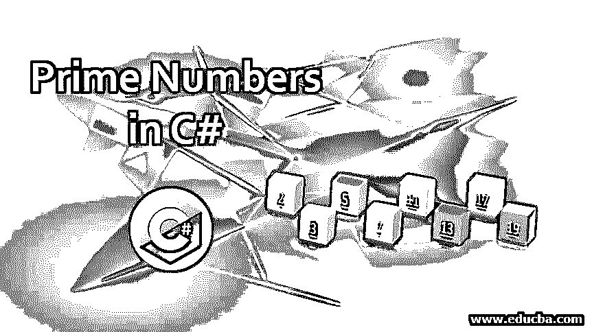
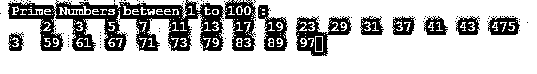
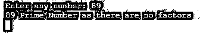
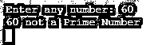

# C#中的质数

> 原文：<https://www.educba.com/prime-numbers-in-c-sharp/>




## C#中质数的介绍

质数是大于 1 的整数，它只能是数字 1 及其自身的因数，即数字“n”只能被 1 或“n”本身整除。一些众所周知的质数是 2、3、5、7、9、11、13、17、19、23 等。以素数为主题的 C#程序，可以用来判断给定的数是否是素数，并显示给定范围内的所有素数。这可以在 C#程序中通过使用各种循环和条件语句定义逻辑来实现，例如 for 循环、if 条件、if else 条件、while 循环等。

### C#中素数的例子

让我们试着用下面的编程例子来概念化质数。

<small>网页开发、编程语言、软件测试&其他</small>

#### 示例#1

打印 1 到 100 之间所有质数的列表的 C#程序。

**代码:**

```
using System;
using System.Collections.Generic;
using System.Linq;
using System.Text;
using System.Threading.Tasks;
namespace ConsoleApplication1
{
class Program
{
static void Main(string[] args) // this function defines the entry point
{
bool Prime = true;
Console.WriteLine("Prime Numbers between 1 to 100 : ");
for (int a = 2; a <= 100; a++) //upper limit and lower limit are defined
{
for (int b = 2; b <= 100; b++)// base logic for the primality
{
if (a != b && a % b == 0) //modulo operators employed
{
Prime = false;
break;
}
}
if (Prime)
{
Console.Write("\t" + a); //printing the correct variable
}
Prime = true;
}
Console.ReadKey(); //hold the output screen
}
}
}
```

****输出:****




**程序解释:**上面的程序是使用循环和[条件操作符](https://www.educba.com/conditional-operators-in-c-sharp/)在固定的数字范围内确定[质数](https://www.educba.com/prime-numbers-in-java/)的经典例子。上面的程序使用了自然数的下限，即 2，将“a”定义为范围为 2 到 99 的自然数，运算后增量为 1，下一步使用具有类似范围的变量“b ”,但受其上限始终小于“a”的条件约束。然后，循环遍历该范围，并使用除数 b 对变量 a 取模的自然运算。

如果 a 能被 b 整除，模运算符返回 0，表明 b 作为一个较小的自然数是合数 a 的一个因子。我们使用布尔参数 Prime 作为标志，以防我们接收到的 a % b 的值不等于零。现在我们使用[条件操作符](https://www.educba.com/conditional-operator-in-java/)在输出控制台中打印数字，以防我们接收到作为质数的[数字。](https://www.educba.com/prime-number-in-javascript/)

#### 实施例 2

用 for 循环检查质数

**代码:**

```
using System;
using System.Collections.Generic;
using System.Linq;
using System.Text;
using System.Threading.Tasks;
namespace ConsoleApplication1
{
class Program
{
public static void Main(string[] args)
{
int n, a, m = 0, PrimeIndicator = 0;
Console.Write("Please enter the number to check for Primality: ");
n = int.Parse(Console.ReadLine());
m = n / 2;
for (a = 2; a <= m; a++)
{
if (n % a == 0)
{
Console.Write("The entered number is not  a Prime number .");
PrimeIndicator = 1;
break;
}
}
if (PrimeIndicator == 0)
Console.Write("The entered number is a Prime number . ");
}
}
}
```

**输出:**


**程序说明:**上述程序使用 for 循环来定义素性的条件。输入读取字段捕获用户输入并分配给变量 n，计数器从值 2 解析到值 n-1，并测试整除条件以确定该数是否是质数，程序中涉及的附加特征使用值为 n/2 或正好是初始用户输入的一半的变量 m，程序解析循环直到值 m

#### 实施例 3

使用 while 循环的素性。

**代码:**

```
using System;
using System.Collections.Generic;
using System.Linq;
using System.Text;
using System.Threading.Tasks;
namespace ConsoleApplication1
{
class Program
{
static void Main(string[] args)
{
int n, i, a;
Console.Write("Enter any number: ");
n = Convert.ToInt32(Console.ReadLine()); // read the user input
a = 0;
i = 2;
while (i <= n / 2)
{
if (n % i == 0)
{
a = 1;
break;
}
i++;
}
if (a == 0)
Console.WriteLine(n + " Prime Number as there are no factors");
else
Console.WriteLine(n + " not a Prime Number ");
Console.ReadLine();
}
}
}
```

**输出:**







**程序解释:**上面的程序演示了在 C#中使用 while 循环确定一个数的素性的过程。上面的程序使用控制读取命令读取用户输入，并在范围 2 内解析用户输入除以 2 的值，以确定用于测试数的素性的标志的值。该值在循环内部赋值，并根据。

### 结论

因此，质数是大于 1 的自然数，只有因子是 1 和它本身。一个合数可以分解成质因数，这些数叫做质因数。上面举例说明的各种程序为我们提供了使用 do、for、while 循环实现任意数的素性的方法。尽管所有上述程序的实现背后的逻辑是通过用模运算符对一个数进行运算来找到该数的因子，但是根据循环的选择，在不同的点上控制该程序的实现。

### 推荐文章

这是一个 C#质数指南。这里我们讨论 c#中素数的介绍和例子，以及代码实现。您也可以阅读以下文章，了解更多信息——

1.  PHP 中的质数
2.  [C 中的质数](https://www.educba.com/prime-numbers-in-c/)
3.  [Java 中的质数](https://www.educba.com/prime-numbers-in-java/)
4.  [Python 中的质数](https://www.educba.com/prime-numbers-in-python/)


