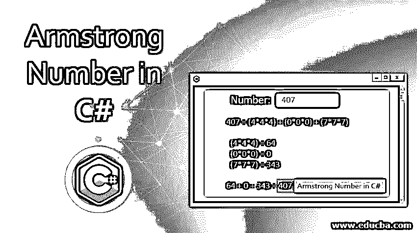
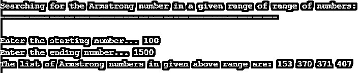
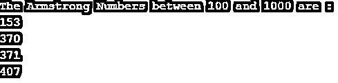

# C#中的阿姆斯特朗数

> 原文：<https://www.educba.com/armstrong-number-in-c-sharp/>




## C#语言中阿姆斯特朗数的介绍

阿姆斯特朗数是一个等于其立方位数总和的数。它由 N 个数字组成，等于每个数字的 N 次幂的总和。例如，包括 0、1、153、370、371 和 407、1634、8208、9474 的数字被认为是阿姆斯特朗数。在这个主题中，我们将学习 C#中的阿姆斯特朗数。

加密和解密的过程使用阿姆斯特朗的号码，该号码将被指向一个密钥。为了在两个目标用户之间进行身份验证和保护，使用了服务器。发送者和接收者将在服务器的帮助下得到验证。

<small>网页开发、编程语言、软件测试&其他</small>

**逻辑**

要看阿姆斯特朗数背后的逻辑，我们就用其中一个数来简单解释一下关于阿姆斯特朗数的方法。把数字当成 407 来解释逻辑。

407 = (4*4*4) + (0*0*0) + (7*7*7)

在这里，将每个数字乘以三次，如下所示:

(4*4*4) = 64

(0*0*0) = 0

(7*7*7) = 343

因此，将上面相乘的数字相加，将得到如下结果:

64+0+343 = 407

### C#中阿姆斯特朗数的例子

下面是下面提到的例子。

#### 示例#1

**代码:**

```
using System;
using System.Collections.Generic;
using System.Linq;
public class Program
{
public static void Main()
{
int i = 0;
int num = 0;
int[] numArray = new int[10];
double res = 0;
//Step 1 : Provide the number in this step
Console.Write("Please enter the number : ");
int number = int.Parse(Console.ReadLine());
//Step 2 : Now store the number in a temporary variable
int tmpryNum = number;
//Step 3 : Calculate the total number of integers in number and store each integer in the digit array
while (number > 0)
{
numArray[i++] = number % 10;
number = number / 10;
num++;
}
//Step 4 : Calculate the number
for (i = 0; i < num; i++)
{
res += Math.Pow(numArray[i], num);
}
//Step 5 : Check whether number is prime or not
if (res == tmpryNum)
{
Console.WriteLine($"The number {tmpryNum} is armstrong");
}
else
{
Console.WriteLine($"The number {tmpryNum} is not armstrong");
}
Console.ReadLine();
}
}
```

**输出:**


#### 实施例 2

**代码:**

```
using System;
using System.Collections.Generic;
using System.Linq;
public class Program
{
public static void Main()
{
int mynum, remainder, res = 0;
Console.Write("Please enter an integer number: ");
mynum = int.Parse(Console.ReadLine());
for (int m = mynum; m > 0; m = m / 10)
{
remainder = m % 10;
res = res + remainder*remainder*remainder;
}
if (res == mynum)
{
Console.Write("The number entered by you is an Armstrong number...");
}
else
Console.Write("The number entered by you is not an Armstrong number...");
Console.ReadLine();
}
}
```

**输出:**


#### 实施例 3

**代码:**

```
using System;
using System.Collections.Generic;
using System.Linq;
public class Program
{
public static void Main()
{
int mynum,m, res=0,r;
Console.Write("Please enter the number :");
mynum = Convert.ToInt32(Console.ReadLine());
m = mynum;
while(m!=0)
{
r=m%10;
res =res+(r*r*r);
m = m / 10;
}
if(res==mynum)
Console.WriteLine("The number which you have entered is an Armstrong Number...");
else
Console.WriteLine("The number which you have entered is not an Armstrong Number...");
Console.ReadKey();
}
}
```

**输出**


#### 实施例 4

**代码:**

```
using System;
using System.Collections.Generic;
using System.Linq;
public class Program
{
public static void Main()
{
int mynum,val,res,temp_var;
int start_no,end_no;
Console.Write("\n\n");
Console.Write("Searching for the Armstrong number in a given range of range of numbers:\n");
Console.Write("--------------------------------------------------------");
Console.Write("\n\n");
Console.Write("Enter the starting number... ");
start_no= Convert.ToInt32(Console.ReadLine());
Console.Write("Enter the ending number... ");
end_no= Convert.ToInt32(Console.ReadLine());
Console.Write("The list of Armstrong numbers in given above range are: ");
for(mynum=start_no;mynum<=end_no;mynum++){
temp_var=mynum;
res = 0;
while(temp_var!=0){
val=temp_var % 10;
temp_var=temp_var/10;
res=res+(val*val*val);
}
if(res==mynum)
Console.Write("{0} ",mynum);
}
Console.Write("\n");
}
}
```

**输出:**




#### 实施例 5

**代码:**

```
using System;
using System.Collections.Generic;
using System.Linq;
public class Program
{
public static void Main()
{
Console.Write("Enter the Start Number : ");
int StartNumber = int.Parse(Console.ReadLine());
Console.Write("Enter the End Number : ");
int EndNumber = int.Parse(Console.ReadLine());
Console.WriteLine($"The Armstrong Numbers between {StartNumber} and {EndNumber} are : ");
for (int i = StartNumber; i <= EndNumber; i++)
{
if (IsArmstrongNumber(i))
Console.WriteLine(i);
}
Console.ReadLine();
}
static bool IsArmstrongNumber(int number)
{
int sum = 0;
int temporaryNumber = number;
int temp = 0;
int length = number.ToString().Length;
while (number != 0)
{
temp = number % 10;
number = number / 10;
sum += (int)Math.Pow(temp, length);
}
if (sum == temporaryNumber)
{
return true;
}
else
{
return false;
}
}
}
```

**输出:**




#### 实施例 6

**代码:**

```
using System;
public class Program
{
// This function is used to find Nth Armstrong Number
static int ArmstrongNum(int n)
{
int cnt = 0;
// specifying the upper limit from integer
for(int m = 1; m <= int.MaxValue; m++)
{
int num = m, rem, digit = 0, res = 0;
num = m;
// Calculate the total digits in num
digit = (int) Math.Log10(num) + 1;
// Calculate sum of power of digits
while(num > 0)
{
rem = num % 10;
res = res + (int)Math.Pow(rem, digit);
num = num / 10;
}
// Check the Armstrong number
if(m == res)
cnt++;
if(cnt == n)
return m;
}
return n;
}
public static void Main()
{
int n = 15;
Console.WriteLine(ArmstrongNum(n));
}
}
```

**输出:**


#### 实施例 7

**代码:**

```
using System;
public class Program
{
int power(int a, long b)
{
if( b == 0)
return 1;
if (b % 2 == 0)
return power(a, b / 2) * power(a, b / 2);
return a * power(a, b / 2) * power(a, b / 2);
}
int myfunc(int a)
{
int n = 0;
while (a != 0)
{
n++;
a = a / 10;
}
return n;
}
bool ArmstrongNum (int a)
{
int n = myfunc(a);
int tmp_var = a, res = 0;
while (tmp_var != 0)
{
int rs = tmp_var % 10;
res = res + power(rs, n);
tmp_var = tmp_var / 10;
}
return (res == a);
}
public static void Main()
{
Program pgm = new Program();
int a = 8208;
Console.WriteLine(pgm.ArmstrongNum(a));
a = 1423;
Console.WriteLine(pgm.ArmstrongNum(a));
}
}
```

**输出:**


### 结论

到目前为止，我们已经学习了如何在 C#中利用阿姆斯特朗数。在数论中，它被称为自恋数。通过这篇文章，我希望上面解释的内容能够增加你的 C#知识。尝试不同类型的数字，如上述各种方法所示，玩阿姆斯特朗数字技术。

### 推荐文章

这是一个用 C#编写的阿姆斯特朗数指南。这里我们讨论阿姆斯特朗数的基本概念、C#中的例子以及如何使用它。您也可以看看以下文章，了解更多信息–

1.  [c#中的逻辑运算符](https://www.educba.com/logical-operators-in-c-sharp/)
2.  [c#中的私有](https://www.educba.com/private-in-c-sharp/)
3.  [c#中的多线程](https://www.educba.com/multithreading-in-c-sharp/)
4.  [c#中的构造函数](https://www.educba.com/constructor-in-c-sharp/)


