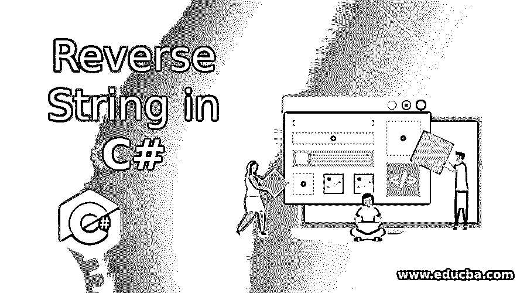
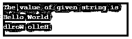

# 在 C#中反转字符串

> 原文：<https://www.educba.com/reverse-string-in-c-sharp/>




## C#中的反向字符串介绍

Reverse 用于将一个字符串或一个数字从后向前颠倒，就像 string educba 一样，颠倒的字符串是 abcude。对于数字 9436，反过来是 6349。在反串的帮助下，我们可以反串任何一根弦。我们可以用许多方法实现这个方法。每个方法都有它的 log(n)。有些方法比另一种方法快。

一些方法使用更多的代码行，本质上很复杂，有时很难理解。我们也可以把数字反过来。

<small>网页开发、编程语言、软件测试&其他</small>

**方法**

这里有一些方法，通过使用它们，我们可以反转字符串:

*   使用反向跟踪方法。
*   使用 ToCharArray 方法。
*   **编程方法:**通过使用这种方法，我们首先将字符串存储在任何变量中，然后计算该变量或字符串的长度。然后我们一次选取一个字符，从背面或反面开始打印。在使用这种方法之前，我们应该确保这种方法不会影响程序的性能。

因此，我们可以根据需求使用上述任何一种方法。

### C#中的反向字符串示例

下面是 C#中反向字符串的示例:

#### 示例#1

**代码:**

```
using System ;
using System.Collections.Generic ;
using System.Linq ;
using System.Text ;
using System.Threading.Tasks ;
namespace ReverseString
{
class Program
{
static void Main(string[] args)
{
string Str, rev;
Str = "Programming" ;
rev = "";
Console.WriteLine("Value of given String is: {0}", Str) ;
// find string length
int a;
a = Str.Length - 1 ;
while (a >= 0)
{
rev = rev + Str[a] ;
a--;
}
Console.WriteLine("Reversed string is: {0}", rev) ;
Console.ReadLine() ;
}
}
}
```

在上面的程序中，Str 被用作变量来存储字符串的值。While loop 用于反转字符串，背后的逻辑是从右到左逐个改变字符的位置。
**输出:**


#### 实施例 2

**代码:**

```
using System ;
using System.Collections.Generic;
using System.Linq ;
using System.Text ;
using System.Threading.Tasks ;
static class StringHelper
{
public static string ReverseString(string str)
{
char[] array = str.ToCharArray() ;
Array.Reverse(array) ;
return new string(array) ;
}
}
class Program
{
static void Main()
{
Console.WriteLine(StringHelper.ReverseString("This")) ;
Console.WriteLine(StringHelper.ReverseString("is")) ;
Console.WriteLine(StringHelper.ReverseString("C#")) ;
Console.WriteLine(StringHelper.ReverseString("programming")) ;
Console.ReadLine();
}
}
```

在上面的例子中，ReverseString 方法用于获取需要反转数组的字符串的值。反向用于修改字符的顺序。

**输出:**


#### 实施例 3

**代码:**

```
using System;
using System.Collections.Generic ;
using System.Linq ;
using System.Text ;
using System.Threading.Tasks ;
namespace reverseString
{
class Program
{
static void Main(string[] args)
{
string s = "", rev = "" ;
int len = 0 ;
Console.WriteLine("Enter a string") ;
s = Console.ReadLine();
len = s.Length - 1;
while (len >= 0)
{
rev = rev + s[len] ;
len--;
}
Console.WriteLine("Reverse of string is {0}", rev) ;
Console.ReadLine();
}
}
}
```

在上面的程序中，我们接受用户的输入来反转字符串。变量用于存储字符串的值。While loop 用于反转字符串，背后的逻辑是从右到左逐个改变字符的位置。

**输出:**


#### 实施例 4

**代码:**

```
using System;
using System.Collections.Generic ;
using System.Linq ;
using System.Text ;
using System.Threading.Tasks ;
namespace reverseString
{
class Program
{
static void Main(string[] args)
{
string s;
Console.Write(" Enter the string : ") ;
s = Console.ReadLine();
s = StringReverse(s);
Console.Write(" Reverse is : ") ;
Console.Write(s) ;
Console.ReadLine() ;
}
public static string StringReverse(string s)
{
if (s.Length > 0)
return s[s.Length - 1] + StringReverse(s.Substring(0, s.Length - 1)) ;
else
return s ;
}
}
}
```

**输出:**


#### 实施例 5

**代码:**

```
using System ;
using System.Collections.Generic ;
using System.Linq ;
using System.Text ;
using System.Threading.Tasks ;
namespace reverseString
{
class Program
{
public static void Main()
{
Console.WriteLine(reverse("Hello")) ;
Console.ReadLine();
}
public static string reverse(string s)
{
string reverseStr = "" ;
for (int a = s.Length - 1; a >= 0; a--)
{
reverseStr = reverseStr + s[a] ;
}
return reverseStr ;
}
}
}
```

在上面的例子中，for 循环用于反转给定的字符串。

**输出:**


#### 实施例 6

**代码:**

```
using System ;
using System.Collections.Generic ;
using System.Linq ;
using System.Text ;
using System.Threading.Tasks ;
namespace reverseString
{
class Program
{
public static void Main()
{
string s;
Console.WriteLine("The value of given string is ") ;
s = Console.ReadLine() ;
char[] array = s.ToCharArray() ;
Array.Reverse(array);
Console.WriteLine(new String(array)) ;
Console.ReadLine() ;
}
}
}
```

**输出:**

**

** 

### 结论

所以我们可以通过使用逼近数来反转任何给定的字符串或数字。但是我们应该确保我们的选择不会影响性能，因为每种方法都有自己的时间复杂度。

### 推荐文章

这是一个在 C#中反转字符串的指南。这里我们用代码和输出来讨论 c#中反串的介绍、方法和例子。您也可以看看以下文章，了解更多信息–

1.  [Python 中的反数](https://www.educba.com/reverse-number-in-python/)
2.  [c#中的析构函数](https://www.educba.com/destructor-in-c-sharp/)
3.  [c#中异常的类型](https://www.educba.com/types-of-exception-in-c-sharp/)
4.  [Java 中的字符串反转功能](https://www.educba.com/string-reverse-function-in-java/)


