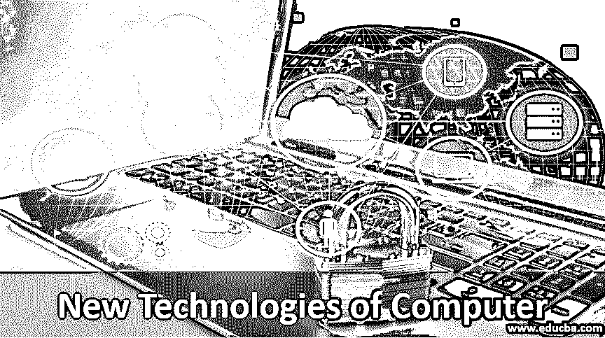
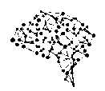
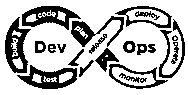

# 计算机新技术

> 原文：<https://www.educba.com/new-technologies-of-computer/>

## 计算机新技术介绍

当今世界被新的和新的技术所包围。新技术像眨眼一样开始被发明。如果我们不不断提升自己，我们就无法在这个世界上生存。现代计算机相关技术是我们以前使用的旧技术的再生。自 2002 年以来，计算机和信息技术产业的增长已经接近于与日俱增，增长率有了显著的变化。有了这些技术，人们的生活正在改变，这些将在下面进一步讨论。

### 计算机新技术

有很多技术给我们的日常生活带来了巨大的变化。由于计算机的发明，我们的生活变得容易多了。因此，我们在这里讨论已经持续改进并将持续改进的各种技术。

<small>网页开发、编程语言、软件测试&其他</small>

#### 1.人工智能

人工智能(AI)是第一个也是最重要的技术，它给当今的技术带来了一场革命。这并不是一项新技术，它已经起源了很长时间，但还没有达到最佳水平。但现在人工智能正被广泛应用，从智能手机到汽车和其他各种电子产品。这是最近的技术趋势，没有它，世界将无法生存。

#### 2.区块链

这项技术产生了虚拟货币，比特币，并在市场上大受欢迎。货币，比特币以越来越高的币率占领了整个世界。那些投资了比特币的人从这里获得了很多，因为这是一种虚拟货币。除此之外，区块链还有巨大的潜力，因为它几乎渗透到了目前从医疗保健到房地产的所有行业。

#### 3.增强现实和虚拟现实

AR 和 VR 技术都是快速出现的技术，让每个人都可以虚拟地体验，非常接近真实。过去几年，游戏、增强现实和虚拟现实设备有了显著增长。各种大型商业企业解决方案利用其用户，如在 3D 投影，运动手势，使其更具互动性和未来感。

#### 4.深度学习

深度学习，也就是基于机器学习的[，是基于人工神经网络的结构化学习。深度学习使用多层从原始输入中提取更高级别的输出。在图像处理中，边缘是较低层，而作为人类概念的脸、数字被认为是较高层。](https://www.educba.com/what-is-machine-learning/)

#### 5.角度编程

Angular 主要基于一个负责创建现代动态网络应用的 JavaScript 框架。基本上几乎没有返工，每当我们想使用 angular 在我们的 web 应用程序中添加新功能时，需要的代码更少。在 angular 和 CSS 的帮助下，我们曾经看到许多用户友好的移动应用程序。

#### 6.DevOps

这是一个奇怪的列表，因为这不是一种技术，而是一种方法。这个术语是开发和运营的组合，代表了 IT 文化，关注于通过采用敏捷环境快速交付服务。开发运维利用自动化工具，这些工具利用不断增加的可编程动态基础设施。它基本上是持续改进的过程，用于缩短软件开发生命周期。

#### 7.物联网

物联网仍然是最广泛采用的相关计算设备、数字机器、无需人与人或人与计算机交互即可传输数据的对象的用例。它通过单个监控中心连接各种无缝工作的设备，创建一个虚拟网络。所有设备都收集和共享有关其使用方式和运行环境的数据。

#### 8.网络安全

它是现代安全功能，有助于保护互联网连接的系统，包括硬件、软件和另一个安全漏洞。在技术快速发展的时代，数字攻击、泄露信息处于增长的边缘，网络安全成为一种趋势，有助于为这些有害层提供安全性。

#### 9.大数据

大数据是指那些负责访问和存储大量数据的数据。大多数现代公司[依靠大数据](https://www.educba.com/what-is-big-data/)来获得第一手的客户群、产品相关数据、营销研究等等。它不仅包含大量信息，而且有助于其他传统数据管理工具无法处理的过于庞大和复杂的数据管理。

#### 10.机器人过程自动化

机器人过程自动化允许每个人自动化日常例行和重复的任务。一个需要重复任务或流程才能继续的行业，在 RPA 的帮助下，一切都可以自动化，并且不需要编写复杂的代码来自动化此类任务。

### 在计算机中使用新技术的好处

计算机的发明彻底改变了整整一代人，目的是拉近人们的距离，拯救人们的生命，创造一种动态体验。

*   首先是所有现代技术的速度和灵活性。这些技术提供了人力资源，通过利用时间来减少工作量，提高产量。在新技术的帮助下，商业市场可以使用各种工具更快地做出决策，并且可以明智地使用资源。
*   出于存储和安全目的，甚至新技术也发挥了重要作用。
*   在计算机、相关技术和云计算的帮助下，人们可以选择在任何地方工作。这种灵活性的产生是因为新一代技术旨在舒适地工作。
*   另一个重要的优势是，新技术有能力使事情自动化，从而在存在重复性任务的情况下为员工减少工作量。
*   最后但同样重要的是，新技术为我们提供了一种将全球各地的人们联系起来的好方法。

### 推荐文章

这是一本计算机新技术指南。在这里，我们讨论了计算机的介绍和各种新技术，包括人工智能(AI)，区块链，深度学习(DL)等。您也可以阅读以下文章，了解更多信息——

1.  [云计算技术](https://www.educba.com/cloud-computing-technologies/)
2.  [微服务的特性](https://www.educba.com/what-is-microservices/)
3.  [计算机网络的类型](https://www.educba.com/types-of-computer-network/)
4.  [计算机语言的种类](https://www.educba.com/types-of-computer-language/)

