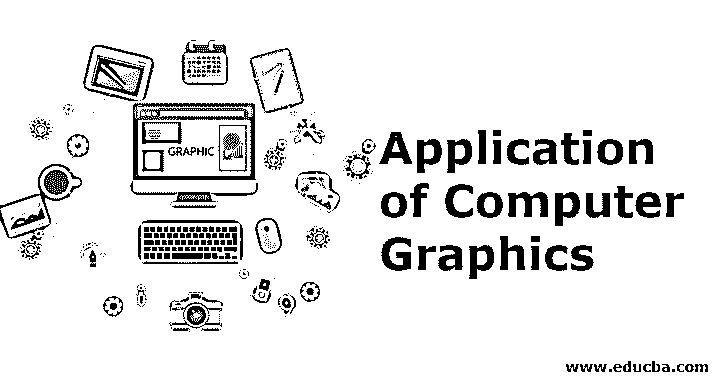
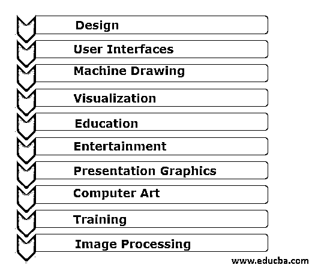

# 计算机图形学的应用

> 原文：<https://www.educba.com/application-of-computer-graphics/>

## 计算机图形学应用导论

在计算机屏幕上处理设计和图像的技术是计算机图形学。计算机图形是显示在计算机显示器上的数据的直观表示。计算机图形用于视频和计算机程序的创建、开发、科学建模、目录设计和其他商业艺术。今天，几乎每台机器都能够制作一些图形，人们甚至期望通过图标和图像来控制他们的计算机，而不是简单地打字。

### 计算机图形学的应用

现在我们将看到计算机图形的应用

<small>网页开发、编程语言、软件测试&其他</small>

#### 1.设计

发展与工程和建筑等领域相关联。而大多数开发人员在他们的应用程序中面临相似的困难并使用相似的方法。缺乏独特的解决方案是大多数设计问题的主要特征之一。因此，开发人员必须对一个可能的项目进行分析，然后进行修改，可能要修改几次，以试图找到更好的解决方案。

在这个反复的过程中，计算机图形学成为了必不可少的元素。例如，考虑计算机图形如何影响电子电路布局。程序员坐在工作站上，用图形输入设备，如鼠标，在屏幕上标记位置。初始显示屏可以由电路中使用的不同元件和安装电路的空白区域组成。

然后，开发人员将挑选并传输所需的元素，并用输入设备将这些元素附加到模型上。为了创建这第一个模型，系统使用了复杂的计算机图形。绘制电路元件，屏幕可能会移动。对于选项和位置，使用图形输入工具。可以使用各种助手来帮助开发人员正确定位元素，并执行诸如自动布线之类的任务。

#### 2.用户界面

通过使用计算机图形，人和机器之间的界面发生了巨大的变化。考虑到数字办公室。本书中的数字是由单一界面生成的。一个秘书坐在一个工作站上，而不是一张带打字机的桌子。客户端有一个类似操纵杆的指向系统，可以与工作站进行交互。有几个图标描述秘书可以执行的不同操作。例如，如果你指出并点击一个邮箱图标，任何电子邮件都可以显示在你的屏幕上。

客户应该用纸盒图标来处理不需要的邮件，而文件柜图标可以用来保存信件或其他文件。我们的电路设计框架将包括一个类似的图形界面。在本书的上下文中，我们将这些界面视为计算机图形的明显用途。然而，从使用办公自动化或电路编程器的秘书的角度来看，图像是项目的次要元素。虽然从来没有人写过图形程序，但大多数计算机用户都使用计算机图形。

#### 3.机械制图

计算机图形经常用于不同机器部件和整个机器的设计、修改和开发，主要是由于从该图中获得的准确性和清晰性，以便机器的安全制造商使用该图。

#### 4.形象化

今天对可视化的需求已经急剧增加，许多先进技术将会看到对可视化的需求。数据可视化帮助我们深入了解信息，以分析和研究我们周围系统的兼容性。

#### 5.教育

计算机生成的模型对于大量概念和基础的教学、理解和学习非常有用。可以用计算机图形学开发几个教育模型，通过这些模型可以激发学生对这个话题的兴趣。

#### 6.娱乐

它的大部分产品通过计算机图形应用于电影和游戏行业。用于电影、电视剧、音乐视频动画电影和创作。计算机图形有助于在游戏行业中有效地提供这些功能，在游戏行业中，注意力和交互性是主要因素。

#### 7.演示图形

准备报告或总结会计、数字、政治、数学、科学和管理报告、研究报告以及条形图、时序图、饼状图等的开发。

#### 8.电脑艺术

我们可以通过包括动画和绘画在内的计算机图形来创造精美的商业艺术。这些包提供了建模物体形状和定义物体运动的工具。

#### 9.培养

可以使用模拟器等专门的培训方法来培训候选人，以便在短时间内更好地理解他们。用计算机图形学建立训练模块很简单也很有用。

#### 10.图像处理

特定类型的照片或照片需要进行编辑，以便在不同的位置使用。计算机图形学的许多技术之一是将现有的图像转换成优化的图像，以增强它们的理解。

### 结论-计算机图形学的应用

这里我们看到了计算机图形的各种应用。这些是一些计算机图形应用程序，它们的受欢迎程度已经大大提高，并将随着技术进步而继续提高。我希望这篇文章对你有所帮助。

### 推荐文章

这是计算机图形学应用的指南。这里我们讨论计算机图形的 10 大应用。您也可以看看以下文章，了解更多信息–

1.  [什么是运动图形？](https://www.educba.com/what-is-motion-graphics/)
2.  [计算机内存的类型](https://www.educba.com/types-of-memory-in-computer/)
3.  [大型计算机的种类](https://www.educba.com/types-of-mainframe-computers/)
4.  [什么是计算机科学？](https://www.educba.com/what-is-computer-science/)

