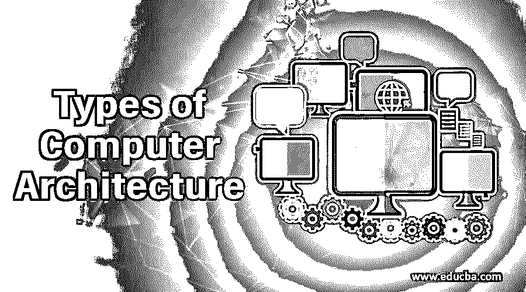
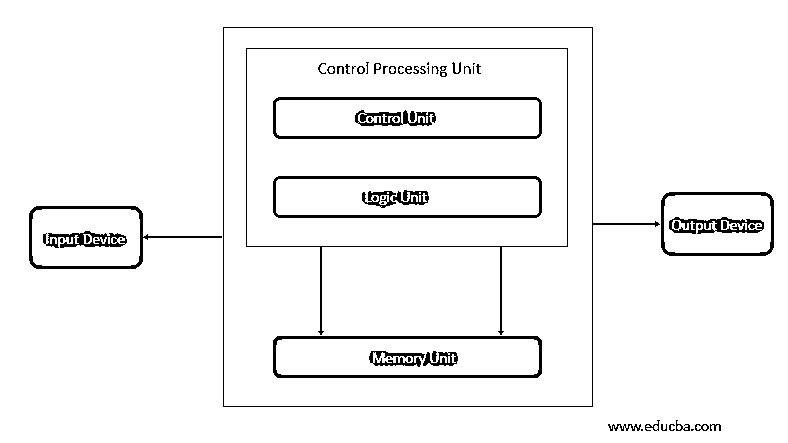
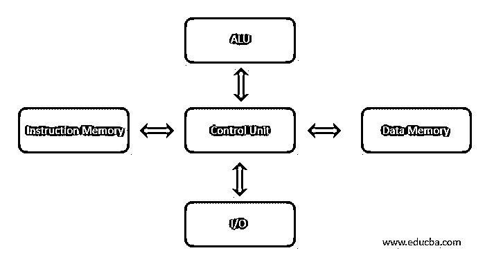

# 计算机体系结构的类型

> 原文：<https://www.educba.com/types-of-computer-architecture/>

## 计算机体系结构类型介绍

计算机体系结构由描述计算机系统的实现和功能的规则、方法或过程组成。体系结构是根据用户的需求构建的，并考虑了经济和财务限制。早期的建筑是在纸上设计，用硬件形式建造。

在内置晶体管-晶体管逻辑之后，以硬件形式构建、测试和形成该架构。我们可以根据计算机系统的性能、效率、可靠性和成本来定义计算机体系结构。它处理[软件和硬件](https://www.educba.com/hardware-vs-software/)技术标准。计算机系统有处理器、内存、I/O 设备和与之相连的通信通道。

<small>网页开发、编程语言、软件测试&其他</small>

### 计算机体系结构的类型

下面给出了计算机体系结构的类型:

#### 1.冯-诺依曼架构

这个架构是由约翰·冯·诺依曼提出的。现在我们使用的计算机是基于冯-诺依曼体系结构的。它基于一些概念。

内存我们有一个读/写内存，可用于读写指令和数据。当我们谈到内存时，它只不过是用于读写数据指令的单一位置，指令也存在于其中。数据和指令存储在计算机系统内的单个读/写存储器中。

每个存储器具有多个位置，并且每个位置具有唯一的地址。我们可以根据存储器的位置对其内容进行寻址，而不管存储器中存在什么类型的数据和指令，因为这样我们就可以读取或写入任何数据和指令。除非需要更改，否则执行总是按顺序进行。例如，假设我们正在执行第 1 行到第 10 行的指令，但现在我们需要执行第 50 行而不是第 11 行，然后我们跳到指令 50 并执行它。

有一条总线(地址总线/数据总线/控制总线)用于指令和数据代码的执行。输入设备接收数据或指令，中央处理器(CPU)一次执行一个操作，从内存中取出数据或指令。一旦操作完成，它就被发送到输出设备。用于处理操作的控制和逻辑单元在中央处理器内。

#### 2.哈佛建筑

当数据和代码存在于不同的存储块中时，使用哈佛架构。数据和指令需要单独的内存块。数据可以由一个存储器位置访问，而指令可以由不同的位置访问。它的数据存储完全包含在中央处理器(CPU)中。需要单组时钟周期。管道是可能的。设计起来很复杂。CPU 可以读写指令和处理数据访问。哈佛体系结构具有不同的访问代码和数据地址空间，也就是说，指令地址零不同于数据地址零。指令地址零标识 24 字节值，数据地址零标识不属于 24 字节值的 8 字节值。

修改后的哈佛体系结构类似于哈佛体系结构机器，它有一个公共的地址空间用于独立的数据和指令缓存。它的数字信号处理器将执行小型或高度音频或视频算法，它是可复制的。微控制器拥有少量程序和数据存储器，通过执行并行指令和数据访问加快处理速度。

我们可以在下图中看到，有单独的数据和指令存储器，这是一条可用于执行操作的总线。它完全包含在中央处理器中。它可以同时执行输入/输出操作，并具有独立的算术和逻辑单元。

#### 3.指令集体系结构

要组成架构，需要指令集架构，因为它有一组处理器能理解的指令。它有两套指令集，一套是 RISC(精简指令集计算机),另一套是 CISC(复杂指令集计算机)。

精简指令集计算机体系结构是由 IBM 在 90 年代实现的。指令有多种地址模式，但程序并不使用所有的地址模式，这就是减少多种地址模式的原因。这有助于编译器轻松地编写指令，提高执行效率。

复杂的指令集体系结构是编译器的根源，因为早期的编译器不在那里写程序，为了方便编程增加了指令。使用来自 ISA 的简单指令可以获得最佳性能。

#### 4.微结构

微体系结构被称为计算机组织，它是指令集体系结构内置处理器的方式。指令集体系结构由各种微体系结构实现，并且随着技术的变化而变化。

微体系结构以某种方式运行。它读取指令并对其进行解码，找到并行数据来处理指令，然后处理指令并生成输出。

它用于微处理器、微控制器。一些体系结构在执行时会重叠多条指令，但这在微体系结构中不会发生。需要像算术逻辑单元、浮点单元、加载单元等执行单元，它执行处理器的操作。系统内有微体系结构决策，如大小、延迟和存储器的连接性。

#### 5.系统设计

名称定义了它自己，设计将满足用户的需求，例如系统的架构、模块、接口和数据，并且它与产品开发相关联。它是获取市场信息并创造产品设计以供生产的过程。模块化系统是由标准化的硬件和软件组成的。

### 结论

我们已经了解了计算机体系结构及其类型。功能、实现如何在处理中工作。需要指令集架构来进行必要的指令执行，并且[数据处理应该](https://www.educba.com/what-is-data-processing/)在不同类型的计算机架构中的不同且单一的存储器位置中进行。执行读/写操作。

### 推荐文章

这是一个计算机体系结构类型的指南。这里我们详细讨论了计算机体系结构的基本概念和不同类型。您也可以看看以下文章，了解更多信息–

1.  [。NET 框架架构](https://www.educba.com/dot-net-framework-architecture/)
2.  [数据挖掘架构](https://www.educba.com/data-mining-architecture/)
3.  [Unix 架构](https://www.educba.com/unix-architecture/)
4.  [什么是虚拟机？](https://www.educba.com/what-is-virtual-machine/)

