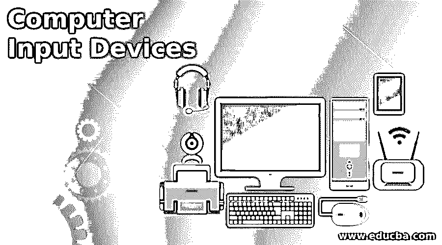

# 计算机输入设备

> 原文：<https://www.educba.com/computer-input-devices/>

## 计算机输入设备介绍

计算机输入设备是向计算机传输数据的硬件。使用最广泛的输入工具是鼠标、键盘等等。主要区别是前者向计算机发送数据，后者从计算机提取数据。外围设备或辅助设备被称为具有附加特性的输入和输出设备。

### 计算机输入设备列表

现在我们将看到一些计算机输入设备，如下所示

<small>网页开发、编程语言、软件测试&其他</small>

#### 1.触摸屏设备

触摸板是电脑鼠标的常见替代品，也称为轨迹板。这主要是一个复杂的表面，可以感应用户手指的运动，并使用它来操作设备。笔记本电脑的触控功能最早出现在 20 世纪 90 年代；没有这种功能的笔记本电脑现在已经很少见了。

#### 2.数码相机

使用数码相机分别收集图像和视频。之后，通过将相机直接连接到电缆，取出存储卡，并将其放在计算机上，可以将视频文件和照片传输到计算机。图片一旦进入电脑，就可以编辑、保存、通过电子邮件发送或打印。

#### 3.图形输入板

图形输入板也称为数字化仪，是用于手绘图像转换的输入工具。使用触笔，用户可以在像一张纸一样特别平坦的表面上绘图。图纸可以编辑、保存或显示在计算机屏幕上。虽然扫描仪只能从草图中产生数字图像，但图形输入板允许艺术家在制作时实时看到他们的图纸，提供了更大的控制和灵活性。

#### 4.触摸屏

如今，许多应用程序不再使用鼠标，而是使用触摸屏，在显示器上拖动或选择用户选项。顾名思义，灵敏的监视器对手指的经过做出反应。移动设备尤其受触摸屏的欢迎，如笔记本电脑、掌上电脑、平板电脑或智能手机。

#### 5.麦克风

麦克风被采集并以数字格式发送到设备。麦克风记录音频。数字化后，音频可以播放、复制、编辑、上传和通过电子邮件发送。麦克风也可以用作视频聊天或音频流的一部分，以录制音频或传输现场声音。

#### 6.扫描仪

在计算世界中，术语“扫描仪”，但在这里我用它来指桌面图像扫描仪，可以以各种方式使用。一般来说，扫描仪是一种输入设备，用于通过信号的数字图像转换通过机器传输图像(或通常是文本)。您可以在编辑、录制、通过电子邮件发送、监控或打印的屏幕上查看数字图像。

#### 7.键盘

最常见的输入设备是键盘。使用穿孔卡片和纸带与计算机进行交互通常是在使用键盘之前进行的。在大多数英语键盘中，字母键的 QWERTY 布局被数字、功能、符号和其他关键字符所包围。用户通过按相应的键将数据和指令插入机器。

#### 8.老鼠

每个在鼠标垫上移动鼠标的用户都在计算机显示屏上相应的方向上移动鼠标垫，但这种鼠标通过一种称为“点击”的机制与设备进行通信电子鼠标的想法源于轨迹球，它是在 1946 年发明的，使用所谓的滚球来引导指针。大多数当代的电脑鼠标都有两个点击按钮和一个滚轮在中间，用来上下滚动网页。

#### 9.网络摄像头

数码相机在两个方面不同于网络摄像头。一是不能脱离电脑独立工作，二是没有集成内存。网络摄像头最常用于直播视频或创建视频聊天，但它们也可以捕捉图像或视频。

#### 10.操纵杆

操纵杆通常在计算机视频游戏中用于控制角色和车辆。在底座上旋转并将其角度或方向作为数据发送给计算机的手柄是操纵杆。许多视频游戏操纵杆有激活器、按钮、手柄和手臂，在游戏中可以按下。

#### 11.光笔

光笔是一种类似钢笔的尖头装置。它用于从显示的菜单项中选择或绘制监视器屏幕上的图像。它由一个光电池和一个小管光学系统组成。

### 结论

在本文中，我们看到了各种向计算机系统提供控制信号和数据的计算机输入设备。你可以根据自己的需要选择任何一种。我希望这篇文章对你有所帮助。

### 推荐文章

这是计算机输入设备指南。在这里，我们讨论了计算机输入设备的介绍和 11 大设备。您也可以浏览我们的其他相关文章，了解更多信息——

1.  [计算机语言的种类](https://www.educba.com/types-of-computer-language/)
2.  [计算机体系结构的类型](https://www.educba.com/types-of-computer-architecture/)
3.  [计算机软件的种类](https://www.educba.com/types-of-computer-software/)
4.  [计算机硬件的类型](https://www.educba.com/types-of-computer-hardware/)

