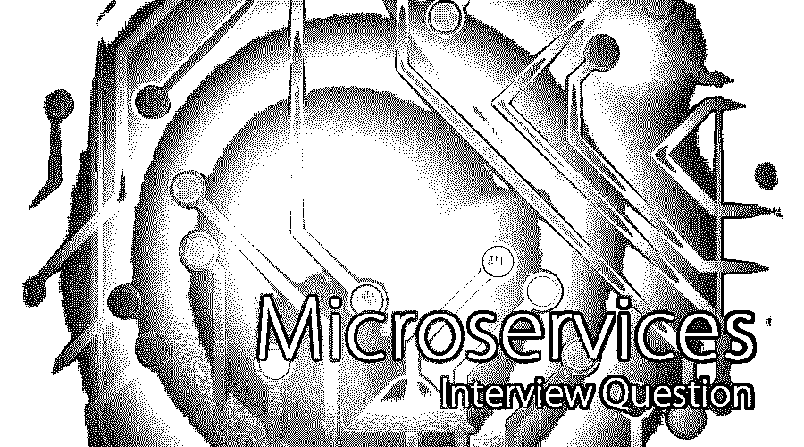

# 微服务面试问题

> 原文：<https://www.educba.com/microservices-interview-questions/>

## 微服务介绍面试问答

微服务是一种架构风格模式，在软件开发过程中实现，以松散耦合组件的形式开发应用程序。这是一种面向服务的架构风格，目前正被用来以小型松散耦合组件的形式实现和开发更大的复杂应用程序。这些微服务更多地受益于 DevOps、CI/CD 和敏捷方法的使用，以在当前的动态业务需求中交付快节奏的产品。与过去的单一软件系统相比，开发微服务的核心组件是模块化模式或开发形式。在微服务架构中可以使用不同的编程语言来开发和集成不同类型的应用。微服务允许跨技术开发的应用程序轻松集成。

现在，如果你要找一份与微服务相关的工作，那么你需要准备 2022 年微服务面试问题。的确，每个面试都因不同的职位而不同。在这里，我们准备了重要的微服务面试问答，帮助你在面试中获得成功。

<small>网页开发、编程语言、软件测试&其他</small>

在这篇 2022 年微服务面试问题的文章中，我们将介绍 10 个最重要和最常用的微服务面试问题。这些问题分为以下两部分:

### 第 1 部分–微服务面试问题(基础)

第一部分包括基本的微服务面试问题和答案

#### Q1。什么是微服务，解释一下他们的架构？

**回答:**
微服务是软件开发过程中使用的一种架构模式，其中包含许多小服务。每个微服务还仅限于单个业务应用。所有这些微服务共同形成一个更大或更复杂的应用程序，从整体上满足业务需求。微服务的关键设计组件是灵活的或适应性强的、可伸缩的、松散耦合的、可组合的、面向业务的、组件化的、分布式的、分散的，

#### Q2。微服务应用有哪些不同的特性？

**答案:**
这是面试时问的基本微服务面试问题。请在下面找到微服务支持的不同表格:

*   **持续开发:**持续集成和持续开发是持续开发中的两个主流，它们驱动着应用程序的频繁发布和部署。
*   **基于组件的**:每个微服务都被视为一个组件，可以轻松升级、修改或替换为合适的等效组件。
*   **松耦合:**这使得应用程序的构建变得非常容易和快速，这将进一步有助于更快地交付产品。
*   **可伸缩性:**更容易根据用户数量来扩展应用程序。

#### **Q3。** **什么****是 Spring Boot？**

**答:**
Spring Boot 是 Pivotal Inc .作为基于 Spring 的应用程序开发和维护的生产级应用程序开发框架。它还用于开发独立的应用程序。服务器将位于运行时依赖库内，作为嵌入式服务器。数据源连接可以通过单个配置文件轻松管理，从而轻松连接到任何类型的数据库。这可以通过使用 Maven 或 Gradle 等项目构建工具，使用已启动的项目来开发。

#### Q4。什么是春云？

**答:**
Spring Cloud 是一个基于微服务架构的框架，用于开发云应用，简化云应用的维护、开发和部署。使用 Pivotal Inc .开发的 Spring Cloud Services 可以轻松开发云服务。微服务可以配置并连接到 Spring Cloud 应用程序，形成微服务架构。

让我们进入下一个微服务面试问题。

#### Q5。微服务应用程序使用了哪些不同的工具来简化开发过程并使设计流程更加灵活？

**答:**
以下工具是配合微服务架构应用使用的:

*   容器
*   管弦乐编曲
*   云基础设施
*   api 网关
*   企业服务总线(ESB)
*   服务发现

### 第 2 部分–微服务面试问题(高级)

现在让我们来看看高级微服务面试问题。

#### **Q6。** **微服务架构的** th **e** 优势**有哪些？**

**答案:**
微服务架构软件系统的优势如下:

*   它们是可扩展的。
*   他们是可靠的。
*   在更短的时间内更容易、更灵活地开发复杂的应用程序。
*   灵活运用多种技术。
*   促进持续发展
*   容错
*   隔离元件和应用
*   跨平台和操作系统的多技术堆栈
*   组件的独立部署和开发
*   安全代码和应用程序

#### **Q7。** **微服务中有哪些** t **何**不同**类型的**架构**测试？**

**答案:**
微服务中不同类型的架构测试如下:

*   顶层:不同类型的顶层测试被归为验收测试
*   **中级:**不同类型的中级测试有回归测试、性能测试、压力测试等。,
*   底层测试:不同类型的底层测试属于性能测试或单元测试的范畴，它们很容易被自动化。

让我们进入下一个微服务面试问题

#### **Q8。** **什么是**容器，**为什么要用在微服务中？**

**答:**
容器定义为将所有需要的组件打包成一个单一的包，以便通过虚拟化其运行时环境，使其独立于所有其他组件或操作系统。容器最好与微服务一起使用，以使它们松散耦合并易于使用。容器将有助于使微服务应用程序更加可伸缩、松散耦合、易于部署和维护。该容器将有助于在更短的时间内加快应用程序的处理速度。Windows 容器还包含一个 Hyper-V 容器，其工作方式是主机容器不与 Hyper-V 容器共享。

#### Q9。Docker 是什么，它如何与微服务一起使用？

**答案:**
这是面试中被问得最多的微服务面试问题。Docker 也叫容器化的过程，使操作系统级别的过程成为虚拟化。这是一个用于打包和运行容器的计算机程序。所有的集装箱都将放在码头上。所有容器将由单个操作系统内核运行或管理，这导致比现有虚拟机级操作系统进程更轻量级。Docker 包含一个守护进程，管理 Docker 中的所有容器。Docker 拥有高级 API(应用程序编程接口)来公开轻量级 API，以便运行隔离的进程。

#### Q10。Docker 有哪些用途？

**答案:**
Docker 的不同用途或应用如下:

*   更简单的配置
*   高效的开发技术
*   孤立的应用
*   整合的服务器功能
*   更简单、更强大的调试工具
*   快速应用开发
*   易于管理
*   持续开发和部署
*   连续监视

### 推荐文章

这是一个微服务面试问题和答案列表的指南，以便候选人可以轻松地解决这些微服务面试问题。在本帖中，我们研究了顶级微服务面试问题，这些问题在面试中经常被问到。您也可以阅读以下文章，了解更多信息——

1.  [冬眠面试问题](https://www.educba.com/hibernate-interview-questions/)
2.  [UI 开发者面试问题](https://www.educba.com/ui-developer-interview-questions/)
3.  [IT 安全面试问题](https://www.educba.com/it-security-interview-questions/)
4.  [网络安全面试问题](https://www.educba.com/cyber-security-interview-questions/)

