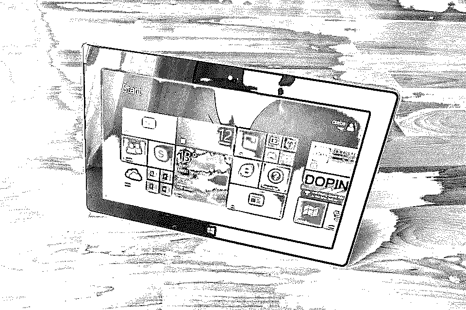
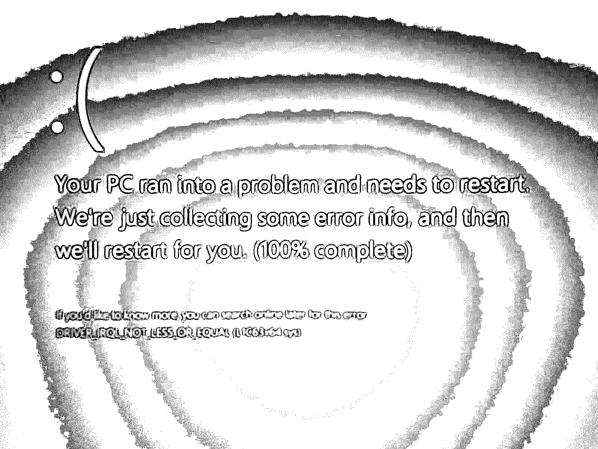
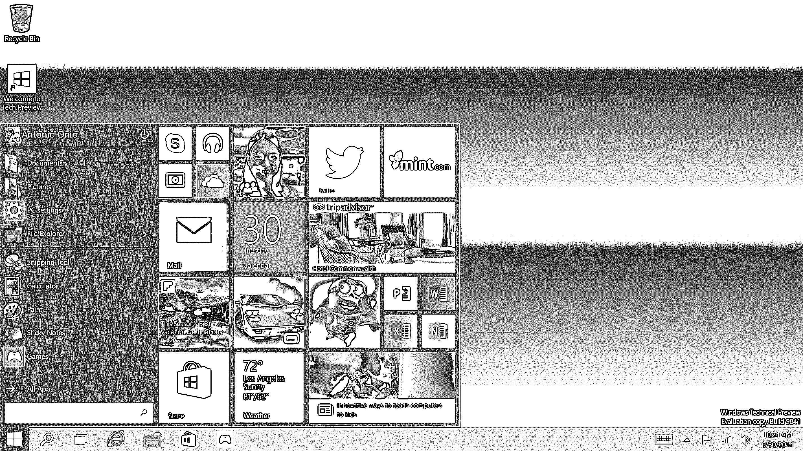
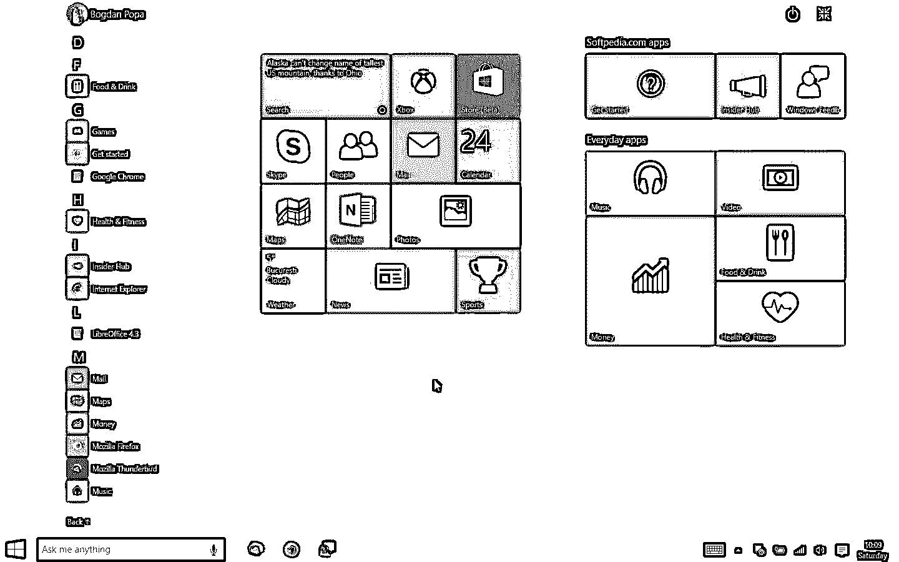
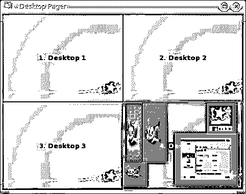

# Windows 10 桌面模式

> 原文：<https://www.educba.com/windows-10-desktop-mode/>

 

## Windows 10 桌面模式介绍

所以，似乎微软这次已经发布了 Windows 10 桌面模式的新更新。呃…这不是更新，这是升级。至少目前微软是这么说的。

上次微软发布升级(Windows 8 和 8.1)时，由于 Windows 8 的拖沓和吃内存性能，大多数人都相当恼火。

<small>网页开发、编程语言、软件测试&其他</small>

然而，微软声称它应该比 Windows 7 更快。但唯一更好的是 Windows 8 的启动时间。

甚至有人批评 windows 8 的新 Metro，它实际上对平板电脑和敞篷车来说很棒，但对笔记本电脑或台式机来说呢？不…试想一下，你有一个 32 英寸的高清 1080p 分辨率显示器，而你所有的空间都被开始菜单占用了。是啊。太可怕了。

此外，更不用说 Windows 8 的更新让它永远处于启动循环和极端系统崩溃的事实了。不过，你可以安装第三方应用程序，恢复旧的开始菜单，就像所有版本的 Windows 10 桌面模式的开始菜单 7 一样。

但是，无论你使用多少第三方应用程序，结合在一起，都不足以应对过去发生的崩溃；尤其是因为更新。我可以断定，你们大多数人甚至可能对下面的截图很熟悉。

 

然而，你可以关闭更新并阻止 windows 8 崩溃，但这将再次阻止你进行大量必要的安全和兼容性更新，这又是一场精神平静的混乱。

是啊。两年前当我安装 Windows 8 时，我非常恼火，尤其是上面的笑脸，因为我几乎每隔一天就会看到它。这似乎更多的是嘲笑我的崩溃，而不是哭泣。

这就是我从双启动 Windows 10 桌面模式和 Linux 切换到全职 Linux 的主要原因。但随着新的 Windows 10 桌面模式的推出，让我们看看这是否会改变骰子。

### Windows 10 桌面模式看起来

这是大多数 windows 10 新桌面用户都会满意的。默认的 UI 主题本质上是黑色的。Metro 开始菜单不见了。现在你可以恢复原来的开始菜单，类似于 Windows 7 的菜单，不会占用整个显示器。

相反，你得到的是 Windows 7 和 Windows 8 的开始菜单的组合，它们都在一个开始菜单中。

 

是的，它们看起来很酷，比 Windows 8 好得多，因为它们不像 Metro UI 那样滞后。我要说的是，即使是动画和主题也相当不错。有些人仍然更喜欢 Windows 8 的开始菜单。

所以对他们来说，活瓷砖还是有的。然而，对于想要 Metro UI 的人来说，他们仍然可以在不安装任何第三方应用程序的情况下恢复 Windows 8 开始菜单(占据整个屏幕)。

难怪，尽管 Windows 8 给它带来了诸多负面影响，但这次它保留了很多选择。当你有一个可转换的小屏幕平板电脑时，Windows8 开始菜单的这一部分非常方便。windows 10 新桌面最棒的一点是你可以根据自己的意愿调整开始菜单的大小。

 

恼人的强制热点角落已在这里被删除，一个新的行动中心取代了旧的通知中心。通过这种方式，它收集所有的警报和东西。

### 多重任务

使用 Windows 10 新桌面进行多任务处理变得更加简单。看起来微软已经经历了很多 Mac 和 Linux 的事情，才把它们融合在一起。微软推出了一项名为 Snap 的新功能。

在这里，你可以将一个窗口拖到屏幕的一角，让它使用你屏幕的一半大小，类似于 Windows 8，但体验要好得多，也更流畅。

但同样，与 Windows 8 不同，所有剩余的应用程序都将显示在屏幕的剩余一半，如果你问我，这很好。如果您使用扩展或多桌面环境，这种方式可以安排很多事情。

如果你有一个平板电脑或可转换的触摸屏，你甚至可以从屏幕的左侧滑动，以显示所有打开的应用程序的列表。

除了快照功能，微软还推出了一个新功能，称为任务视图。这似乎更像是我们在 Mac 上拥有的任务控制功能。

通过任务视图，您可以在单个屏幕上显示所有打开的 windows 10 新桌面。有了这些东西，看起来微软更关注多任务处理，并希望它的用户也能轻松地做同样的事情。

### 虚拟桌面

是的。这似乎不同寻常。许多使用 windows 7 的 Linux 用户和大多数精通技术的人可能知道这一点。Linux 和 Mac 都有虚拟桌面。如果你不知道那是什么意思，看看下面。

 

*图片来源:microsoft.com*

在 Linux 中，这被称为工作区。如果你是 Mac 用户，很可能你也知道这一点。甚至在 Windows 10 桌面模式中也引入了这一功能。使用 Windows 7 的人可能习惯使用第三方应用来强制这多个桌面，但还是那句话，谁能依赖第三方应用。

考虑到这些事情，微软再次改进了这个功能的多任务处理。但与 Mac 不同，在 Mac 上，你只需用三个手指(在触控板上)向右或向左滑动，就可以轻松地在桌面之间切换，而在 Windows 10 桌面模式下，你不能做同样的事情。

你必须特别地按下视窗键、控制键和左或右按钮，这取决于你的需要。

### 互联网浏览和语音控制

在这一类别中，微软推出了两款新应用。和 Edge 浏览器，而不是 windows 10 桌面模式和 Cortana 的默认 internet explorer。是啊！这是超赞的 Cortana。

*   #### edge

Edge 完全不同于旧的 Internet Explorer。它由许多来自 Chrome 等现代浏览器的 Windows 10 桌面模式新功能组成，并内置了许多东西。

如果这还不够，它甚至允许人们自定义自己。首先，看看窗口的边缘，你会似乎意识到这些属性来自 Mozilla Firefox 和 Google Chrome。

它的 run fast 拥有流畅的动画，在 HTML5 支持方面与竞争对手不相上下。看起来微软在网络浏览器的安全上花了很多时间。

一看，你就会发现许多丑陋的特征都被去掉了。ActiveX、丑陋的 Silverlight、VBScript 和其他吸引恶意软件的东西。你甚至可以通过开关手动关闭 Adobe Flash Player。

它内置了很多应用程序，比如 chrome、PDF 阅读器等等。到目前为止，edge 还不支持扩展，但是微软承诺在不久的将来会支持。

*   #### Coltat

不知道 Cortana 的举手。好吧，我没看到有人举手。而这也正是 Cortana 的出名程度。如果你不知道 Cortana，那么你可能必须关闭所有的门。

Cortana 是微软开发的 AI(人工智能)或语音控制。到目前为止，我们只在 Lumia 等 Windows 10 手机中看到过它。

但是现在，它也被引入到桌面系统中。Cortana 不仅仅是语音控制。如果你觉得无聊，你甚至可以和 Cortana 聊天。是啊。它就是这么聪明。例如，如果你问“谁是你的父亲？”，你会得到一个像比尔·盖茨一样的答案，里面有很多解释。更像是 Mac 上的 Siri 和 Android 的 Google Voice。

你甚至可以选择“嘿，Cortana ”,类似于 Android 中的“嘿，谷歌”。你可以使用 Cortana 发送信息和简短的电子邮件，编写基于语音的描述，甚至不用触摸鼠标就可以从头开始创建电子邮件。你还可以获得天气预报，记笔记，以及类似于 Android 的搜索浏览器。

### 好吧！很多好东西。有什么条件？

是啊。虽然 windows 10 的功能更新有很多好的方面，但这里几乎没有任何亮点。你们中的大多数人可能已经免费下载了 Windows 10 功能更新。但它并不是真正免费的。如果你注意到了，你可能会不时地在 Metro-tiles 上看到一些广告。也许广告是免费获得 Windows 10 功能更新的代价。

还有很多其他 Windows 10 的功能，这些功能并不全。照片应用程序仍然落后。虽然媒体中心已经不在了，但新的 Windows 10 播放器无法播放 mkv 和 DVD 文件，这很烦人。

一个人最终不得不转向 VLC。在现在名为 Groove 的新音乐应用程序中管理播放列表甚至相当困难。敞篷车还有一个功能，可以从鼠标切换到触摸屏，这就是 Continuum，但它仍然有硬件问题。

### 结论

所以，问题是生存还是毁灭。在我们的情况下，它是安装或不安装。坦率地说，我肯定会试一试。因为比起 Windows 10 的功能更新，我总是更喜欢 Linux，不过，我会通过双启动我的桌面来尝试一下。微软已经取得了长足的进步，树立了许多里程碑。

虽然 Windows 10 还处于年轻阶段，但很高兴看到它给 Mac 带来了竞争，如果不是 Linux 的话。至少这很容易，而且将永远是使用 Windows 10 而不是 Mac，除非你是一名程序员和一个精通技术的家伙。

第一张图片来源:pixabay.com

### 推荐文章

这是 Windows 10 桌面模式的指南。这里我们讨论了一个简要的概述，windows 10 的外观，虚拟桌面，互联网浏览和语音控制。您也可以看看以下文章，了解更多信息–

1.  [电子邮件礼仪规则](https://www.educba.com/email-etiquette-rules/)
2.  [Windows 面试问题](https://www.educba.com/windows-interview-questions/)
3.  【Windows 10 生产力提示
4.  [Windows Server 面试问题](https://www.educba.com/windows-server-interview-questions/)

