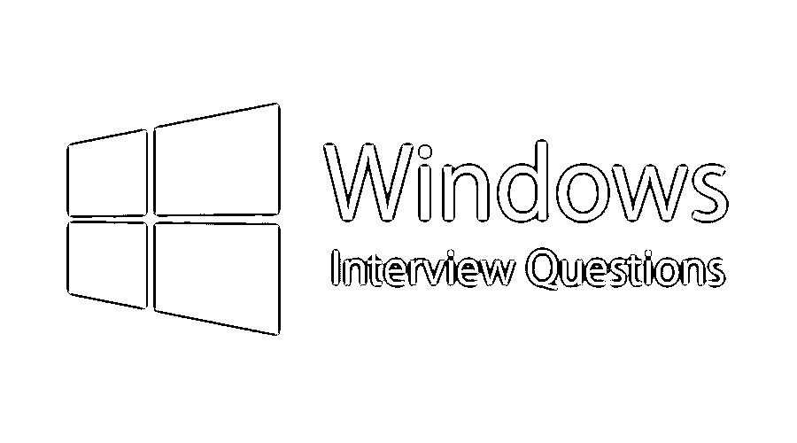

# Windows 面试问题

> 原文：<https://www.educba.com/windows-interview-questions/>

## 简介 Windows 面试问题和答案

窗口是计算机系统中屏幕上的一个观察位置，作为 GUI(图形用户界面)的一部分，它允许多次观察。基本上，窗口是由 IT 巨头微软公司开发、营销和销售的一系列 OS(操作系统)。它最终发布了许多版本；windows 版本的每个版本都必须包括对图形用户界面的改进支持，使通信用户可以轻松查看 Windows 中的文件和文件夹。

IT 巨头微软公司在 1985 年 11 月 20 日推出了名为 Windows 的操作环境，作为 MS-DOS 的图形操作系统外壳。1985 年发布的第一个 Windows 版本是一个简单的图形用户界面，是微软现有磁盘操作系统(MS-DOS)的扩展。在 Windows 进入市场之前，计算机系统使用一系列用于操作的文本命令。

<small>网页开发、编程语言、软件测试&其他</small>

在过去的二十年里，Windows 是个人电脑系统中发展最快、使用最广泛的操作系统。微软视窗的美妙之处在于它是为个人和专业目的而设计的，这使用户更加方便。

以下是 windows 的一些主要优势和功能:

*   Windows 允许用户与系统交互(使用键盘、鼠标、麦克风等)。).
*   它控制计算机系统中的内存分配和数据存储。
*   它控制并入计算机系统的硬件，如扫描仪和打印机等。
*   为了计算机的安全，Windows 控制用户对计算机的访问。

一个重要的特点是它允许用户同时在电脑上做几个任务

在 Windows 中准备工作面试。我相信你想知道最常见的 Windows 面试问题和答案，这将有助于你轻松破解 Windows 面试。以下是 Windows 面试中常见的问题和答案，分为两部分:

### 第 1 部分–Windows 面试问题(基础)

第一部分包括基本的面试问题和答案

#### 1.解释一个操作系统的主要目的？

**答案:**
操作系统的构建主要出于两个目的:

*   操作系统被设计成通过管理计算机系统的所有活动来确保计算机系统运行良好。
*   操作系统为代码开发和程序执行提供了环境。

#### 2.微软视窗的目的是什么？

**答案:**

*   微软 windows 是市场上的大巨头之一，它作为大多数台式机和笔记本电脑系统的核心提供服务，90%以上的运行版本是 Windows 操作系统。
*   Windows 为所有程序提供了一个运行平台。在过去的三十年里，微软开创并统治了这个市场，它总是增加更多的功能来改进用户界面，使其更容易使用。

#### 3.操作系统的功能是什么？

**答案:**

*   微软视窗是一种计算机操作系统，其编程代码不向公众公开。
*   操作系统(OS)是在计算机硬件上运行的核心软件代码/程序之一，它产生并帮助用户与硬件交互，然后它可以发送命令(输入)并接收作为输出提供的输入的结果。它的功能是为所有软件执行命令提供一个一致的环境。

#### 4.什么是 Windows Server？

**答:**
windows server 是微软公司开发的一系列服务器操作系统。这是 Windows 面试中常见的问题。

#### 5.解释在 windows DNS 服务器中什么是主要、次要和存根区域？

**答案:**
DNS ( [域名系统](https://www.educba.com/what-are-the-types-of-dns-servers/))服务器是在 DNS 中进行名称解析过程的系统。DNS 服务器由称为区域文件的文件组成，它使它们能够将名称解析为 IP 地址，反之亦然。

*   **主区域:**在该区域中，文件将被保存为普通文本文件，扩展名为**。dns"**
*   **辅助区域:**在该区域中，它在另一个支持的 DNS 服务器中保存和维护区域数据库的只读副本数据。此外，它还通过支持容错和负载平衡来为主服务器提供备份服务器。
*   **存根区域:**该存根区域包含所有名称服务器和 SOA 记录的副本，用于减少 DNS 搜索订单。

### 第 2 部分–Windows 面试问题(高级)

现在让我们来看看高级面试问题。

#### 6.解释线程和计算机进程的区别？

**回答:**
线程和计算机进程之间有很多不同之处，其中一些如下:

*   **计算机进程**:计算机进程是计算机程序的一个实例，它将由一个帮助并行运行几个程序的计算机系统顺序(一个接一个)执行。
*   线程:一个线程是几个可执行程序的集合，它们作为一个进程一起工作。例如，一个线程将向用户发送一条错误消息；另一个将处理错误信号，而第三个线程可能正在执行程序的原始动作。

#### 7.解释部署本地 DNS 服务器的目的是什么？

**答案:**
这是 Windows 面试中问得最多的面试问题。本地 DNS 服务器提供完全合格的域名&到 IP 各自地址的本地映射。并且为了解决与计算机网络上的域名相关的远程请求，本地 DNS 服务器可以向远程 DNS 服务器提供记录信息。

#### 8.要检查 TCP/IP 配置和 IP 连通性，可以使用哪两个命令行实用程序？

**答案:**

*   Ipconfig : ipconfig 是检查计算机 IP 配置的命令，也可用于更新客户端的 IP 地址(仅当它由 DHCP 服务器提供时)。
*   **Ping** : Ping 命令用于检查本地计算机和网络上任何其他计算机设备之间的连接。

#### 9.解释本地服务器上 NTFS(新技术文件系统)和 FAT(文件分配表)的主要区别是什么？

**答案:**
FAT(文件分配表)和 FAT32 为计算机系统的本地用户提供安全性，同时 NTFS(新技术文件系统)为域用户和本地用户提供安全性。NTFS 还提供了文件级的安全性，这是 FAT32 无法实现的。

#### 10.什么是活动目录？

**答:**
Active directory (AD)是一个目录，由微软开发，用于存储对象(例如:用户信息、计算机、打印机、网络信息)，Active Directory 还提供了 Active Directory 数据库来有效地管理位于不同位置的多个域控制器的计算机网络，这些数据库能够管理/更改来自任何域控制器的 AD，这些数据库将被复制到所有其他 DC，集中管理多个地理位置，并对 Windows 域中的用户和计算机进行身份验证。

### 推荐文章

这是一个 Windows 面试问题和答案列表的指南，以便候选人可以轻松地解决 Windows 面试问题。在这篇文章中，我们研究了面试中经常被问到的最常见的问题。您也可以阅读以下文章，了解更多信息——

1.  [Windows Server 面试问题](https://www.educba.com/windows-server-interview-questions/)
2.  [Minitab 面试问题](https://www.educba.com/minitab-interview-questions/)
3.  [控制系统面试问题](https://www.educba.com/control-system-interview-questions/)
4.  [Hadoop 管理员面试问题](https://www.educba.com/hadoop-admin-interview-questions/)

