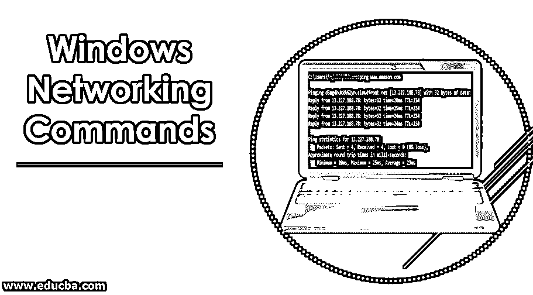
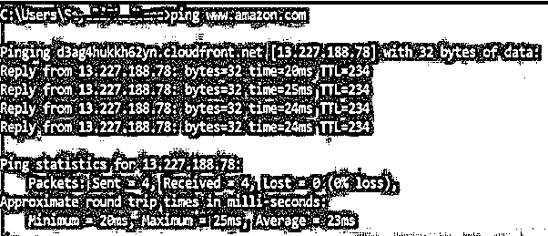
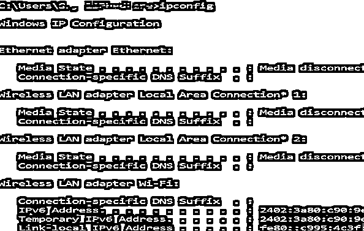
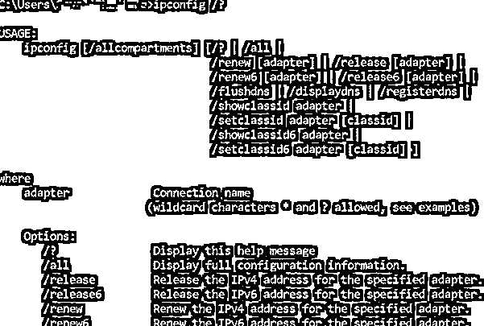
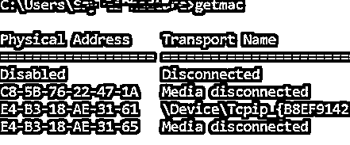
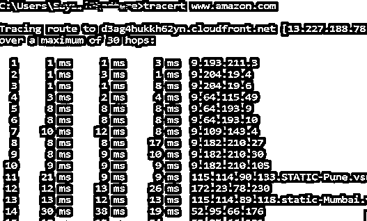
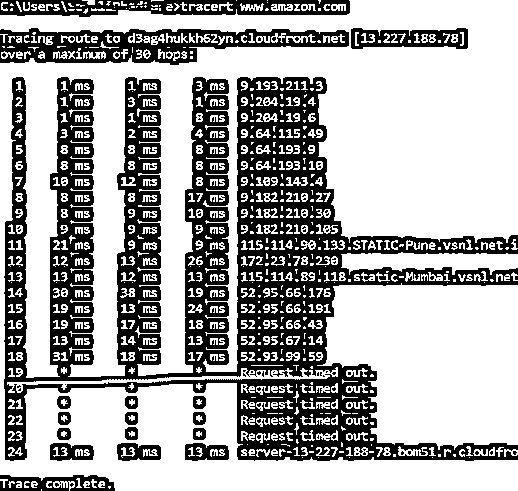
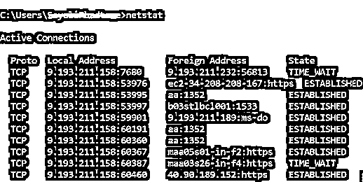
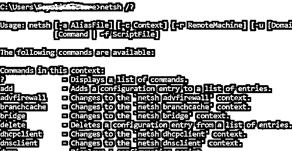
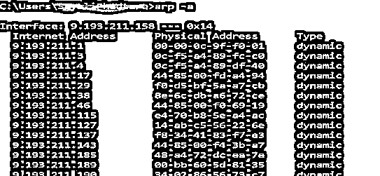

# Windows 网络命令

> 原文：<https://www.educba.com/windows-networking-commands/>

## Windows 网络命令简介

Windows 系统提供了大量网络命令，通过在 CMD(命令提示符或命令控制台)中执行这些命令来解决网络问题。转到在计算机上搜索->搜索 cmd。

假设你是电脑新手，遇到了系统或网络问题。您可以通过远程访问请求其他人帮助您。这是通过共享您系统的 IP 地址来实现的，允许其他人远程操作您的计算机并解决问题。

<small>网页开发、编程语言、软件测试&其他</small>

有两种[网络协议](https://www.educba.com/what-is-networking-protocols/) TCP 和 UDP。TCP 需要 IP 地址，因为如果出现问题，它会有所帮助。UDP 不需要 IP 地址。连接到设备时需要这些。

### Windows 网络命令的类型及示例

以下是一些 windows 网络命令，下面将举例说明:

#### 1.砰

它用于检测网络上的设备和排除网络问题。这将有助于查看您的设备和网络上另一台设备之间的连接。如果我们收到设备的回复，则设备工作正常。我们可以使用带有 IP 地址和主机名的命令。我们已经搜索了亚马逊网站。发送包数时 0%的数据丢失。成功结果以毫秒表示 n 次往返时间。

#### 2.用于查看本机的 IP 信息

它会找到网络信息本地设备，如 IP 地址和默认网关。

我们可以看到上面的信息。您可以看到介质状态为介质断开，因为蓝牙没有打开。

#### 3.ipconfig/释放

给出当前的 IP 地址，但如果我们没有连接到 Wi-Fi 和媒体断开连接，那么这个命令将不起作用。

#### 4.Ipconfig /？–将显示帮助选项

#### 5.主机名

它将向我们显示机器的主机名。

#### 6.getmac

它会给你网络接口的 MAC 地址。人们可以用这个来控制哪个设备可以连接到网络。每个设备都有一个唯一的 MAC 地址，它由制造商分配，存储在设备硬件中。你可以在下图 3 中观察到不同的 mac 地址被分配给不同的媒体。

#### 7.Tracert

当我们遇到任何网络问题并解决这个问题时，Traceroute 将发送数据包从服务器到服务器的路由。它将显示用户和跳之间的延迟。将显示该跳的 IP 地址。

您可以看到每跳有三个延迟读数，因为 tracert 每跳将发送 3 个数据包，但是如果任何延迟丢失，它将不会显示正确的延迟。最佳实践是平均有 3 个延迟。参考下图。您可以看到，未给出延迟是请求超时的原因。

#### 8.网络管理命令行工具

它代表名称服务器查找。当我们想知道域的 IP 地址时，我们可以使用这个命令。事实是，如果我们一遍又一遍地运行这个命令，我们会得到一个像谷歌，雅虎，Flipkart 网站不同的 IP 地址，因为这些域名已经传播到不同的机器。你可以在下图中看到相同域名的 IP 地址是不同的。
第一个 IP 地址是:13.227.188.78
第二个 IP 地址是:184.31.213.84

我们可以在网络浏览器中输入 IP 地址，在 IP 地址的帮助下找到域名，看看它通向哪里。这样做的成功率不是 100%,因为不是所有的 IP 地址都会显示域名，它们可能无法到达。

#### 9.netstat

它用于网络静态、诊断和分析。如果我们正在管理一个巨大的大学校园网络，那么这个工具是有用的，因为它提供了网络的一个高级方面。

通过运行此命令，将显示系统上的活动连接数。活动连接大约端口(TCP)是打开的，并准备好接受连接请求。
TIME_WAIT(在上图中可以看到)-本地端点(您的系统)已经关闭了连接。

#### 10.netsh

它代表一个网络外壳。它将帮助用户查看和配置系统上的每个适配器，因为它在类似外壳的路由相关命令、诊断命令等中提供了大量的上下文。参考下图。通过运行该命令，提示符被转移到网络外壳。

#### 11.阿尔普

它代表地址解析协议。它会从 IP 地址中找到主机的 MAC 地址和硬件地址。

### 结论

我们已经学习了如何处理网络问题，了解网络端口何时开放以处理请求。这些命令还将显示大量不同的帮助选项，用于处理不同的请求。通过这个，我们了解了 [TCP 和 UDP 协议](https://www.educba.com/tcp-vs-udp/)。TCP 是面向连接的协议，具有错误处理能力。UDP 是一种无连接协议，并且具有显著的错误处理能力。

### 推荐文章

这是 Windows 网络命令指南。在这里，我们将讨论基本概念、各种类型的 windows 网络命令以及示例。你也可以看看下面的文章来了解更多-

1.  [网络协议的类型](https://www.educba.com/types-of-networking-protocols/)
2.  [云联网](https://www.educba.com/cloud-networking/)
3.  [什么是网络协议](https://www.educba.com/what-is-networking-protocols/)
4.  [网络拓扑类型](https://www.educba.com/types-of-network-topology/)

