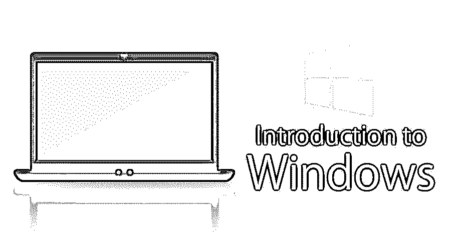
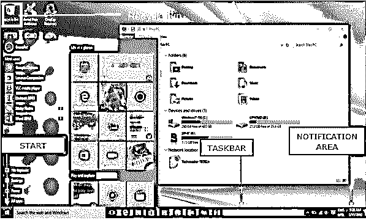

# Windows 简介

> 原文：<https://www.educba.com/introduction-to-windows/>

## Windows 简介

在本主题中，我们将学习 Windows 简介。微软视窗是微软公司开发的多任务操作系统，它使用图形用户界面与用户进行交互。微软最初于 1972 年命名为“Traf-O-Data”，1975 年 11 月更名为“微软”，然后于 1976 年 11 月 26 日更名为“微软”。1981 年 8 月，微软通过发布 1.0 版操作系统微软 DOS (MS-DOS)进入市场，这是一个 16 位命令行操作系统。比尔·盖茨和保罗·艾伦创立了微软，windows 操作系统一直是其主要产品。

在 Windows 简介中，我们还将向您介绍 Windows 的最新操作系统版本“Windows 10 ”,该版本于 2015 年发布。

<small>网页开发、编程语言、软件测试&其他</small>

简而言之，以下是微软视窗系统的发展历程:

*   windows 1.0–1985 年 11 月
*   windows 2.0–1987 年 12 月
*   windows 3.0–1990 年 5 月
*   windows 95–1995 年 8 月
*   windows 98–1998 年 6 月
*   windows ME–2000 年 9 月
*   windows XP–2001 年 10 月
*   windows Vista–2006 年 11 月
*   windows 7–2009 年 7 月
*   windows 8.0–2012 年 10 月
*   windows 8.1–2013 年 10 月
*   windows 10–2015 年 7 月

### Windows 的主要组件

在学习了 Windows 简介之后，我们现在要学习 Windows 的主要组件。Windows 操作系统的主要组件如下:

*   配置和维护
*   用户界面
*   应用程序和实用程序
*   Windows 服务器组件
*   文件系统
*   核心组件
*   服务
*   DirectX
*   建立工作关系网
*   脚本和命令行
*   核心
*   NET 框架
*   安全性
*   不推荐使用的组件和应用程序
*   蜜蜂

**来源链接:**[https://en . Wikipedia . org/wiki/List _ of _ Microsoft _ Windows _ components](https://en.wikipedia.org/wiki/List_of_Microsoft_Windows_components)

谈到 GUI 组件，我们有以下主要组件:

*   #### Desktop

这是 windows 启动后您将看到的第一个屏幕。在这里你会看到“我的电脑”、“我的文档”、“开始菜单”、“回收站”，以及你可能创建的任何应用程序的快捷方式。

*   #### Taskbar

在底部，你会看到一行被称为任务栏。它有当前正在运行的应用程序，您也可以通过使用一个选项“固定到任务栏”来固定您经常使用的应用程序。

*   #### Start menu

它位于 Windows 操作系统 GUI 的左下角。这是用户可以搜索任何设置和任何应用程序的地方。用户可以从控制面板卸载或修复应用程序。用户只需通过搜索开始菜单就可以完成许多活动。

*   #### My computer

当您双击“我的电脑”菜单时，它将让您在不同的计算机驱动器和控制面板工具之间导航。您可以查看和管理驱动器中的内容。

*   #### Recycle Bin

当您使用“删除”按钮，甚至简单地单击鼠标右键并选择“删除”选项从您的任何驱动器中删除一个项目时，它不会被完全删除，而是被移动到 Windows 的“回收站”文件夹中。如果您误从这里删除了您的内容，或者如果您选择从这里删除项目，您可以恢复您的内容，它将被永久删除。如果你想删除第一步中的条目，而不把它移到回收站，你可以使用“Shift+Del”键

**图片** **来源****:**[https://win10help.info/windows-10-gui-basics/](https://win10help.info/windows-10-gui-basics/)

### Windows 的功能

正如我们在上一节中了解的 Windows 简介，让我们来探索 Windows 的主要功能:

*   **Windows Search:** 我们的系统中可能会有大量的文件和内容，有时我们可能会因为文件的确切位置而耗尽内存。Windows 搜索是 Windows 附带的搜索功能，允许用户搜索他们的整个计算机

*   **Windows 文件传输:**我们可能需要将文件和内容从我们的机器传输到其他设备，如其他电脑、手机和平板电脑。我们可以通过使用轻松传输电缆、CD 或 DVD、USB 闪存驱动器、无线蓝牙、网络文件夹或外置硬盘来实现这一点。

*   **Windows 更新:** Windows 包含自动更新功能，旨在保持其操作系统的安全和最新。

*   **Windows 任务栏:**在窗口的最底部，你会看到一行任务栏。它有当前正在运行的应用程序，您也可以通过使用一个选项“固定到任务栏”来固定您经常使用的应用程序。任务栏是 Windows 的主要导航工具

*   **远程桌面连接:**windows 的这一功能允许您连接到另一个系统，并在另一个系统上远程工作。

### Windows 应用程序

**影像来源:**[https://goo . img/x3 tyns](https://allprogramswindows10.com/)

为在 MS 操作系统下运行而编写的程序是 Windows 应用程序。在 Windows 操作系统上运行的应用程序的例子有 Microsoft Outlook、Internet Explorer、Remote Desktop Condition、Snipping Tool 和许多其他应用程序。

这些应用程序为用户的日常活动提供了强大的功能。为在 windows 上运行而开发的每个应用程序都应该与 Windows 操作系统兼容。这就是为什么当你安装一个软件时，你可能会看到两三个下载选项，Windows 下载，Linux 下载和 iOS 下载。如果你对开发 Windows 应用感兴趣，你可以从这里开始:[https://docs.microsoft.com/en-us/windows/win32/](https://www.microsoft.com/en-us/p/star-chart/9wzdncrfhxn9#activetab=pivot:overviewtab)

### Windows 的优点和缺点

在浏览了所有的组件、功能和对 Windows 的广泛介绍之后，我们将探讨 Windows 的优点和缺点

#### 优势

让我们看到一些优点:

*   台式机和平板电脑友好的操作系统
*   在应用程序之间切换非常容易
*   操作视窗不需要太多的技术知识
*   Windows 操作系统是占主导地位的操作系统，拥有超过 90%的市场份额
*   微软操作系统有一个强大的支持社区，它也有最大数量的应用程序
*   微软提供了一套强大的以企业为中心的操作系统、应用程序和服务，使其成为操作系统市场上最具主导地位的玩家。
*   更多游戏

#### 不足之处

存在隐私和安全问题及事故，而且这些问题和事故非常普遍。Linux 操作系统是迄今为止最安全的操作系统。

*   升级成本
*   Windows 操作系统吸引了大量的病毒程序，因为它最大的市场份额和易于突破的范式
*   Windows 操作系统没有那么好触摸

### 推荐文章

这是一个介绍 windows 的指南。这里我们已经详细讨论了 Windows 的特性、组件和优缺点。您也可以阅读以下文章，了解更多信息——

1.  [Windows 面试问题](https://www.educba.com/windows-interview-questions/)
2.  [Ubuntu vs Windows 10](https://www.educba.com/ubuntu-vs-windows-10/)
3.  【Windows 10 的生产力技巧和提示
4.  [Linux 系统命令列表](https://www.educba.com/linux-system-commands/)

