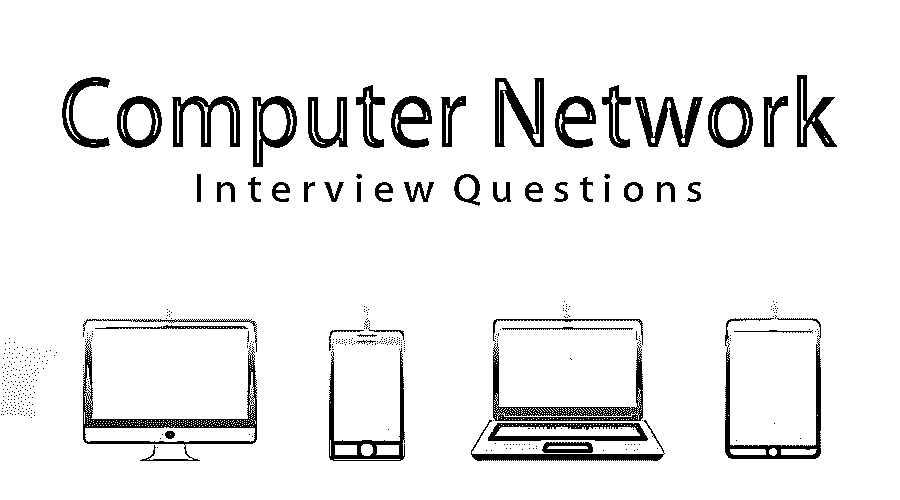

# 计算机网络面试问题

> 原文：<https://www.educba.com/computer-network-interview-questions/>

## 计算机网络面试问答介绍

计算机网络是一组为了共享资源而相互连接的计算机。通过连接的主要资源共享是互联网**。**计算机网络共享资源的另一个例子是通过连接在不同的计算机之间共享一台打印机。计算机网络最好的例子是互联网。

下面是面试中最常被问到的问题

<small>网页开发、编程语言、软件测试&其他</small>

现在，如果你正在寻找一份与计算机网络相关的工作，那么你需要准备 2022 年的计算机网络面试问题。的确，每个面试都因不同的职位而不同。在这里，我们准备了重要的计算机网络面试问题和答案，将帮助您在面试中取得成功。这些顶级面试问题分为以下两部分:

### 第 1 部分-计算机网络面试问题(基础)

这第一部分包括基本的面试问题和答案。

#### Q1。你说的网络是什么意思？

**答:**
通过物理媒介相互连接的一组设备称为计算机网络。例如互联网。

#### Q2。你说的节点是什么意思？

**答案:**
在计算机网络中，节点被称为设备。

#### Q3。网络拓扑是什么意思？

**答:**
[网络拓扑](https://www.educba.com/what-is-network-topology/)是网络的物理结构，它定义了计算机或节点如何相互连接。

#### Q4。什么是路由器？

**答案:**
路由器是一种负责通过计算机网络将数据从源发送到目的地的设备。

#### Q5。什么是 OSI 模型？

**答案:**
OSI 模型代表开放系统互联。它是一个参考模型，描述了不同的应用程序如何通过计算机网络相互通信。

#### Q6。解释 OSI 模型的不同层次。

**答:**
下面给出了 OSI 模型的不同层次:

| **物理层** | 将数据位转换成电脉冲。 |
| **数据链路层** | 数据包将被编码和解码成比特。 |
| **网络层** | 将数据报从一个传送到另一个。 |
| **传输层** | 负责从一个到另一个的数据传输。 |
| **会话层** | 管理和控制计算机之间的信号。 |
| **表示层** | 将数据转换成应用层格式。 |
| **应用层** | 最终用户将与应用层进行交互。 |

#### Q7。描述集线器、交换机和路由器？

**答案:**

*   **集线器:**集线器将所有数据广播到每个端口。所有设备都有一个公共连接点。
*   **交换机:**交换机将创建动态连接，并向请求端口提供信息。
*   **路由器**:路由器是负责转发数据包的设备。

让我们转到下一个计算机网络面试问题。

#### Q8。你说的 TCP/IP 模型是什么意思？

**答案:**
TCP/IP 代表传输控制协议和互联网协议。它描述了数据如何在端到端通信中传输和路由。

#### Q9。解释 TCP/IP 模型的不同层次。

**答案:**
应用层、传输层、网络或互联网层、网络接口层。

#### Q10。HTTP 是什么意思？

**回答:**
HTTP 代表超文本传输协议，端口为 80。该协议负责 web 内容。

#### Q11。TCP 和 UDP 是什么意思？

**答:**
TCP 代表传输控制协议，UDP 代表用户数据报协议，TCP 是面向连接的协议，UDP 是无连接协议。

#### Q12。你说的防火墙是什么意思？

**回答:**
防火墙是一个安全系统的概念，它将帮助计算机防止未经授权的访问或任何网络攻击。

### 第 2 部分-计算机网络面试问题(高级)

现在让我们来看看高级面试问题。

#### Q13。你说的 DNS 是什么意思？

**答案:**
DNS 代表域名系统。这是一个带有本地名称的互联网地址映射过程。我们也可以称之为互联网电话簿。

#### Q14。代理服务器是什么意思？

**答:**
代理服务器阻止未经授权的外部用户访问网络。

#### Q15。你说的网络类别是什么意思？

**答:**
IP v4 的类有 5 种类型:

| **A 类** | 0.0.0.0 至 127.255.255.255 |
| **B 类** | 128.0.0.0 至 191.255.255.255 |
| **丙类** | 192.0.0.0 至 223.255.255.255 |
| **D 级** | 224.0.0.0 至 239.255.255.255 |
| **E 类** | 240.0.0.0 至 247.255.255.255 |

让我们转到下一个计算机网络面试问题。

#### Q16。你说的 NIC 是什么意思？

**答案:**
NIC 代表网络接口卡。它是一个将安装在计算机上的适配器，因为有了这个网卡，只有该计算机才能与网络进行交互。

#### Q17。你说的 ASCII 是什么意思？

**答案:**
ASCII 是美国信息交换的标准代码。

#### Q18。网络中可用的模式类型有哪些？

**答:**
计算机网络中的数据传输方式有三种:
单工、半双工和全双工。

#### Q19。你说的滑动协议是什么意思？

**答案:**
SLIP 代表串行线接口协议。它用于在一条线路上通过网络发送 IP 数据报。

让我们转到下一个计算机网络面试问题。

#### 问题 20。该协议的关键要素是什么？

**答案:**
该协议有三个关键要素:

*   **语法:**描述数据的格式。
*   **语义:**描述每一节的意思。
*   **计时:**说明数据发送速度的计时。

#### 问题 21。你说的解码器是什么意思？

**答案:**
解码器是将加密数据转换成其实际格式的程序。

#### 问题 22。IEEE 在计算机网络世界中的作用是什么？

**答:**
IEEE 全称是电气和电子工程师协会，用于定义和开发将在网络上使用的标准。

#### 问题 23。100Base-FX 网络的最大网段长度是多少？

**答案:**
最大段长度将为 412 米。

### 结论

以上是与计算机网络相关的重要问题。您必须涵盖的关键主题是 OSI 模型、所有层的功能、有类网络和 IPv4 的类、拓扑以及 VPN 和 VPC 的配置。

### 推荐文章

这是一个计算机网络面试问题和答案列表的指南，以便候选人可以轻松地解决这些计算机网络面试问题。在本帖中，我们研究了面试中经常被问到的计算机网络面试问题。您也可以阅读以下文章，了解更多信息——

1.  [网络面试问题](https://www.educba.com/networking-interview-questions/)
2.  [网络安全面试问题](https://www.educba.com/network-security-interview-questions/)
3.  [计算机科学职业](https://www.educba.com/career-in-computer-science/)
4.  [Oracle 数据库面试问题](https://www.educba.com/oracle-database-interview-questions/)

