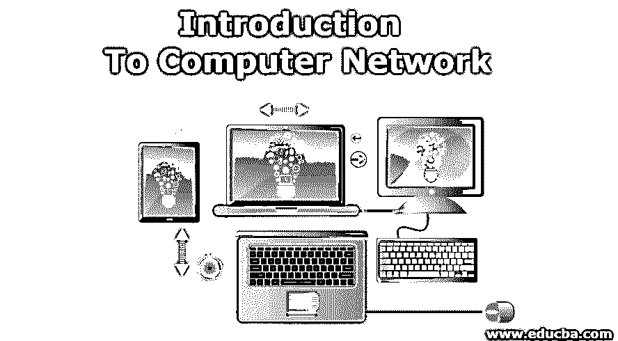
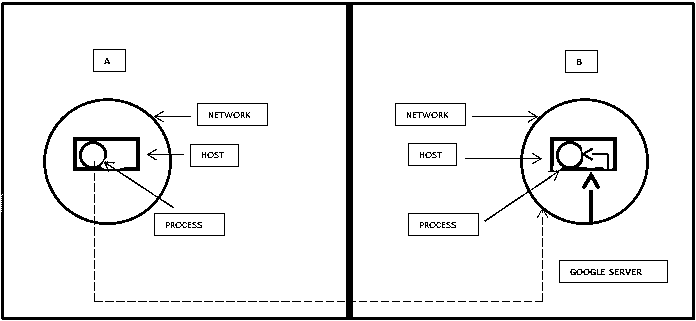
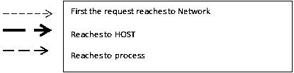
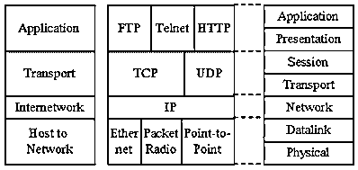

# 计算机网络导论

> 原文：<https://www.educba.com/introduction-to-computer-network/>

## 计算机网络导论

术语“网络”是指为了交流而聚集在一起的一组、一条链或一个集合。在计算机参考中，相同的定义具有价值，但有一个细微的变化，即

网络是一组相互关联的计算机，它们相互交换资源、文件并进行某种通信。该参考文献中的通信字表示“数据”。因为这些活动是在计算机之间进行的，所以它们被称为计算机网络。

<small>网页开发、编程语言、软件测试&其他</small>

### 了解流程

在上一节中，我们已经学习了计算机网络的一些基本介绍，所以现在我们要学习计算机网络过程。网络段非常庞大，需要进一步改进。它允许计算设备通过有线或无线网络交换数据。

计算机网络市场包括以下几个方面

*   网络硬件
*   软件和服务
*   虚拟网络
*   服务器
*   网络管理和安全

让我们看一个计算机网络的例子来进行整体理解，这个解释将使读者理解事物是如何工作的以及幕后的故事。准备出发……..

在一个网络中，有一个主机(可以有许多主机)，在一个主机中，有一个进程(可以有许多进程)。

这个过程就是罗恩先生想在他的网络浏览器上打开[www.google.com](http://www.google.com)(域名)。他必须连接到谷歌服务器才能在他的系统上获得网页。看到从 A 出现并到达 B 的虚线(图像描述可用)。

现在，只使用域名，我们必须识别网络、主机和进程，这是我们将看到发生的全部事情。

域名(即[www.google.com](http://www.google.com))必须转换为 IP 地址，以便接收主机和网络能够理解。

所以，IP 地址有两部分

1.  主机 ID
2.  网络 ID。

因此，使用网络 ID 我们可以到达目标网络，使用主机 ID 我们可以到达目标主机。在这之后，我们需要端口号来到达进程。这就是 web 服务的连接方式。

### 计算机网络的类型

在学习了计算机网络及其流程的介绍之后，我们现在要学习计算机网络的类型。

#### 1.局域网

这是为小区域或工作单位设计的，如办公室、建筑群等。这些是首选，因为它们易于设计和故障排除。个人电脑和工作站通常首选局域网。在 LAN 网络分布中，我们有环形、总线形、星形和树形拓扑。局域网具有资源共享、数据集中、数据安全、共享连接等优点。局域网具有的一些缺点是高成本设置、隐私侵犯、数据安全威胁、有限的区域范围。

#### 2.城域网

它是局域网的更大版本，通常覆盖更大的操作区域。当它覆盖一个非常大的地形区域时，这意味着它通常连接不同的局域网。MAN 在快速通信方面效率极高，但他们需要大量的安装成本和更多的电线电缆

#### 3.广域网

用名字本身就很好理解。它可以是私有网络，也可以是公共网络。它有可能覆盖整个国家。

### ISO/OSI 参考模型

在学习了计算机网络的介绍之后，现在我们将讨论 ISO/OSI 模型。

*   **物理**–如何传输信号(主要是编码)
*   **数据链**–双方通信–以太网
*   **网络**–路由、IP 寻址
*   **transport**t–端到端通信–TCP
*   **会话**–建立/管理连接
*   **演示**–ASCII 转换
*   **应用**–实际文件传输、电子邮件、远程登录

以下是 TCP/IP 参考模型的连接图。7 个连接层的工作方式如下所示。

**简要了解 OSI 和 TCP/IP 模型—**

在 OSI(开放系统互连)中有 7 层。OSI 定义了实现协议的网络框架。前进到 [TCP/IP 模型](https://www.educba.com/tcp-ip-model/)是一个四层参考模型。属于该模型的所有协议都位于该模型的前三层。

**IP 版本 4 和 IP 版本 6**

IP 层下面有多种局域网协议。我们可以说，互联网本质上是一个 IP 互联网。目前，互联网使用(大部分，但不再)IP 版本 4，这是一个 32 位地址大小。因为存在一些技术上的依赖性，这迫使移动到新的大型区块。因此，将 IPV4 转换为 128 位地址大小的 IPV6 的压力越来越大。两者都是通用路由和寻址协议。

*   IPv4 是 32 位，IPv6 是 128 位
*   IPv4 是由点(.)而 IPv6 是由冒号(:)分隔的字母数字
*   IPv4 有 12 个报头字段，而 IPV6 只有 8 个。报头字段的长度是 20(对于 IPv4)和 40(对于 IPv6)。

**数字系统**

在计算机网络中有两种数制。它们是一元和二进制，一元数字系统有零(0)，而二进制有零和一(0 和 1)。

*   2 ^10 = 1024，称为 k
*   2^20 =简称 m(兆)
*   2^30 =简称 g(千兆)
*   2^40 =简称 T (tera)…。等等

### 网络设备

在学习了计算机网络的介绍、它的流程和 ISO/OSI 模型之后，现在我们将学习[不同类型的网络设备](https://www.educba.com/networking-devices/)

*   **HUB:** 用于连接多个网络主机，甚至用于数据传输。通过有线或无线进行的数据传输是通过称为包的介质进行的。每当主机向任何网络发送数据包时，集线器都会复制出与其相连的数据包信息。但这让 HUB 在安全性方面有所不及。
*   **SWITCH:** 它在局域网上也能工作，但事实证明它比 hub 更聪明。除了数据传输，交换机还负责过滤和转发细节。
*   **MODEM:** 代表调制器-解调器；这有助于调制和解调数字数据和模拟信号之间的信号。
*   **路由器:**它是一种帮助将流量从一个网络路由到另一个网络的设备。
*   **网桥:**它连接属于同一个网络**的两个子网络。**
*   中继器:它是一种电子设备，主要用于放大信号。

### 推荐文章

这是一本介绍计算机网络的指南。这里我们讨论了计算机网络的介绍，如网络设备的类型，ISO/OSI 模型等。您也可以阅读以下文章，了解更多信息——

1.  [计算机网络面试试题](https://www.educba.com/computer-network-interview-questions/)
2.  [计算机编程职业](https://www.educba.com/career-in-computer-programming/)
3.  [JavaScript 简介](https://www.educba.com/introduction-to-javascript/)
4.  [计算机网络的类型](https://www.educba.com/types-of-computer-network/)

