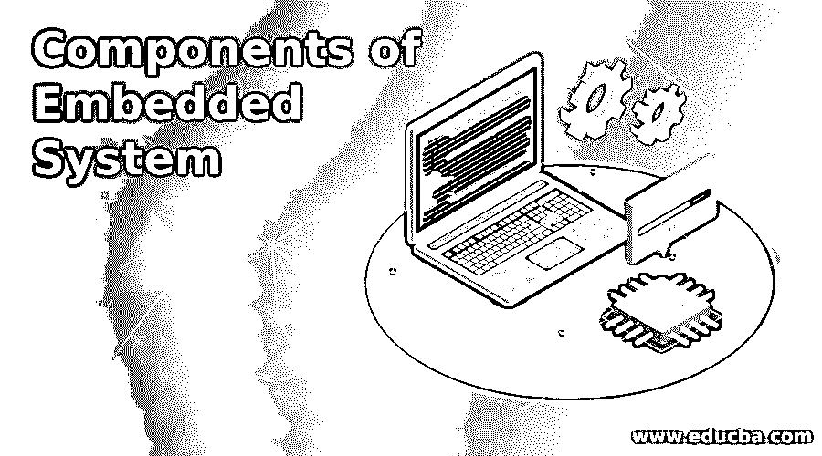

# 嵌入式系统组件

> 原文：<https://www.educba.com/components-of-embedded-system/>

## 嵌入式系统组件介绍

嵌入式系统被归类为由用于执行特定功能的软件和硬件组件组成的系统类型。嵌入式系统可用于各种行业，如工业、农业设备、医疗设备和汽车行业，以及更多行业。嵌入式系统可用于执行单个任务或同时执行多个任务。嵌入式系统的设计涉及多个组件。使用的组件有软件组件和硬件组件。

### 嵌入式系统的组件

因为嵌入式系统由硬件和软件组件组成。在下一节中，硬件组件描述如下:

<small>网页开发、编程语言、软件测试&其他</small>

#### 1.电源

对于嵌入式系统来说，电源是为嵌入式系统电路提供电源的关键部件。通常，嵌入式系统需要 5 V 电源或 1.8 至 3.3 电源。v .电源可以是电池，也可以由墙壁适配器提供。根据用户要求和应用要求选择电源。电源应该是平稳的并且应该是高效的，以便可以向嵌入式系统提供连续的电源。电源还应该允许耗散，并且应该尽可能高效。

#### 2.处理器

对于任何嵌入式系统，处理器都是系统的大脑。处理器负责决定嵌入式系统的性能。市场上有多种类型的处理器可供选择，可以根据用户需求进行选择。嵌入式系统可以充当微控制器和微处理器。处理器可以是 8 位处理器、16 位处理器和 32 位处理器。位越小，嵌入式系统的应用程序就越小。当使用大型应用程序时，嵌入式系统需要更高的位处理器。处理器需要非常快，价格应该最低，性能应该良好，以便在嵌入式系统中可以非常快地执行功能。

#### 3.记忆

由于嵌入式系统中使用了不同的微控制器，所以存储器存在于微控制器本身中。基本上有两种类型的内存 RAM(随机存取存储器)和 ROM(只读存储器)。由于 RAM 是易失性存储器，数据可以临时存储在存储器中，当系统关闭时，数据会从存储器中丢失。只读存储器被归类为代码存储器。rom 用于存储程序，当系统打开时，嵌入式系统从 ROM 存储器中读取代码。

#### 4.计时器计数器

在一些应用中，总是存在需要在应用中提供的延迟要求。例如，在 LED 显示应用中，需要一定的延迟，以便 LED 能够持续闪烁。为此，定时器和计数器可以用在嵌入式系统中。编程可以以这样的方式进行，使得延迟可以生成嵌入式系统。延迟时间跨度可以通过使用晶体振荡器和系统频率来决定，以便可以根据用户要求产生延迟。

#### 5.通信端口

通信端口是用于与其他类型的嵌入式系统通信的接口类型。在嵌入式系统中，有多种类型的通信端口，如 UART、USB、以太网、RS-485 等。当嵌入式系统用于小规模应用时，可以使用微控制器的通信端口。也有串行协议可用于将数据从一个系统板发送到另一个系统板。

#### 6.输出和输入

当使用嵌入式系统时，需要输入来与系统交互。嵌入式系统的输入可以由传感器提供，也可以由用户自己提供。嵌入式系统中使用的处理器可以基于输入和输出。使用输入和输出端口需要进行适当的配置。在嵌入式系统中，有固定的输入和输出端口，因此设备只能连接到指定的端口。比如 P0、P1、P2 等等。

#### 7.应用中使用的电路

设计嵌入式系统时，有几个硬件组件可用于设计目的。电路的选择完全取决于嵌入式系统的应用。例如，在温度传感器应用中，需要温度传感器来测量温度。

### 嵌入式系统的硬件组件

当为嵌入式系统选择了所有的硬件组件后，下一个任务是选择用于设计嵌入式系统的软件组件。

#### 1.装配工

当用于设计应用程序的编程语言是汇编语言时，使用汇编程序。然后，汇编语言程序被转换成十六进制代码，以便进一步处理。编写完代码后，编程器用于在芯片中编写程序。

#### 2.仿真器

仿真器是用于执行主机系统功能的软件工具。所有组件都可以由仿真器工具控制。模拟器也用于查找错误和调试代码。仿真器还用于将代码从主机系统传输到目标系统。

#### 3.编译程序

编译器是一种软件，用于将编程语言转换成目标机器可以理解并执行功能的某种语言。编译器的基本用途是将高级代码转换成某种低级语言。低级语言包括机器代码、目标代码和汇编语言。

### 结论

嵌入式系统是一种通常由硬件和软件组件组成的系统。有多种硬件组件和软件组件，用于设计嵌入式系统的组件的选择完全取决于应用和用户需求。组件数量越多，嵌入式系统的成本就越高，嵌入式系统的设计也就越复杂。

### 推荐文章

这是嵌入式系统组件指南。在这里，我们讨论了嵌入式系统的 6 个不同的组件和 3 个不同的硬件组件介绍。您也可以浏览我们的其他相关文章，了解更多信息——

1.  [在 HTML 中嵌入 PHP](https://www.educba.com/embed-php-in-html/)
2.  [什么是嵌入式系统？](https://www.educba.com/what-is-embedded-systems/)
3.  [安卓操作系统](https://www.educba.com/android-operating-system/)
4.  [计算机操作系统的类型](https://www.educba.com/types-of-computer-operating-system/)

