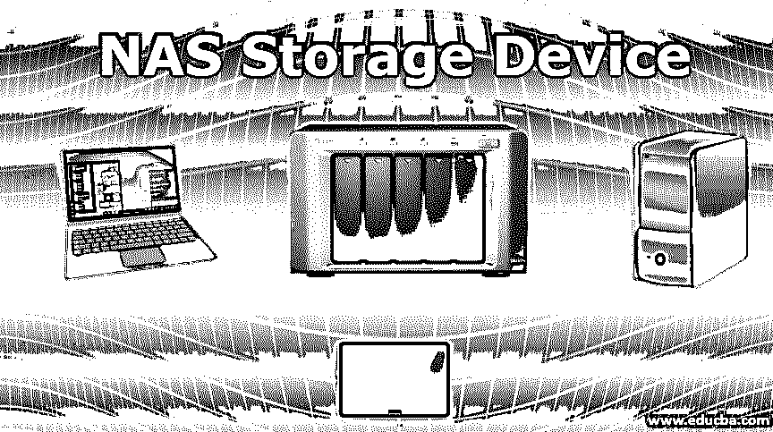

# NAS 存储设备

> 原文：<https://www.educba.com/nas-storage-device/>

## NAS 存储设备简介

在最近的时代，企业、组织和其他部门真正理解了数据存储的重要性。如果存储区域维护不当，可能会导致客户流失和组织的业务运营效率低下。NAS 存储设备为所有这些相关问题提供了强有力的解决方案，因为 NAS 在小型企业和组织中非常受欢迎。这些是低成本存储设备，易于扩展。这些设备直接连接到网络上，因此数据可以方便地存储，并可以从某个位置提取。

### 我们为什么要使用 NAS 存储设备？

NAS 存储设备为用户提供存储数据或共享数据以及有效访问数据的便利。NAS 设备主要由从事同一项目但位于不同地理区域的人员使用。可以在不同的地理位置同时访问它们。它主要有利于分布式工作环境，因为所有 NAS 设备都连接到网络。组织和企业大多使用这种存储设备，因为他们的项目位于不同的位置。

<small>网页开发、编程语言、软件测试&其他</small>

NAS 设备还用于处理需要更大存储容量和高延迟网络的大块媒体文件流。NAS 设备也用于个人用途，因为用户可以存储媒体文件，也可以为他们的数据创建备份。在组织中也使用 NAS，因为备份过程是在 NAS 设备中自动进行的，这在发生任何灾难时都是有益的。无论何时发生灾难，数据都可以很容易地为组织备份，因为数据是组织非常重要和不可或缺的一部分。当需要额外存储和备份时，通常会使用 NAS 设备。

NAS 设备可以聚合到一个单独的 NAS 设备上并形成一个群集，这样就可以提升 NAS 设备的性能并增加存储容量，这可能是大型企业的要求，因为他们的项目需要大量的存储容量。

### NAS 存储如何工作？

NAS(网络附加存储)设备提供了在局域网节点上存储数据和使用以太网连接维护文件类型存储的工具。它易于设置，安装过程非常快。NAS 为用户提供了在互联网上维护数据的功能，并且可以不受干扰地在互联网上获取和存储数据。NAS 设备可以单独存在，也可以组合在多个 NAS 设备中。NAS 设备可以位于服务器中的任何位置，但存在于局域网中。由于 NAS 是在 LAN 内分配的，因此 IP 地址会分配给该 NAS 设备。

NS 存储设备将整合 web 上存在的数据，以便数据可以集中，从而可以减少应用服务器上的过载。由于过载是减少 NAS 设备有助于降低设置成本，并将使用户受益。网络连接存储设备也使用基于文件的 NFS、AFP 和 SMB 协议。它们可以在多种操作系统上运行，这使得它非常强大，并且为了使用该设备，可以使用 web 浏览器来访问 NAS 存储设备。它还会自动为用户数据创建备份。当用户改变本地计算机中的某些内容时，网络附加存储设备中的内容也会自动改变。用户可以快速访问存储在 NAS 设备中的数据。通过这一切，NAS 存储设备降低了成本和能耗，从而增加了使用它的重要性。

### NAS 存储设备的优势

NAS 存储设备提供了在网络中存储数据的工具，并且可以在需要数据时提取。NAS 存储设备有几个好处。

其中一些提到如下:

*   NAS 存储设备的主要优点是增加了用户本地计算机的存储容量。笔记本电脑和计算机的存储容量有限，因此 NAS 可以用于广泛的存储容量。通过使用 NAS 存储设备，可以降低成本并容易地扩展存储容量。当需要增加存储容量时，不需要升级系统，用户可以轻松地使用 NAS 的另一个硬盘驱动器，并可以获得额外的空间。
*   在 NAS 存储设备中，当需要在一个组中做某事时，许多用户可以访问同一文档。用户可以编辑这些文件，并可以根据需要添加。
*   NAS 设备提供拥有个人云的功能。它提供了一些软件选项，用户可以通过这些选项从任何位置非常容易地访问存储设备。它有助于从存储器中获取所有文档，用户可以添加或编辑这些文档。
*   在 NAS 设备中，有一个设置自动备份的功能，以便可以在 NAS 设备中创建备份。当用户更改本地计算机上的文档时，这些更改会立即反映在 NAS 设备中。这样，数据就可以轻松地备份到 NAS 设备中，而无需手动操作。
*   NAS 设备的另一个重要好处是它可以很容易地安装，运行起来一点也不复杂。NAS 设备使用简单的 web 界面，因此用户可以轻松地在他们的计算机中进行设置并访问设置。

### 结论

NAS 存储设备对于存储数据和访问数据非常有效。NAS 设备可以帮助组织增加存储容量，并且可以从不同的地理位置访问同一文档。NAS 设备支持不同的操作环境，支持 NAS 设备的集群化。

### 推荐文章

这是 NAS 存储设备指南。在这里，我们将讨论我们为什么使用 NAS 存储设备，以及它的工作原理和它的诸多好处。您也可以浏览我们推荐的其他文章，了解更多信息——

1.  [联网设备](https://www.educba.com/networking-devices/)
2.  [网络设备的类型](https://www.educba.com/types-of-network-devices/)
3.  什么是防火墙设备？
4.  [数据存储设备](https://www.educba.com/data-storage-devices/)

