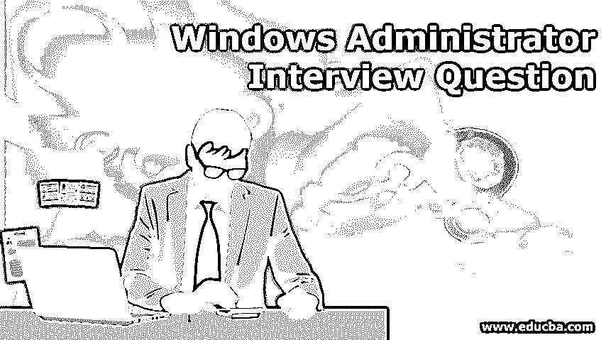

# Windows 管理员面试问题

> 原文：<https://www.educba.com/windows-administrator-interview-question/>

## Windows 管理员简介

Windows 管理员主要负责安装和设置 Windows 服务器和系统。它提供后端支持，配置用户访问，维护系统稳定性。管理员为用户和其他管理员提供技术支持，并帮助 IT 团队解决技术问题。管理员通过注意服务器架构中的系统故障来维护系统安全。当我们获得使用 [windows 命令](https://www.educba.com/windows-commands/)的命令的专业知识时，我们可以解决 windows 系统的任何问题。管理员应该具有广泛的病毒知识，并且该人员应该知道保护措施。根据公司标准，需要系统备份。我们可以根据服务器的空间每周或每月备份系统。

在这篇 windows 管理员访谈问题文章中，我们将介绍 12 个最重要和最常被问到的 Windows 管理员。这些面试问题分为以下两部分:

<small>网页开发、编程语言、软件测试&其他</small>

### 第 1 部分–Windows 管理员面试问题(基础)

第一部分介绍了基本的 Windows 管理员面试问题和答案。

#### 1.什么是服务器，它是如何工作的？

**答案:**服务器是一个网络操作系统，它为客户端操作系统提供服务。

#### 2.什么是域？

**回答:**Active domain directory services 是微软的目录服务器。它在可以部署其他服务的区域内提供身份验证和授权。

#### 3.ADC 是什么？

**答案:** ADC 代表一个 active directory 域控制器。它是一台保存活动目录数据库的服务器。所有活动目录都被复制到目录控制器。

#### 4.什么是架构和活动目录？

**答:**它定义了可以存储在 active directory 中的对象以及关于那些对象的信息。Active Directory 架构是对象及其属性的集合。为了便于理解，用户是对象，名字、姓氏等是对象的属性。

#### 5.什么是活动目录分区，类型和如何配置？

**回答:**是关于 active directory 信息逻辑存储的方式和位置。我们可以手动配置应用程序分区，以便与 active directory 集成应用程序一起使用。

*   (计划或理论的)纲要
*   配置
*   领域
*   应用程序分区

#### 6.如何进行 active directory 备份，备份哪个域控制器？

**答案:**系统状态备份会使用 NTbackup 对 active directory 进行备份。最低要求是在每个域中备份两个域控制器，其中一个应该是担任操作主机角色的域控制器。不需要备份 RID(相对 ID)主机，因为不应恢复 RID 主机。

### 第 2 部分–Windows 管理员面试问题(高级)

现在让我们看看高级 Windows 管理员面试问题和答案。

#### 7.active directory 分区存储在哪里？

**答:**我们只能从配置和域分区中真实还原对象。不支持权威还原架构命名上下文。

#### 8.我们可以将域控制器的备份还原到另一个域控制器吗？

**回答:**应该是恢复到同一个域控制器。一个域控制器的备份不能还原到另一个域控制器。

#### 9.什么是组策略？

**答:**组策略指定程序、网络资源和操作系统如何为组织中的用户和工作站工作。它是应用于用户和工作站的用户和工作站配置设置的集合。为了在 Windows 环境中更好地管理组策略，使用了组策略对象。

#### 10.什么是组策略对象？

**答:**它是组策略设置的集合，可以使用名为组策略管理单元的 windows 实用程序来创建。组策略对象影响位于域和组织单位中的用户和计算机帐户。

#### 11.什么是本地组策略对象？

**答:**用来控制一个运行在 windows 服务器上的本地服务器。对于每台服务器，都存储了本地组策略对象。本地组策略只影响存储它的计算机。默认情况下配置安全设置节点。休息设置被禁用。

#### 12.本地组策略对象存储在哪里？

**答案:**它存储在% systemroot % system32 group policy 文件夹中。

### 结论

我们已经大致了解了 windows 管理员的角色和职责。如果你获得了关于 windows 管理工作的知识，并希望从事管理工作，那么上述问题对面试有所帮助。出于基本目的，我们首先要了解[什么是系统](https://www.educba.com/what-is-system-design/)，服务器，备份，环境，[操作系统](https://www.educba.com/types-of-computer-operating-system/)等。

### 推荐文章

这是一个 Windows 管理员面试问题和答案的列表指南，以便候选人可以轻松地解决这些 Windows 管理员面试问题。您也可以阅读以下文章，了解更多信息——

1.  [SQL 面试问答](https://www.educba.com/sql-interview-questions/)
2.  [NoSQL 面试问答](https://www.educba.com/nosql-interview-questions/)
3.  [云计算面试问题](https://www.educba.com/cloud-computing-interview-questions/)
4.  [人工测试面试问题](https://www.educba.com/manual-testing-interview-question/)

