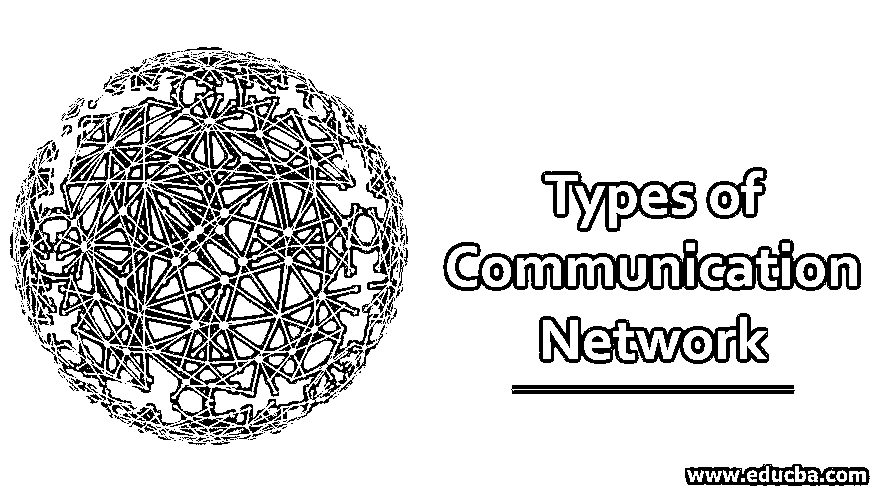
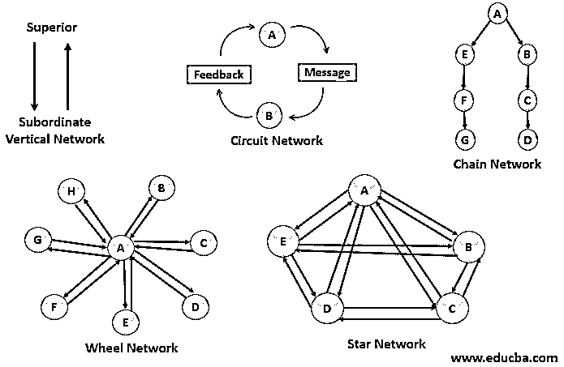

# 通信网络的类型

> 原文：<https://www.educba.com/types-of-communication-network/>

## 通信网络导论

在本文中，我们将看到一个关于通信网络类型的概述。在一个组织中，成员相互联系，联系的模式或信息的流动就是交流网络。联系人以不同的模式创建，这有助于管理层联系员工。通过网络，资源可以共享它们的数据和应用程序。网络是根据参与通信的人数、组织规模和通信网络的性质来划分的。常见的网络模式有垂直网络、电路网络、链状网络、轮状网络和星形网络。信息的传递和接收是交流的基础。

### 通信网络的类型

以下是通信网络的类型:

<small>网页开发、编程语言、软件测试&其他</small>

#### 1.垂直网络

以垂直模式从一个人或过程传递到另一个人或过程的通信称为垂直网络。它可以发生在从上到下或从下到上的格式中。这种通信提供了即时响应，因为接收器接收信息的速度比任何其他网络都快。我们可以称这个网络为正式网络。最好的例子是高层和底层员工之间的沟通。由于这是一种直接交流，因此在这种网络中不会发生沟通错误。

#### 2.链式网络

这个网络是分等级的，遵循一系列的命令。这里没有自下而上的交流。上级命令下级是这种网络的最好例子。还有，领导一群人的领导就是一个连锁网络的例子。信息必须从顶层传到底层，而不改变意思或用词。应注意避免同样的情况。这个网络不是很快，很少有人不理解这个消息会留在循环中。

#### 3.由四端网络组成的线路

当两个人之间的通信同时发生在一个电路中时称为电路网络。虽然它像垂直网络一样工作，但没有上级或下级，或者至少不像他们那样被考虑。这里的交流是双向的。消息传递或信息接收是连续的，并且所涉及的人可以处于相同的层级。

#### 4.车轮或辐条网络

命令或信息来自一个单一的上级，下级在网络中形成一个轮子。整个网络是高度集中的格式，一旦消息被给予接收者，就期望立即的反馈。正因为如此，我们可以把这种交流称为一种微观管理。这个网络是链式网络的改进形式。因为信息是直接从中央机关接收的，所以没有错误传达的机会，并且沟通是非常有力的。创业公司大多使用这种类型的网络。

#### 5.星形网络

几个人参与到这个网络中，这个过程形成了一个星形。这个网络使人们能够相互交流或与参与同一过程的人交流。这个网络可以被认为是一个没有中心人物来控制通信方式的轮子网络的发展。所有人都可以自由地互相交流。没有任何限制来阻止流程中人与人之间的通信。团队合作是通过这种交流建立起来的。一个和工作有关的 WhatsApp 群就是一个很好的明星网络的例子。

### 通信网络的特征

以下是解释的一些特征。

*   在同一个网络中的人们之间传递的信息或分享的信息应该是清晰的，不应该有任何术语。积极的声音应该是首选，信息应该是简单的话和简短的。如果信息很长，最好用项目符号来传递信息。
*   信息必须简洁，只有这样，听者才能全神贯注地仔细阅读。无论如何都要避免冗长的信息。如果用非常没有意义的词语来阐述，人们将没有足够的耐心来阅读整个信息。
*   传递的信息要用具体的信息解释好。在任何情况下都不应该传递错误的信息，否则会导致沟通失误。
*   消息应该按照相关的顺序传递。如果在开始的时候说结束，或者在没有完整信息的情况下结束信息，这是不好的。接收者会以错误的方式理解信息，这将导致冲突和想法的不同。信息应该在人与人之间以一种逻辑的、顺序的和计划好的方式传递。因此，这部分必须很好地集中。
*   传达者应该诚实，尊重他人，在谈话的底层或结尾对听者开诚布公。发送者应该体谅听者，应该使用礼貌的词语。信使不应该粗鲁，因为粗鲁的信使不会为他的信息找到任何接受者，即使信息是重要的。传递信息的人不应该是种族主义者，也不应该在传递信息时使用这样的词语。接收信息的另一端的所有人都应被视为平等的，在传递信息时不应使用不体贴的词语。
*   听众在交流网络中也起着重要的作用。他们应该很好地理解这些信息，并在可能的情况下澄清这些信息。应该从混杂的词语中发现信息，应该很好地分析非语言行为，实际地理解问题，并且足够成熟地根据信息采取行动。
*   当信息从另一端发出时，听者应该注意集中信息。不应该发生误解。
*   传递信息的同时要控制情绪。听者不应该利用他的知识向圈内的其他人传递信息。重点应该只放在从顶层传递的信息上。

要使用的网络类型取决于要从一级传递到另一级的消息。此外，还必须考虑网络通信的安全性。每个网络都有其优势。

### 推荐文章

这是一个通信网络类型的指南。在这里，我们讨论了通信网络的简要概述，各种类型以及特点。您也可以浏览我们推荐的文章，了解更多信息——

1.  [计算机网络 vs 数据通信](https://www.educba.com/computer-network-vs-data-communication/)
2.  [网络类型](https://www.educba.com/types-of-network/)
3.  [网络设备的类型](https://www.educba.com/types-of-network-devices/)
4.  [网络协议的类型](https://www.educba.com/types-of-networking-protocols/)

