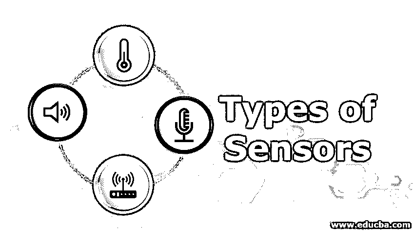
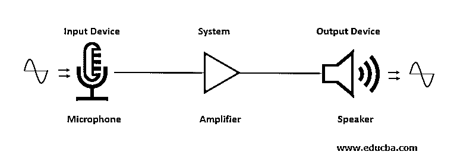

# 传感器的类型

> 原文：<https://www.educba.com/types-of-sensors/>

## 传感器类型介绍

在本文中，我们将了解不同类型的传感器，但首先，我们将了解什么是传感器？传感器是一种检测物理输入中的任何变化和事件并给出所需输出信号的设备，这些信号可以被记录并供以后使用。输出信号来源于电量。传感器这个词也被称为传感器，与测量系统有关。传感器的一个很好的例子是水银温度计，它可以感应系统或人体中的热量或温度。根据液体水银的收缩和膨胀，从温度计的校准玻璃体内测量温度。“传感器”这个词的来源是“感知”

### 传感器的类型

传感器有多种分类，从简单到复杂的操作都有不同的作用。一些同样被测量的不同物理输入以下面的形式被接收:

<small>网页开发、编程语言、软件测试&其他</small>

*   **声学:**输入由波、波长、波的速度和频谱来测量
*   **电:**要测量的输入是电流、电压、电场、电导率和介电常数
*   **磁性:**需要校准的输入是磁导率、磁场、磁通密度
*   **热学:**要测量的术语有比热、导热系数和温度
*   位置、力、加速度、压力、体积、结构、刚度、扭矩、动量、应力和应变值、密度和柔度是需要注意的输入的机械形式。要测量的光学信号是波速、吸收率、折射率、波和发射率。

上面提到的是某种形式的输入，也可以根据需要转换为另一种形式的输出，并为未来的技术进行记录和研究。

传感器根据其不同应用分类如下:

*   接近度
*   位置
*   位移传感器

用于测量距离的传感器是一个电位计。应用于该领域的各种传感器有感应式接近传感器、光学编码器、涡流接近传感器、气动传感器和霍尔效应传感器

*   **光传感器:**应用于光电二极管、光敏电阻和光电晶体管。
*   温度传感器:它们用于热电偶、热敏电阻和恒温器
*   **运动和速度传感器:**它们部署在测速发电机和增量编码器中
*   **触觉传感器和压电传感器:**用于测量流体压力和膜片压力表
*   **液体流量传感器:**应用于孔板涡轮流量计和文丘里管
*   **红外传感器:**它们用于一对红外发射器和接收器
*   **力传感器:**应用于应变仪和称重传感器
*   **触敏传感器:**用于电阻式和电容式触摸传感器。
*   **紫外线传感器和光稳定性传感器:**用于检测 UV p 杀菌紫外线探测器、光电管和紫外线探测器。

传感器根据要求分为主动传感器和被动传感器。

*   **主动传感器:**其工作是基于外部来源的电力或信号。这个信号被称为激励信号，它产生所需的输出。
*   **无源传感器:**它直接给出与输入信息相对应的输出信号。

主动传感器的例子是应变仪，它不产生输出信号，但计算与系统电阻相关的施加压力的量。电阻是通过让电流通过它来计算的。这里通过的电流称为激励信号。热电偶是无源传感器的一个例子。

### 传感器的工作

根据需求，传感器的工作和使用因设备而异。这里讨论了部署在公共操作系统中的传感器。该系统由麦克风、扬声器和放大器组成。这里，传感器用作麦克风的输入功能，麦克风感测声波并将其转换为电信号。然后它被送到放大器，在那里电波被增强并放大，然后送到扬声器。

扬声器从致动器获得输出波，在致动器处，来自放大器的电波被再次转换成传播距离更远的声波。模拟传感器以一组数值给出不间断变化的输出波。电压是输出信号，与被测对象成正比。像温度、速度、应变、压力这样被测量的有限计数是模拟量，并且在自然界中连续发生。

数字传感器以数字形式产生离散信号。该传感器的输出具有逻辑 1 和 0 的开和关状态。按钮相当于一个数字传感器。该开关有两种可能的状态，当按下它的 ON 时，当释放它时，它处于 OFF 状态。光传感器用于计算速度并产生数字信号。圆盘通过有限数量的可见槽连接到电机轴上。光传感器检测光的存在或不存在，并给出对应于输入的逻辑 1 和 0 信号。

然后，输入显示在光盘的速度和转数上。光盘中的槽增量增加了精确值，并且允许同时设置更多的槽。比较数字传感器和模拟传感器的性能，数字传感器的精度高，用几个位表示被测对象。

### 传感器的优点和缺点

下面是一些优点和缺点解释。

*   一些限位开关传感器具有高电流能力，需要有限的技术感测，并且成本低廉。这种限位开关传感器的缺点是它需要物理接触，并且拾取时间非常慢。
*   光电传感器具有很长的耐用性，最小的响应时间，应用于远程传感设备，传感所有形式的可用能量并有效地工作。但是这里的镜头容易被污染，而且感应范围会受到颜色的影响。目标的反射率降低。
*   电感式传感器可预测性强，使用寿命长，安装简单，可耐受恶劣环境。在电感式传感器中，放置的距离是需要纠正的限制。
*   电容传感器可以识别非金属目标，也可以通过大型容器检测它们。但是它们对环境变化很敏感
*   超声波传感器用于感应所有材料，对温度变化过于敏感。它具有低分辨率和可重复性。

### 推荐文章

这是传感器类型的指南。这里我们分别讨论传感器的工作原理、类型、优缺点。您也可以看看以下文章，了解更多信息–

1.  [什么是传感器？](https://www.educba.com/what-is-sensors/)
2.  [什么是接近传感器？](https://www.educba.com/what-is-proximity-sensors/)
3.  [物联网技术](https://www.educba.com/iot-technology/)
4.  [模糊逻辑系统](https://www.educba.com/fuzzy-logic-system/)

