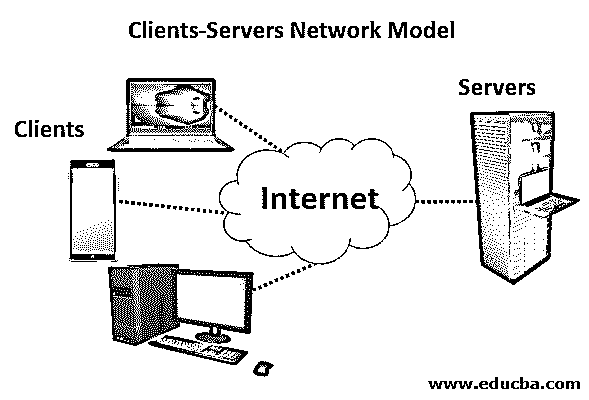
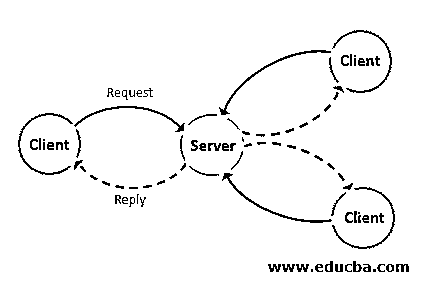
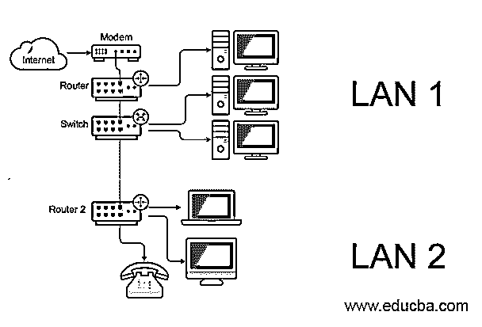
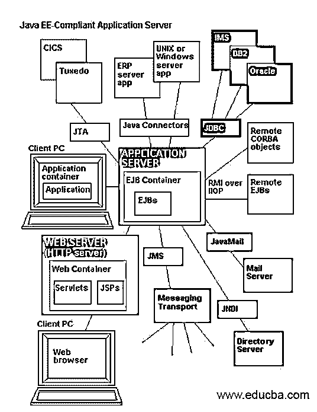
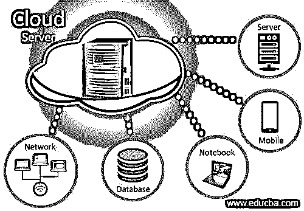
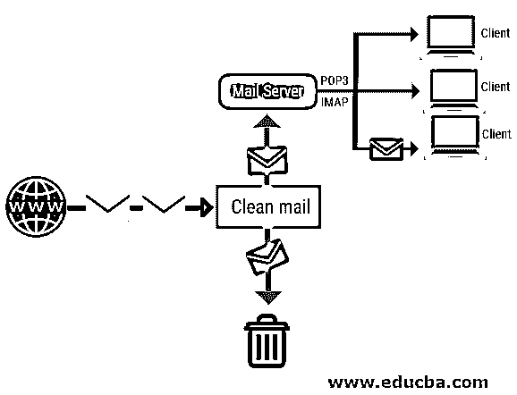
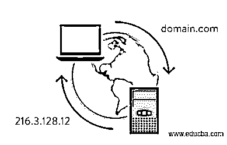
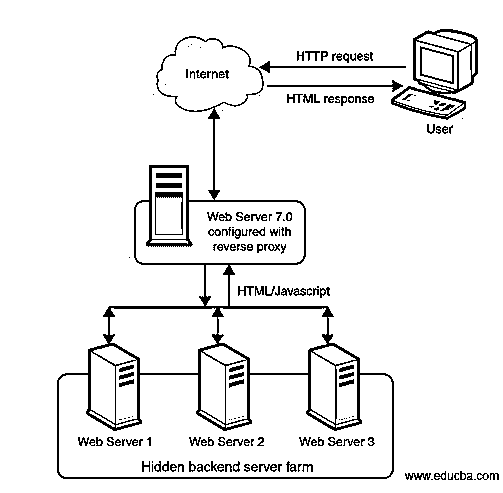
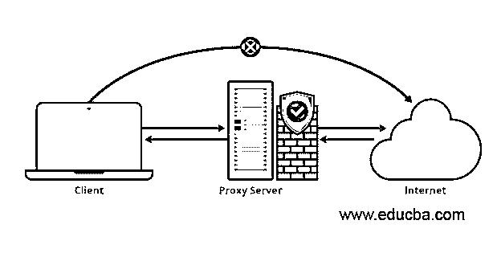

# 什么是服务器？

> 原文：<https://www.educba.com/what-is-server/>

## 服务器简介

向称为客户端或客户的其他计算机程序提供功能的计算机程序或设备称为服务器。这整个体系结构被称为客户机-服务器体系结构。该架构的单个进程被分配给设备或程序的整个计算进程。它基本上在网络上工作，管理网络资源。不能向服务器分配其他任务，它也不执行其他任务。一旦运行，一台计算机可以同时执行服务器的多个程序。简单来说，它向其他计算机提供数据。

**示例:**为了更好地理解，让我们以基本客户端-服务器模型为例:

<small>网页开发、编程语言、软件测试&其他</small>

通过参考上图，我们可以得出结论:

**客户端:**电脑、智能手机等

**服务器:**专用电脑

通过上面的图表，您可以清楚地了解到，客户端正在发出一个请求，这个请求被发送到服务器，并在处理之后用内容进行回复。

### 计算机如何连接到服务器？

它连接到路由器或交换机等设备，并通过互联网与客户端通信。用户使用域名通过客户端连接到服务器，域名由 InterNIC 提供的 DNS 解析器自动转换为服务器 IP。

一个 web 服务器示例，用户可以连接到该服务器来查看网站、进行搜索并通过网络与其他用户进行交流。

### 服务器的类型

让我们详细讨论一下类型:

#### 1.应用服务器

在这种环境中，不同的应用程序可以运行，而不管它们是什么或者它们将执行什么功能。它用于开发、处理和运行基于网络的应用程序。一些例子是 PHP、Java 和。NET 框架。应用程序，它们提供了处理高端作业和集中存储数据的优势。

#### 2.云服务器

它们是高度分布式、海量存储和高端处理能力。这些类型主要由“云计算”使用

**什么是云计算？**

这是一个通过计算机、智能手机、平板电脑上的应用程序(google drive)或通过浏览器访问云的网站来访问的环境。

例如:亚马逊网络服务、谷歌文档、Window Azure。

#### 3.数据库服务器

它们提供对数据库中数据的访问和检索。我们可以通过“前端”和“后端”来访问数据库，前者运行在本地用户机器上，后者运行在数据库本身上，可以通过任何远程设备或外壳来访问。

数据库中的任何信息都通过触发查询来检索，然后输出给请求数据的用户。

大型组织利用数据库进行存储，用户可以通过使用任何查询语言执行查询来访问数据。

示例:SQL Server

#### 4.电子邮件服务器

它是一台集中式或远程计算机，为特定网络上的客户端保存电子邮件。这和邮局是一样的，在把邮件发送到最终目的地之前，它们被储存和分类。每当用户通过客户机请求或发送任何电子邮件时，他们都需要联系邮件服务器，将邮件传送到接收客户机的计算机上。

示例:简单邮件传输协议(SMTP)、邮局协议 3(POP3)。

#### 5.域名服务

众所周知，域名系统接收具有域名主机名的请求，并回复相应的 IP 地址。DNS 使用端口 53 来提供服务。

#### 6.网络服务器

它是一台或一组计算机，用于根据请求向多个用户提供网页和其他内容。

例如:Apache、Tomcat、微软网络服务器(IIS)

#### 7.代理服务系统

它是网关服务器的一部分，或者是将本地网络与全球网络分开的另一台计算机。它缓存通过网络访问的所有页面，这将允许想要访问同一页面的用户，这将更快地加载负载并减少网络带宽。当在没有代理服务器访问的情况下访问页面时，使用其自己的 IP 地址的网页缓存该页面并将其转发给相应的用户。

### 利益

以下是一些简要说明的好处:

**1。可扩展性:**如果任何业务扩展，我们将需要更多的机器来满足新的要求，而无需更换机器，以确保业务的顺利运行。它们在磁盘空间、速度和远程访问方面更容易升级。

**2。可靠性:**任何设备或组件发生故障的可能性都很高，这会给公司带来损失。由于多重可靠性，确保零业务停机时间

**3。无缝连接:**如果一个备份失败，除非得到修复，否则它们现在是分布式的。

**4。协作:**在分布式环境中，不同的服务器协作提供服务。

**5。更快的扩展:**由于可扩展性，我们可以在网络中快速添加服务器，而不会出现任何停机

**6。集中式和自动化系统:**由于分布式集中式环境中的频繁备份，我们可以轻松关闭任何正在使用的服务器。

### 推荐文章

这是一个什么是服务器的指南。在这里，我们讨论基本概念、在不同环境中部署的 7 种不同类型以及优势。您也可以阅读以下文章，了解更多信息——

1.  [什么是计算机科学？](https://www.educba.com/what-is-computer-science/)
2.  [计算机网络概论](https://www.educba.com/introduction-to-computer-network/)
3.  [SMTP 协议](https://www.educba.com/smtp-protocol/)
4.  [Java 服务器套接字](https://www.educba.com/java-serversocket/)

