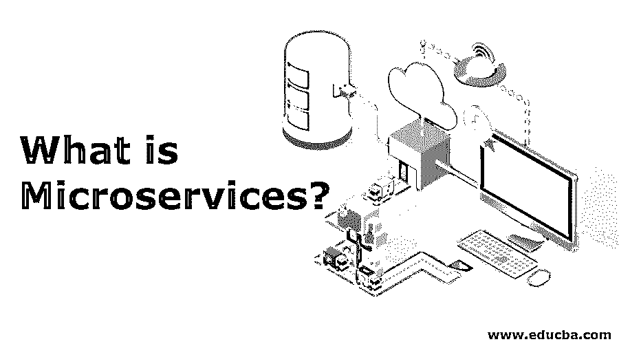
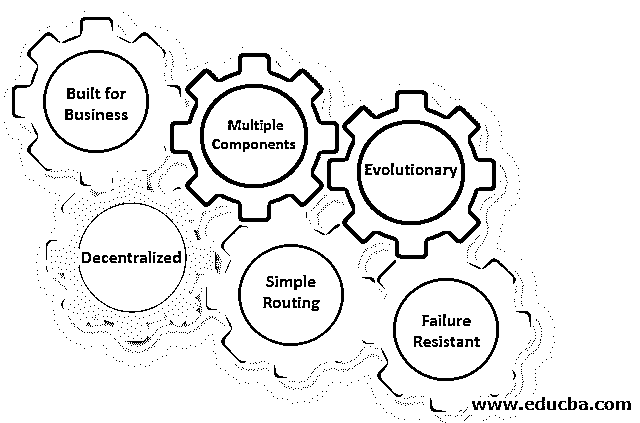

# 什么是微服务？

> 原文：<https://www.educba.com/what-is-microservices/>

## 微服务简介

一种将应用程序中所有松散连接的设备安排到单个服务中的软件开发技术称为微服务。软件按照基于面向服务的架构风格来安排。所有的服务都管理得很好，协议也很轻。应用程序被分解成更小的部分，以便每个部分通过接口相互通信。这些跨平台接口包括 API 和 REST 接口。应用程序被分解成更小的组件或服务。软件的功能在微服务中得到很好的识别和隔离。

### 微服务的特征

有六种类型的特征，解释如下:

<small>网页开发、编程语言、软件测试&其他</small>

#### 1.专为企业打造

微服务的设计一般涵盖公司优势和目标。跨职能团队使用[微服务架构](https://www.educba.com/what-is-microservices-architecture/)与传统的整体设计模型形成对比，在传统的整体设计模型中，不同的团队有一个特殊的关注点，如 ui、服务器、技术层或服务器端逻辑。该团队有责任基于通过消息总线传输的一个或多个服务来生产这样的产品。

#### 2.分散的

由于微服务包括一系列网络和技术，老派的集中管理方法并不适合。微服务组支持分布式管理，因为它的设计者正在努力创建实用的工具来解决与他人相同的问题。微服务架构支持分散式数据管理，分散式治理也是如此。单片系统使用单个逻辑数据库用于各种应用程序。通常，每个服务在微服务应用程序中管理其唯一的数据库。

#### 3.多个组件

根据定义，设计为微服务的软件可以分成多个组件服务。以便独立地部署、修改和重新部署这些服务，而不改变应用程序的结构。因此，只需要修改一个或多个不同的系统，而不是重新部署整个应用程序。

#### 4.简单路由

微服务的功能类似于标准的 UNIX 系统，接收请求，处理请求，并给出适当的响应。这与其他产品的数量相反，例如企业服务总线，其中高技术系统用于消息、编排、路由和业务规则。你可能会声称微服务有处理信息的智能端点，并使用逻辑和愚蠢的管道来传递信息。

#### 5.进化的

进化模型是微服务架构，同样适用于进化系统，在这种系统中，有一天访问应用程序的计算机形式是无法完全预测的。许多应用程序都是从单片开始的，但是由于出现了一些不可预见的需求，与旧的单片架构交互的微服务可以通过 API 逐渐重新开发。

#### 6.抗故障

微服务旨在像一个全面发展的孩子一样管理失败。考虑到许多特定的服务相互通信，出于这样或那样的目的，在这种情况下系统可能会失败，用户应该允许其环境在退出时尽可能优雅地运行。然而，对其进行监控有助于防止故障风险。由于显而易见的原因，这种需求给微服务带来了比单一系统架构更大的复杂性。

### 利弊

下面给出了一些利弊解释。

#### 赞成的意见

*   微服务的架构给予开发者独立开发和执行产品的自由
*   一个相对较小的团队可以开发一个微服务
*   简单的集成和自部署(使用像 Hudson、Jenkins 等开源软件。)当前整合。
*   [易于培养](https://www.educba.com/advantages-of-microservices/)人们理解和改变，团队的新成员可以很快富有成效
*   开发者可以使用最先进的技术。
*   更快地启动 web 容器，以便更快地部署它
*   如果需要更改应用程序的特定部分，相关组件会随之更改并重新部署—无需更改或替换软件。
*   第三方提供的服务的扩大和融合
*   没有长期的工程堆栈承诺

#### 骗局

*   由于分布式交付，测试可能变得复杂和重复。
*   更多的服务会导致信息阻塞。
*   该架构更加复杂，因为程序员必须降低网络延迟、容错能力，并处理各种消息和负载平衡格式。
*   服务数量的增加会使整个产品的集成和管理变得复杂。
*   除了整体架构的几个复杂性之外，开发人员还必须解决分布式系统的进一步复杂性。
*   开发人员将更加努力地应用服务之间的交互过程。
*   在不使用集中交易的情况下，涉及一个以上公司的案件的管理不仅复杂，而且需要团队之间的沟通和合作。

### Java 微服务框架

以下是 java 微服务的框架:

*   Spring Boot: 这可能是最好的 Java 微服务系统，它运行在控制反转语言、面向编程等之上。
*   Dropwizard: Dropwizard 将健壮、成熟的 Java 库集成在一个简单、轻量级的包中，专注于在 Dropwizard 中实现事情。
*   Restlet 项目帮助 Java 开发人员构建更好的 REST 系统 Web APIs。
*   **Spark:** 用 Kotlin 和 Java 8 以最小的努力构建 web 应用的微框架。

### 结论

在这里，我们看到了什么是微服务，以及它们如何帮助您开发业务架构。在确定了这些项目之后，我们讨论了它们的主要好处。相反，我们看到了一些最著名的 Java 微服务 API。

### 推荐文章

这是什么是微服务的指南？在这里，我们讨论 java 微服务框架的介绍、特点、优点和缺点。您也可以看看以下文章，了解更多信息–

1.  [云计算服务](https://www.educba.com/cloud-computing-services/)
2.  [AWS 存储服务](https://www.educba.com/aws-storage-services/)
3.  [微服务 vs 网络服务](https://www.educba.com/microservices-vs-webservices/)
4.  [微服务工具](https://www.educba.com/microservices-tools/)

