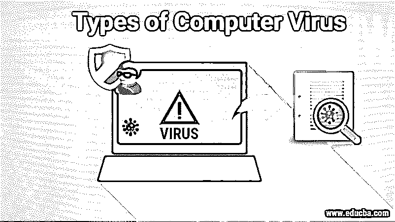

# 计算机病毒的类型

> 原文：<https://www.educba.com/types-of-computer-virus/>

## 计算机病毒类型介绍

我们将看到计算机病毒类型的概要。计算机病毒是黑客设计用来从用户那里获取数据的简单恶意代码。计算机病毒通过将自身复制成另一个程序，将自身传播到文档中，并控制该文档和敏感数据来进行自我复制。将计算机病毒作为可执行文件传播的一般方法是通过电子邮件。如果用户打开电子邮件并点击文件，病毒就会进入系统并影响其性能。计算机病毒也通过 USB 驱动器、存储盘和可移动硬盘传播。这是一个严重的问题，必须通过安装防病毒程序来采取措施。

### 不同类型的计算机病毒

计算机病毒以各种形式出现，对系统产生不同的影响。以下是计算机中不同类型的病毒:

<small>网页开发、编程语言、软件测试&其他</small>

#### 1.引导扇区

引导扇区病毒影响主引导记录，清除病毒是一项困难而艰巨的任务，并且经常需要对计算机进行格式化。它通常通过可移动磁盘传播。

#### 2.直接行动

直接作用病毒是安装在隐藏或检索隐藏在计算机内存下，它也称为非常驻病毒。它作为一个寄生虫，附在一个相当大的文件，希望受到影响。但是它不会干扰用户的体验和系统的性能。

#### 3.居民

常驻病毒安装在系统上，要找到它并从系统中根除电脑病毒是非常困难的。它存储在计算机内存中，会影响系统的性能。常驻病毒很麻烦，因为它们可以隐藏在系统的 RAM 中，不被反病毒软件发现。清除原始病毒后，可以启用内存存储中保存的版本。当[计算机操作系统](https://www.educba.com/types-of-computer-operating-system/)启动某些应用程序或功能时，就会发生这种情况。

#### 4.多国参加的

多部分病毒可以通过多种方式传播，同时影响计算机的引导系统和可执行文件。

#### 5.多态的

多态病毒无论在哪里复制都会改变其特征模式，并且很难找到受影响的过程。它可以将其属性转换为底层代码，而无需转换基本函数。当用户倾向于检测病毒时，它可以改变它的修改，并且用户不再能够发现病毒的存在。

#### 6.写得过多

覆盖病毒删除被感染的文件，并有可能删除和删除损坏的文件，用户失去了所有的耸人听闻的数据。它主要通过电子邮件传播，主要用于破坏文件系统或整个应用程序。顾名思义，它通过用其代码覆盖文件并破坏系统性能来影响系统。另一方面，还会执行其他文件来影响其他文件系统和数据。

#### 7.空间填充填充

Spacefiller 病毒填充代码之间的空间，不会影响文件。它被称为蛀牙病毒。

#### 8.文件感染者

文件感染病毒通过程序文件传播，并在程序作为文件类型执行时影响程序。当加载文件时，病毒也会随之加载。每当加载脚本时，也会执行该命令。

#### 9.宏指令

宏病毒主要针对 Microsoft word 中的语言命令。类似的评论也适用于其他程序。宏是部署在命令序列上的关键字。宏病毒旨在将恶意代码添加到 word 文档的宏序列中。网络攻击者利用社会工程来锁定用户。用户可以启用宏来加载病毒。Office 2016 版本中克服了 word 文档错误。可以对其进行访问以进行受信任的工作，如果需要，可以在整个公司范围内对其进行阻止。

#### 10.Rootkit

rootkit 病毒是秘密安装在受影响的进程上的非法 rootkit，它为黑客打开了大门，并访问整个系统。黑客可以禁用或修改这些功能。与其他病毒不同，它的设计超越了反病毒软件。更新版本的重要反病毒涉及 rootkit 扫描。引导记录感染程序会影响磁盘上特定系统区域中的代码。它连接到硬盘上的 USB 和 DOS 引导或 MBR。但是这些病毒现在并不常见，因为它依赖于物理存储介质。

#### 11.爬行动物

爬虫不是一种危险的病毒，但是它能自我复制。一旦它影响到系统，它会创建一个弹出消息，比如如果你能抓住我。

#### 12.麋鹿克隆人

Elk Cloner 是一种启动病毒，它攻击了苹果系统，并留下了黑客写的一首诗。ILOVEYOU

ILOVEYOU 是一种造成巨大经济损失的病毒。这封邮件被伪装成给通讯录中任何人的情书，如果用户提示打开它，病毒就会被注入他们的系统。这很流行，在短短九天内影响了五千万个系统。

#### 14.红色代码

红色代码病毒攻击了微软的服务器，并导致了许多与服务器相关的问题，因为它使所有的信息技术系统降级。Ninda 是一种窗口病毒，通过多种方式注入。它通过电子邮件、网络浏览器、附件和不同的便携式设备传播。

#### 15.监狱

Slammer 是一种传播速度极快的病毒，能在几分之一秒内影响数十亿个系统。破坏整个程序的一位代码是一种病毒，当程序出错时，用户就会收到大量毫无价值的媒体，并引用一句话，比尔·盖茨停止赚钱了。韦尔奇亚是一种病毒，它会影响计算机，然后自我删除。

#### 16.指挥官

Commwarrior 是一种高级病毒，它通过短信攻击智能手机。这是一种新的病毒，在初期阶段，所以安全是坚定的，以防止用户数据。用户必须用强大的防火墙和防病毒软件来保护他的设备，以防止系统受到任何病毒攻击。用户在安装程序、点击垃圾邮件、下载可疑文件、将硬盘插入系统之前，应该反复检查两次。

### 推荐文章

这是计算机病毒类型的指南。在这里，我们讨论不同类型的计算机病毒的基本概念，如引导扇区、直接作用、常驻等。您也可以浏览我们推荐的文章，了解更多信息——

1.  [USB 端口类型](https://www.educba.com/types-of-usb-ports/)
2.  [恶意软件的类型](https://www.educba.com/types-of-malware/)
3.  [网络攻击的类型](https://www.educba.com/types-of-network-attacks/)
4.  [网络安全的类型](https://www.educba.com/types-of-cyber-security/)

