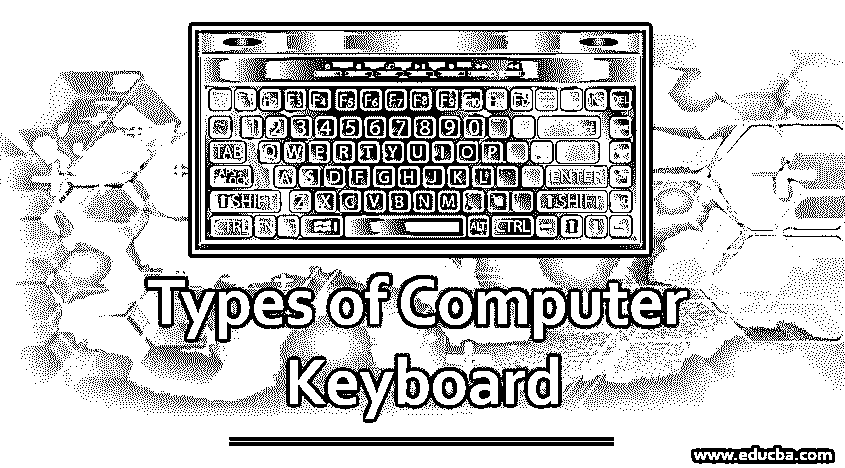

# 计算机键盘的类型

> 原文：<https://www.educba.com/types-of-computer-keyboard/>

## 什么是电脑键盘？

键盘是一种包含所有字母、数字、符号和特殊字符的便携式有线或无线电子设备，用于将输入数据输入到膝上型/台式计算机系统中。计算机用户出于不同目的通常使用的各种类型的计算机键盘是 qwerty 键盘、游戏键盘、虚拟键盘和多媒体键盘。根据键盘用于连接电脑的连接选项，键盘可分为有线键盘、无线键盘、蓝牙键盘和 USB 键盘。

### 计算机键盘的类型

键盘根据大小和使用模式进行分类。这些类型讨论如下:

<small>网页开发、编程语言、软件测试&其他</small>

#### 1.多媒体键盘

拥有所有多媒体按钮的键盘称为多媒体键盘。这些按钮包括播放、暂停、上一个、下一个、调高音量、调低音量、静音和启动媒体的特殊按钮。此外，一个按钮来启动浏览器，我的电脑，计算器是可用的。

#### 2.机械键盘

每个键使用物理按钮的原始键盘被称为机械键盘。每按一个键都会发出噪音。一个按钮被按下，一个电信号被发送到计算机设备，然后显示字符。

#### 3.无线键盘

蓝牙、红外技术或无线电频率用于连接键盘和计算机设备。我们可以移植键盘，并且在键盘附近不需要父系统。这些键盘重量轻，尺寸更小。这些键盘应该有一个发射机和收发机。发射器以无线电波的形式将键盘上的笔画发送出去，并由位于父母设备附近的收发器接收。

#### 4.虚拟键盘

智能手机中使用的键盘称为虚拟键盘。该键盘在需要时出现，在键入完成时消失。这可以根据需要自动设置。同样在 windows 系统中，我们可以使用出现在屏幕上的虚拟键盘。虚拟键盘不需要携带任何物理物品。

#### 5.USB 键盘

通用串行总线键盘有一个带电线的 USB 棒，必须插入系统的 USB 端口。然后键盘就好用了。重新启动系统时，键盘不受支持，因此用户可能会遇到问题。安装合适的驱动程序有助于解决此问题。

#### 6.人体工程学键盘

这种键盘主要是为用双手打字的用户设计的。这种键盘的优点是对用户来说肌肉劳损和腕管综合症更少。键盘是从人体工程学的角度来设计的。这种键盘很贵，普通人买不起。

#### 7.标准键盘

由于琴弦的排列，早期的打字机的键在 QWERTY 范围内。早期的计算机键盘也是以同样的方式制造的，以便于打字机用户使用。这个键盘是我们所有人最常用的，因此不需要介绍。

#### 8.游戏键盘

只有很少几个键是游戏玩家专用的键盘叫做游戏键盘。键盘中还包括图形。w，S，D，A 和箭头键是你能在这个键盘上找到的唯一的键。这个设计太棒了，任何人都会爱上这个键盘。

#### 9.Chiclet 键盘

这款键盘的按键呈方形，边缘呈圆形。不同的设备采用不同的技术，使其与众不同。按钮与键盘上的开关薄膜相连，现在几乎所有的设备都使用这种薄膜。

#### 10.薄膜键盘

这些键盘使用压力垫，字符印刷在一种叫做薄膜的柔性表面上。这些键盘的成本非常低。但是打字和游戏的不准确让他们失去了重要性。

#### 11.拇指键盘

带有较少键或只有数字字符的小键盘被称为拇指键盘。这些主要用于算术运算，也用于游戏。这个键盘只有拇指大小。

#### 12.柔性键盘

由硅胶制成的键盘拥有大部分的按键，外观灵活，被称为柔性键盘。按键之间的距离更小。键盘可以滚动，不可折叠。

#### 13.笔记本电脑大小的键盘

在这种类型的键盘中，键被减少并且键之间的空间更小。这些是专门为笔记本电脑设计的。大多数键盘没有数字小键盘，一些功能与键盘上的其他键结合在一起。

#### 14.背光键盘

按键上有灯，即使在黑暗中也能帮助用户打字。这些键盘可用于游戏和传统键盘。

#### 15.魔法键盘

这些键盘由 Mac 制造，由电池支持。设计不错，让大家有了键盘的手感。

#### 16.蓝牙键盘

键盘通过蓝牙与[系统连接，因此 USB 端口可用于其他用途。这种键盘为有线键盘提供了灵活性。](https://www.educba.com/what-is-bluetooth/)

#### 17.和弦键盘

有限数量的按键有助于用户将键盘移植到任何地方。一些键的组合有助于产生期望的特征。这种键盘体积小，在商业上不如其他键盘成功。

### 键盘的使用

这里我们已经指出了键盘的用途。

*   用户可以用键盘输入字母和数字。此外，一些特殊的命令可以使用键盘来完成。只有用键盘，我们才能输入数据。
*   大多数功能都可以通过键盘完成，无需鼠标的帮助。功能键和控制键用于鼠标完成的特殊功能。
*   快捷键用于访问系统中的任何文件，因此可以避免使用鼠标。
*   控制键和退出键可以在大多数功能中用于各种目的。

触摸屏键盘现在是最常用的，在未来，它们可能会被增强现实键盘所取代。新键盘比传统键盘更加灵活，更加个性化。也许在将来，数据可以通过键盘以外的其他方式输入。这一代人需要欢迎所有变化的心态。

### 推荐文章

这是计算机键盘类型的指南。这里我们讨论不同类型的计算机键盘的基本概念，如多媒体、机械、无线键盘等。您也可以浏览我们推荐的文章，了解更多信息——

1.  [计算机内存的类型](https://www.educba.com/types-of-memory-in-computer/)
2.  [计算机硬件 vs 网络](https://www.educba.com/computer-hardware-vs-networking/)
3.  [USB 端口类型](https://www.educba.com/types-of-usb-ports/)
4.  [大型计算机的种类](https://www.educba.com/types-of-mainframe-computers/)

