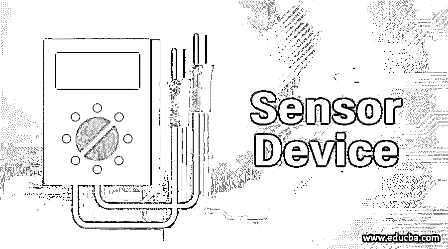
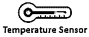
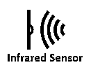
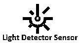
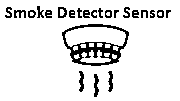

# 传感器设备

> 原文：<https://www.educba.com/sensor-device/>

## 传感器设备简介

传感器是一种检测并根据从物理环境接收的一些输入做出响应的设备。输入可以是任何形式，如热、光、压力、湿度、运动和其他环境因素。然后，传感器设备对收集的输入进行一些处理，并生成人类可读形式的输出。该传感器设备可用于家用电器、工业和其他部门。传感器设备的设计基于使用情况，并且可以相应地进行设计。[传感器可用于](https://www.educba.com/what-is-sensors/)任何领域，有助于简化日常工作。

### 什么是传感器设备？

传感器设备是一种进行某些处理并产生输出的输入设备。传感器设备的另一个含义是，它是一种将信号从一个能量源转换到电域的设备。传感器的一个例子是光敏电阻(LDR)。在 LDR，电阻根据光照强度而变化。当光强度较大时，电阻非常小，而当光强度较小时，电阻值较高。

<small>网页开发、编程语言、软件测试&其他</small>

### 传感器设备的类型

有各种类型的传感器用于日常使用，并具有不同类型的应用。传感器依赖于一些物理现象，如电阻、传导、温度、热传递、电容等。

在下一节中，将对其中一些进行描述:

#### 1.温度传感器

顾名思义，温度传感器是用来感应温度的。温度传感器检测温度变化。随着温度的变化，属于温度传感器中电压和电阻的相应变化。它可用于手机、电脑、空调系统、汽车、工业等部门。温度传感器有各种各样的例子，如电阻温度器件(RTD)、热敏电阻和集成电路。

#### 2.近程传感器

接近传感器是一种非接触式传感器，用于检测物体的存在。该传感器用于检测一个物体与另一个物体的任何接触。可以用在手机里，也可以用在汽车里(停车传感器)。接近传感器的主要用途[是在停车系统中。在汽车倒车时，主要使用接近传感器。近程传感器中使用的技术基于霍尔效应、超声波、电容和光学。](https://www.educba.com/what-is-proximity-sensors/)

#### 3.红外传感器

红外传感器是一种基于光的传感器，可用于检测任何物体。红外传感器在移动电话中用作接近传感器。大体上有两种类型的红外传感器，即透射型红外传感器和反射型红外传感器。当需要检测物体之间的任何运动时，使用透射式 IR 传感器。它被放置在物体之间，当物体之间有东西通过时，透射传感器检测到该活动并通知该活动。在反射型传感器中，当有东西放在反射型传感器前面时，它检测该活动和关于该活动的信息。

#### 4.光探测器传感器

顾名思义，光检测器传感器用于检测光的强度。这种类型的传感器用于将光能转化为电能。光检测器传感器能够检测紫外光、可见光、红外光等。

#### 5.烟雾探测器传感器

烟雾探测器传感器是一种探测烟雾和火灾的烟雾探测装置。它主要用于家庭、学校、工业和办公室。这种装置被广泛使用并且非常重要，因为它可以用于探测火灾和降低事故风险。当传感器检测到烟雾时，它会立即发出警报并提醒所有人，以便在规定时间内采取适当的行动。

### 传感器设备的使用

以下几点解释了传感器设备的用途:

*   温度传感器可用于测量土壤温度，这对作物生产是有益的。
*   压力传感器可用于检测管道中的漏水，并有利于节约用水。
*   近程传感器可以用在汽车上。倒车时，可以使用近程用户，如果物体非常靠近汽车，近程用户就会发出警报。它也可以用于博物馆，如果有人试图触摸博物馆中的任何物体，它就会发出警报。
*   红外传感器可用于检测湿度和火焰。
*   这种光学传感器可以用在电脑、复印机上，在黑暗的时候可以自动打开。也可用于化学工业、炼油厂、化工厂等。
*   气体传感器可用于检测化工厂、煤气厂的气体泄漏。它可用于降低事故风险，并负责检测任何有毒气体、可燃气体或任何可燃气体的泄漏。
*   烟雾传感器用于检测办公室、家庭或任何行业中的任何烟雾或火灾。当它探测到烟雾时，会立即发出警报。

### 传感器设备的优点

以下几点解释了传感器设备的优势:

*   红外传感器用于控制许多系统。因为传感器的尺寸非常小，很难用肉眼看到，并且也非常可靠。
*   光传感器对于安全系统来说非常可靠。当用于工业、办公室和银行时，它们提供额外的安全性。
*   运动传感器用于检测任何类型的可疑活动。它也非常容易安装和使用。
*   烟雾传感器、气体传感器用于检测工业中的任何类型的事故，并有助于挽救人们的生命。

### 结论

对于当前的工业场景，传感器非常重要。因为它们在工业、办公室、家庭中被大量使用，以减少人力并使工作变得容易。传感器是不同的应用，可用于任何部门，使人类的工作变得容易。

### 推荐文章

这是传感器设备指南。这里我们详细讨论什么是传感器设备，它的类型、用途和优点。您也可以浏览我们的其他相关文章，了解更多信息——

1.  [物联网的挑战](https://www.educba.com/challenges-of-iot/)
2.  [防火墙设备](https://www.educba.com/firewall-devices/)
3.  [联网设备](https://www.educba.com/networking-devices/)
4.  [传感器的应用](https://www.educba.com/applications-of-sensors/)

