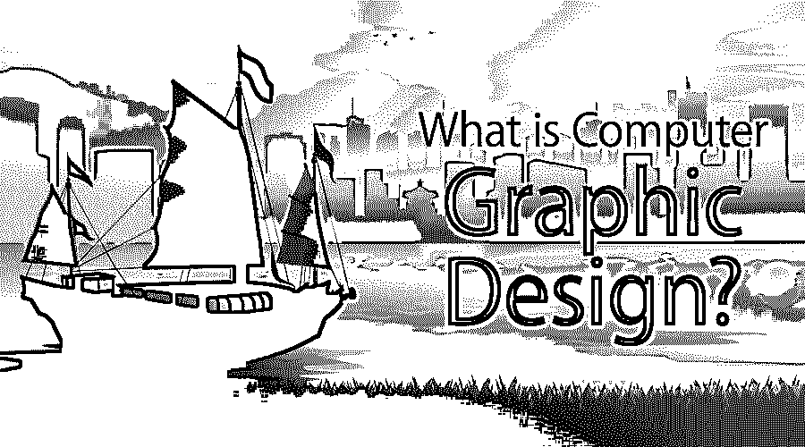

# 什么是电脑平面设计？

> 原文：<https://www.educba.com/what-is-computer-graphic-design/>

## 什么是电脑平面设计？

计算机图形设计产生视觉想法和广告宣传的创意模板。这已经成为你的广告影响营销的一种现象。在发布信息和创造更有吸引力的产品形象以促进产品市场方面，平面设计师扮演着重要的角色。为了产生情感并向观众传递信息，它使用技术来操纵和融合文字、图片、颜色和字体。继续阅读不同的计算机图形设计方面。

### 电脑平面设计如何让工作变得如此轻松？

它包括各种软件的[,使设计变得容易](https://www.educba.com/career-in-designing/)和更少的时间消耗。使用这些工具设计图像会给你带来大量现成的东西，你只需要把它们放在合适的地方。同样，如果我们讨论着色，那么只需单击一下就可以填充该区域，编辑起来太容易了。

<small>网页开发、编程语言、软件测试&其他</small>

将媒体和文本等内容添加到经过处理的图像中，可以完美地向最终用户解释您的感受。我们可以制作现在比较有名的 GIF(图形集成文件)。GIF 大约是 0 到 5 秒，简单地解释了你想要解释的内容。

### 顶级公司

平面设计中的许多顶级行业是:-

1.  Doodlo 设计
2.  五角星形
3.  兰多
4.  元设计
5.  追逐
6.  查理·史密斯设计
7.  快乐齿轮
8.  chermayeff & geismar & haviv
9.  藏红花品牌顾问

### 电脑平面设计能做什么？

我们可以在以下几个方面利用平面设计

1.  数字设计=> It [表示任何经过处理或修改的](https://www.educba.com/what-is-digital-design/)图像，则该设计称为数字设计。在此过程中，我们关注图像的艺术价值和美学外观。数字设计用于广告，有时也用于广告牌。
2.  多媒体设计= >多媒体设计是指包括声音和文本，并将其制作成一个媒体文件。这些是通常在网站或演示文稿中看到的精美图形图像。

### 工作

有时你在广告中写的文字可能不清楚，不能吸引路过的人。但是使用这个软件，你可以增强图片上的文字，使其更具美感，从而吸引注意力。

### 优势

一旦你学会了电脑图形设计，你就会知道:-

1.  你的营销技巧变得更加强大。
2.  你所操作的图像给你的产品带来了巨大的市场，增加了收入来源。
3.  在多媒体设计中，你不需要告诉任何东西，相反，你添加的声音和文字会在你添加的图像的帮助下告诉你一切。

### 所需技能

要学习计算机图形学，你应该具备分析技能、沟通技能和时间管理技能。你应该有艺术才能和一些创造力来展示你能创造出多么娴熟的艺术。

### 为什么要用电脑平面设计？

我们使用电脑图形设计是因为

1.  考生可以独立工作。
2.  他们可以根据项目进行团队合作。
3.  如果我们有好的帮手，项目可以在规定的时间内完成。
4.  可以同时处理多个项目，这使我们能够做更多的工作。

### 范围

每个领域都有不同的范围，但平面设计师有以下优势:-

1.  如果候选人只是对成为艺术家来表达他的创造力感兴趣，那么他就在正确的平台上。
2.  由于各种跨国公司都在使用计算机图形工具，所以学习候选人有很大的选择余地。
3.  如果你对格式化现有的图像或信息感兴趣，那么你可以发展你的职业作为一个桌面出版商。
4.  你可能有机会成为教授这些工具的学院或大学的培训师。

### 我们为什么需要电脑平面设计？

当今世界对计算机图形的需求在以下几个方面变得越来越重要

1.  每个营销人员或销售人员都依赖于产品的惊人增强。
2.  产品推出后，第一步是进行多媒体设计。
3.  无论是公司还是大品牌，每个人都有自己的网站，他们需要定期更新网站。他们必须在图形设计师的帮助下修改他们的产品或信息，因为图形设计师会以更吸引人的方式展示信息。

### 谁是学习这项技术的合适受众？

候选人应该拥有任何领域的学士学位，或者至少必须毕业于任何领域。如果候选人来自销售或营销领域，那么他可以通过学习这些来利用他以前的经验。

热情的爱好者和有艺术头脑的人最受欢迎，因为这将有助于探索他们的职业生涯。

### 这项技术将如何帮助你的职业发展？

在这项技术中，你必须创建自己的投资组合，这有助于提升你的职业生涯。作品集可以是你已经成功完成的任何项目，无论是你的学校项目还是大学项目。你的项目的细节应该以一种详细的方式被适当地提及。你可以提到你完成的所有项目的数量，这些项目给你的职业生涯带来了繁荣。

### 结论

既然可以得出结论，那就是每个人都想通过互联网攫取知识，这是当今现代世界的基本需求。通过使信息和媒体更强大和更有吸引力，使最终用户学习和清楚地了解事物。

### 推荐文章

这是一个什么是计算机图形设计的指南？.在这里，我们讨论了电脑平面设计的基本概念，工作，技能，范围，以及优势。您也可以浏览我们推荐的其他文章，了解更多信息——

1.  [什么是 C#中的设计模式](https://www.educba.com/What-is-Design-Pattern-in-C-sharp/)
2.  [网页设计职业](https://www.educba.com/career-in-web-designing/)
3.  [什么是系统设计？](https://www.educba.com/what-is-system-design/)
4.  [什么是 Adobe Illustrator](https://www.educba.com/What-is-Adobe-Illustrator/)

