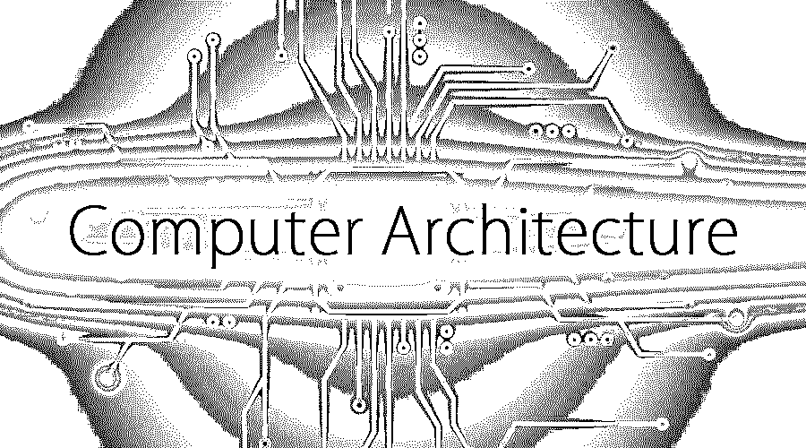

# 计算机体系结构面试问题

> 原文：<https://www.educba.com/computer-architecture-interview-questions/>

## 计算机体系结构概论面试问答

计算机体系结构是用多套规则和方法准备的关键实现之一，这些规则和方法详细解释了任何计算机系统的功能、实现和组织。[计算机体系结构](https://www.educba.com/types-of-computer-architecture/)是计算机工程中必须阅读和理解的关键科目之一。每个体系结构都有自己的定义，这实际上有助于计算机详细定义计算机的功能和相关的编程模型，但从不定义任何特定或特殊的实现。它还涉及定义特定体系结构的指令的适当设计开始，在微观层面上设计纯体系结构，设计逻辑表示，以及帮助整个系统的适当实现。

现在，如果你正在寻找一份与计算机架构相关的工作，那么你需要准备 2022 年计算机架构面试问题。的确，每个面试都因不同的职位而不同。在这里，我们准备了重要的计算机体系结构面试问题和答案，这将有助于你在面试中取得成功。

<small>网页开发、编程语言、软件测试&其他</small>

在这篇 2022 年计算机体系结构面试问题的文章中，我们将提出 10 个最重要和最常见的面试问题。这些问题分为以下两部分:

### 第 1 部分–计算机架构面试问题(基础)

第一部分包括基本的面试问题和答案

#### Q1。给出微处理器使用的基本元件的全部细节？

**答案:**
我们可以假设一个微处理器通常使用的三种基本元件，例子如下:

*   对于微处理器来说，为单个块指定合适的地址是非常重要的，因此地址线是微处理器的关键部件之一。
*   传输数据是一个主要标准，这里数据线是微处理器保持相同的组件。
*   现在寻址和数据传输已经完成，所以目标是处理数据。集成电路芯片是微处理器中的关键部件。

#### Q2。解释一下 MESI 的细节？

**答案:**
MESI 是最流行的协议之一，它基本上有助于支持处理器的关键要求之一，即回写缓存。由于 MESI 协议是由伊利诺伊大学开发和设计的，所以也称为伊利诺伊协议。最初使用的是写通缓存，这实际上损失了巨大的带宽。回写高速缓存主要是由于在物理系统中适当地管理带宽而流行的。该协议维护一种称为脏状态的方法，它实际上向系统指示该缓存中的数据与主存储器的缓存中存储的数据不同。

#### Q3。解释市场上存在的不同类型的危险，是否有可能避免它们？如果是，请解释如何？

**答案:**
这是一个物理系统的临界情况之一，称之为危险源。这种情况主要是防止在适当的时钟周期内给下一个执行程序流提供适当的指令来执行实际上由体系结构设计的所希望的脚本。这显然会降低物理系统的预期性能。

通常在计算机系统中定义三种危险:

*   **结构性:**通常由于系统的已定义结构而产生的危险，假设一些指令由于硬件故障而无法运行。
*   **数据:**这种危险会在执行相关指令时产生。
*   **控制:**这种危险主要产生在改变流水线时，直接影响系统配置。

结构性危险可以通过改进硬件配置或更换来避免，因为这种混乱情况几乎是众所周知的问题。

#### Q4。详细描述一下流水线操作？

**答案:**
这是一次面试中问到的计算机基础架构面试问题。这是先进的微处理器常用的技术之一。这种技术主要用在多条指令进入系统，但微处理器不会按顺序执行所有指令的时候。整个序列的执行过程可以由指令创建者定义。有人会把每条指令的处理顺序提供给物理系统，这叫做流水线操作。

#### Q5。假设定义高速缓存的大小为 64 KB，并且它具有多个块。假设总块大小为 32B，并且遵循该高速缓存的双向组关联，现在考虑 32 位机器或物理地址，提供索引、标签和块偏移之间划分的细节？

**答案:**
缓存大小为 64 KB，块大小为 32B，块数将为 2000 (64 KB/ 32)。现在我们考虑双向组关联，那么行数将是 1000 (2000/2)，这意味着每个索引应该有 10 位。因为它是 32B 块，所以块偏移将是 5 比特。并且标签也将是 17，则计算是(32-10-5)。

### 第 2 部分-计算机架构面试问题(高级)

现在让我们来看看高级面试问题。

#### Q6。在窥探缓存中解释更多细节？

**答:**
窥探是引入了高速缓存的存储器管理的计算机系统中的定义过程之一。这是其中单独生成的高速缓存具有一个特定定义的监控地址线的过程之一，该监控地址线具有对它们的存储器位置的一个特定访问，该存储器位置直接是它们在高速缓存存储器中已经具有的位置。它在计算机系统中有一个帮助高速缓冲存储器优化的功能。假设已经观察到一个写操作，即高速缓存位置已经在该特定位置执行了所需的高速缓存拷贝，则高速缓存控制器自动使它们自己在该特定位置上的控制拷贝无效，该特定位置在计算机系统中被称为窥探的存储器位置。这实际上有助于优化缓存内存分配器

#### Q7。详细解释一下缓存一致性？

**答案:**
缓存一致性也是计算机系统中缓存管理的流行特征之一。它主要保证数据的完整性，将数据存储在实际属于共享资源的本地缓存中。

让我们转到下一个计算机体系结构面试问题

#### Q8。详细解释一下虚拟内存？

**答案:**
虚拟内存是在计算机系统中附加的一种内存，它扩展了计算机原有的内存，增加了一些额外的空间。

#### Q9。请详细解释 DLX 管道的 5 个阶段。

**答案:**
这是面试中被问得最多的计算机架构面试问题。DLX 管道如下

*   CPU 操作数存储
*   显式操作数
*   位置
*   操作
*   操作数的类型和大小

#### Q10。详细解释一下缓存？

**答案:**
缓存是任何计算机系统架构进程的关键功能之一。它总是以各种形式存在于每一台计算机中。计算机系统中有几种可用的缓存，一些流行的缓存有内存、[软硬件磁盘](https://www.educba.com/hardware-vs-software/)、页面缓存等。根据计算机系统的架构设计，甚至虚拟存储器也被认为是高速缓冲存储器。内存缓存主要集中在高速静态随机存取存储器上，当大量程序或指令试图重复使用相同的数据时，这是非常必要的。类似地，网页缓存主要帮助互联网浏览器提高访问该网页上相同级别数据的速度。

### 推荐文章

这是一个计算机体系结构面试问题和答案列表的指南，以便候选人可以轻松地解决这些面试问题。在本帖中，我们研究了面试中经常被问到的顶级计算机架构面试问题。您也可以阅读以下文章，了解更多信息——

1.  [产品经理面试问题](https://www.educba.com/product-manager-interview-question/)
2.  [数据结构面试试题](https://www.educba.com/data-structure-interview-questions/)
3.  [UI 开发者面试问题](https://www.educba.com/ui-developer-interview-questions/)
4.  [冬眠面试问题](https://www.educba.com/hibernate-interview-questions/)

