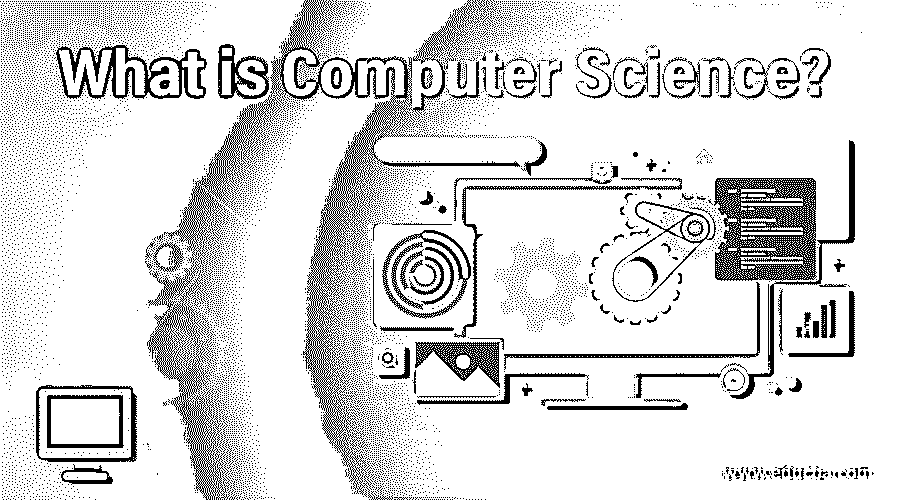

# 什么是计算机科学？

> 原文：<https://www.educba.com/what-is-computer-science/>

## 计算机科学导论

计算机科学是对涉及数据并由多个程序表示的不同程序的研究。用户可以使用算法、编码、与其他人互动，并且可以使用计算机科学知识操纵数字信息。它帮助人们进行计算和设计软件，开发不同的应用程序。技术是用来解决问题的，不同的学科包括微处理器、编程语言、数据库、网络和计算机软件。一门没有任何传统科学方法，只用技术来解决任何问题的科学，叫做计算机科学。

### 计算机科学是如何让工作变得如此简单的？

计算机科学家关心的是计算理论和软件系统的设计。计算机科学家使用技术来解决问题。科学家编写软件，让计算机做一些事情或新事物，并更有效地完成任务，然后为桌面设备、移动设备创建应用程序，开发网站和编程软件。如果我们看到任何地方，包括大型技术公司到小型技术公司，政府机构到创业公司和非营利组织，甚至小商店，我们都能找到软件应用程序。所以大家都是电脑用户。

<small>网页开发、编程语言、软件测试&其他</small>

它有助于自动化和监控任务。因此，计算机科学能做的最好的事情之一就是编写一个程序来执行一项任务，一旦完成，就可以使用该程序自动执行该任务，次数不限。例如，在收到一封电子邮件时，对其进行过滤、分类、回复和转发，或者对计算机进行编程，使其移动为汽车制造零件的机械臂。因此，在计算机科学的帮助下，我们可以在没有人力、没有手工的情况下完成任何可以想象的任务，还可以通过编程等待事情发生。

### 优势

自动化任务的好处是节省时间。例如，使用像亚马逊网站这样的网上购物，你可以找到很多和你在商店里找到的一样的产品，价格相同或者更便宜。你也可以让那些物品送货上门，而不必离开你的家；另一个例子可以使用在线银行网站查看您的银行余额并支付账单；如果你喜欢的餐馆有网站，你可以点外卖而不必排队，你可以查看在线交通摄像头和带有交通信息的地图以找到最快的路线等等。

这只是其中的几个例子，但是在日常生活中，计算机科学还可以做更多的事情，它会给你带来越来越多的好处，让你的工作和生活变得更容易。

### 使用计算机科学

要从事计算机科学，我们需要从事计算机系统的理论方面的工作，而不是计算机工程领域的硬件方面的工作。计算机科学的主要用户是 IT(信息技术)公司、计算机科学家和所有开发基于计算机的应用程序以实现任务自动化的人，因为 IT 公司的主要雇主是 IT 咨询公司和服务提供商，以及大多数行业组织的 IT 部门。这些行业包括零售、金融服务、电信、国防和航空航天。

在计算机科学中，计算机科学家致力于开发与基于计算机的系统(如处理器)一起工作的数学模型，以提高性能。为了开发一个计算机程序，程序员或科学家需要进行逻辑思考来设计程序，修复错误和排除问题，并使用各种编程语言，如 c、c++、java、python 等等。计算机科学家还需要良好的沟通技巧，以便向其他计算机人员(如程序员)展示结果，以及与没有技术背景的用户和其他领域的专家一起工作。对计算机科学家来说，跟上最新技术和软件的发展是至关重要的，因为这些技术和软件发展非常迅速。

### 计算机科学所需的技能

成为计算机科学所需的主要技能是以有效的方式编写代码和创造性地解决问题的想法。如果你有这些技能，那么就在计算机科学领域茁壮成长，并为自己的成功做好准备。

对于成功的计算机科学专业学生来说，以有效的方式解决问题是最重要的考虑因素，为此所需的技能包括分析技能、解决问题的技能、创造力、批判性思维技能、应变能力等等。

#### 1.分析技能

在计算机科学中，重要的技能是正确地分析问题并提出解决方案，因为计算机科学主要涉及找出问题并提出解决方案。这需要很强的分析能力来理解问题并找到不同的解决方案。

#### 2.解决问题的技巧

计算机科学的另一个关键技能是以系统和逻辑的方式解决问题，因为在 IT 公司，你需要系统地遵循给定步骤中的标准开发方法策略。这是因为大多数从事项目工作的 IT 公司都需要将概念转化为现实。所以你需要以最好的方式执行项目，列出完成项目所需的步骤。

#### 3.创造力

计算机科学的另一个重要的关键技能是成为计算机科学专业学生的创造力。提出问题的解决方案并不是一件容易的事情，为了确保您交付的是最具创新性和最有效的解决方案，需要一个程序员应该跳出框框思考的简单过程。

#### 4.批判性思维技能

批判性思维技能必须要求成为计算机科学大师，因为公司中的计算机科学家或开发人员或程序员将使用各种方法来开发各种不同的项目，因此，如果您知道在解决问题时使用哪些方法以及何时使用是很重要的。因此，通过批判性思考，你可以提出正确的解决方案和正确的方法，同时节省时间，避免在替代方案或失败的解决方案上浪费时间。

#### 5.弹性

当程序员要解决问题时，并不确定在第一次尝试中，只有你会得到解决方案，实际上在多次失败后，你会得到成功的代码。因此，无论程序员处于什么水平，他们所需要的关键技能之一就是考虑到他们在成功之前很可能会失败。在经历了多次失败后，这种有弹性的学习决定了成功，因为这是过程的一部分。

### 范围

随着现在世界变得越来越数字化，计算机科学的范围也变得越来越大。计算机科学有很大的发展空间，甚至你可能会看到来自其他专业的人，比如土木、机械、电子，他们都在计算机科学领域工作。因此，信息技术出口正在扩大；根据记录，如果我们看到印度，印度的 IT 出口预计将扩大到 1750 亿美元。计算机科学范围最重要的一点是，它不局限于印度，这意味着它没有地理边界。这个领域可能使用的全球名称是:分裂的皮查伊、硅谷之外、萨蒂亚·纳德拉、维沙尔·西卡等等。

完成计算机科学后，你可以从事各种工作，如开发人员或软件开发人员、软件测试、数据库开发人员、数据架构师、数据建模人员、助理、质量保证、分析师、移动应用程序开发人员、UI/UX 设计人员、[软件质量保证(QA)](https://www.educba.com/software-quality-assurance/) 、游戏设计人员、网站或移动应用程序设计人员、信息技术审计人员等等。

### 工作机会

根据你的兴趣和职位空缺，在不同的领域和公司有不同的工作机会。

获得工作机会的各种公司如下:

*   印孚瑟斯
*   Wipro
*   塔塔咨询服务公司
*   惠普公司
*   highcostofliving 高生活费
*   太阳微系统公司
*   知道的
*   埃森哲

在美国，在著名的硅谷，他们甚至被像谷歌、雅虎这样的顶级公司招聘。、Adobe、苹果公司、英特尔等等。除了大量的机会，你还会在计算机科学方面获得不错的待遇，这取决于各种因素，如你的大学品牌。如果你在顶尖大学攻读计算机科学，会自动增加你获得高薪的机会，而如果你在任何非品牌大学攻读计算机科学，都不会达到目的，你最终会获得大约 25 k， 另一个因素是你的分数，你的简历反映了你的分数，这可能会给你的面试官留下印象，语言知识是获得良好待遇的一个重要因素，你应该擅长编程语言，如 C，C++，JAVA 等。 C++和 Java 是面试官对你期望更高的两种语言。

### 谁想从事计算机科学？

如果你持有计算机科学工程学位，这是可能的。这些学生可以选择工程学士(CSE)或工程学士(CSE)，工程学士(IT)或工程学士(IT)，工程硕士(CSE)或综合课程来从事计算机科学工程。在 B.Tech 中，CSE 学院教授 CSE 的基础领域，如操作系统、编程语言(C、C++、Java)、网络、数据库管理等等。

你也可以参加上述学位的入学考试。IIT 班加罗、IIT 孟买、IIT 德里、IIT 坎普尔、IIT 卡拉格普尔、IIT 鲁尔基、比尔拉理工学院、德里技术大学等都是印度为数不多的顶尖计算机科学学院。

### 谁是学习计算机科学技术的合适受众？

学习计算机科学技术的合适受众是除了像开发基于计算机的应用程序的开发人员、科学家这样的专业人士之外，想在计算机科学领域发展的学生。

### 结论

它是对计算机和计算系统的研究。它包括信息处理和推进对算法的基本理解，以及有效、可靠的软件和硬件的实际设计，以满足给定的规范。它可以帮助自动化任务，监控任务和节省时间。它所需要的技能包括编写代码、创造性解决问题、分析技能、解决问题的技能、创造力、批判性思维技能、适应能力等等。

完成计算机科学后，你可以从事各种各样的工作，如开发人员或软件开发人员、软件测试、数据库开发人员、数据架构师、数据建模人员、助理、质量保证、分析师、移动应用程序开发人员、UI/UX 设计人员、软件质量保证(QA)、游戏设计人员、网站或移动应用程序设计人员、信息技术审计人员，以及 Infosys、Wipro、Tata Consultancy Services (TCS)、惠普、HCL、Sun Microsystem、Cognizant、埃森哲等公司。学习计算机科学技术的正确受众是学生和专业人士，如开发人员、科学家。

### 推荐文章

这是一本关于什么是计算机科学的指南？在这里，我们讨论计算机科学的工作，范围，所需的技能，职业发展。您也可以浏览我们推荐的其他文章，了解更多信息——

1.  [什么是数据科学](https://www.educba.com/what-is-data-science/)
2.  [计算机科学面试问题](https://www.educba.com/computer-science-interview-questions/)
3.  [什么是 Shell 脚本？](https://www.educba.com/what-is-shell-scripting/)
4.  计算机编程职业

