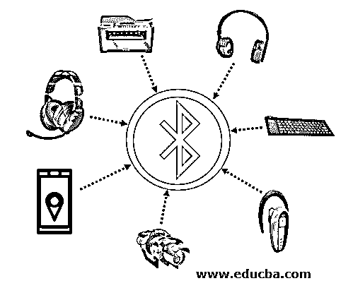

# 什么是蓝牙？

> 原文：<https://www.educba.com/what-is-bluetooth/>

## 蓝牙简介

蓝牙是一种无线技术，用于在短距离放置的两个设备之间共享数据，使用短波长，例如 2.400 至 2.485 GHz 范围内的科学、工业和医疗无线电波段中的超高频无线电波。它还通过个人局域网应用于建筑物和公寓。它类似于通过无线电波工作的 Wifi。蓝牙在设备之间的最大距离为 164 英尺，但这个范围对于家庭、汽车、电子设备和医疗保健应用来说已经足够了。

### 什么是蓝牙？

它是主要为低功耗设备设计的有线通信的标准替代品。它通过廉价的收发器微芯片在短距离内工作。由于这些设备依靠无线电波工作，因此不可见，但准光学无线路径是可见的。这是由 Bluetooth Special Interest Group(SIG)授权的，该组织在电信、计算和网络以及消费电子领域拥有超过 35000 名员工。因此，这是一种简单的机制，对于使用无线电波的短距离传输是有效的。

<small>网页开发、编程语言、软件测试&其他</small>

### 蓝牙的工作原理

*   它基于使用无线电波发送和接收数据的简单原理。每个启用的设备都有一个称为蓝牙适配器的芯片附件。这个适配器用于接收和发送数据。这种适配器适用于相当多的连接。只有当一个电子适配器落入第一个设备的区域内时，它才能识别另一个支持蓝牙的设备。
*   当它们被放置在估计的通信范围内时，它被链接和配对，这被称为蓝牙设备的配对。两个设备之间建立的无线电波连接用于在连接的蓝牙设备之间发送和接收数据。
*   设备每秒可以发送和接收的数据量限制为 720KB。可用频道为 79，频率为 2.45GHz，用于数据共享。
*   当两台设备试图建立连接或链路时，它们会搜索一个公共频率，通过该频率它们可以发送和接收数据。当他们识别出特定的公共频率时，该设备将被转换为“找到”。两个设备的链接不会妨碍其他设备的配对，因为它们使用不同的频道，并且没有重叠的可能性。
*   它的优点是能够让两个以上的设备同时共享信息。当任何两个电子设备开始共享数据时，它们就形成了一个由电子设备组成的微型计算机网络，称为微微网。微微网范围可以容纳七个设备。
*   该设备中的任何一个充当主设备，并且在另一个是从设备的情况下初始化开始的顺序，并且遵循主设备的建议。当另一个微微网加入这个微微网时，它被称为分散网。微微网可以没有任何依赖性地加入或离开微微网。

### 蓝牙的类型

根据其不同的应用，有不同类型的蓝牙，如蓝牙耳机，车载蓝牙耳机，斯托蕾雅耳机，蓝牙打印机，支持网络摄像头，蓝牙 GPS 和蓝牙摄像头。它有一个不同的版本，适用于许多类型的设备。

下面给出了不同类型的蓝牙:

**1。耳机:**这款耳机将智能手机连接到耳机上。它可以帮助拨打电话或接听来电。它配有语音识别功能，便于拨打电话或发送短信。

**2。立体声耳机:**立体声耳机与蓝牙耳机类似，可以连接到音乐播放器。

**3。车载耳机:**该耳机用于在不使用手机的情况下拨打电话，可以听到车载扬声器系统的声音。

**4。配备的打印机:**这种配备的打印机用于打印文件或图片，无需使用任何有线系统。它们是同步的，并且属于连接打印机的相同范围。

**5。启用网络摄像头:**用于无线连接摄像头，并保持与电脑的连接。

**6。全球定位系统(GPS):** 全球定位系统支持智能设备通过语音控制来获取地址方向。

**7。键盘:**该键盘在没有任何有线连接的情况下使用，连接到笔记本电脑或电脑。也可以应用到智能手机上。

### 使用

下面给出了提到的用途:

*   这种应用主要是在电池供电的 2 型设备中，无论连接的另一端是与低功率设备类似的 1 型还是 2 型组件，其范围差异都很小。其范围取决于传播条件、所用材料、天线设置和电池配置。
*   它们用于室内环境，可用于智能手机、智能手表、汽车、医疗应用、GPS、音乐播放器、扬声器等。因为它的安全性非常强，所以它可以安装在所有的办公室、家庭和汽车上。它不容易被黑客攻击，因为它有强大的防火墙。
*   在任何情况下实现和使用都是安全的。一个装有蓝牙设备的房子，用户可以很容易地从一个集中的位置控制他的恒温器设置、警报和电器，比如灯和风扇。
*   对于娱乐，该技术可以链接所有连接到家庭影院的设备，而无需任何电线或音频或视频可以直接从手机播放到电视或扬声器。
*   当用户开车时，蓝牙可以将启用的设备连接到汽车的仪表板上，以接听电话或听手机歌曲，或从导航显示器上的 GPS 获取方向。
*   类似地，它可以通过网络或互联网连接应用于耳机的消费电子产品，例如电话。它可以在电话、电视、扬声器和相机之间共享数据。其配备的健身设备，使它很容易按照日常锻炼。监测心率和 GPS 跟踪器，自动生成报告或计算燃烧的卡路里。

### 推荐文章

这是一个什么是蓝牙的指南？在这里，我们讨论介绍，为什么我们使用蓝牙，工作，以及不同的类型。您也可以浏览我们推荐的其他文章，了解更多信息——

1.  [网站类型](https://www.educba.com/types-of-websites/)
2.  [网络应用安全](https://www.educba.com/web-application-security/)
3.  [SQL 数据类型](https://www.educba.com/sql-data-types/)
4.  [菊花链网络](https://www.educba.com/daisy-chain-network/)

