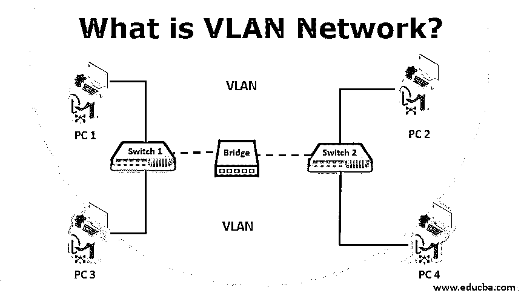
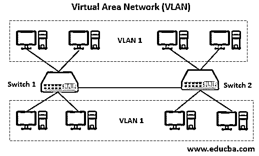

# 什么是 VLAN 网络？

> 原文：<https://www.educba.com/what-is-vlan-network/>

## VLAN 网络简介

VLAN 是广播中同一区域的逻辑系统分组。通常，通过将一个接口放在另一个广播域的一个或多个接口上，在交换机上配置 VLANs。VLANs 可以分布在几个交换机上，每个交换机都被视为自己的广播域或子网域。这意味着只有一个 VLAN 内的端口会在传输到网络的帧之间交换。VLAN 的行为类似于物理 LAN，使主机能够链接到同一个广播区域，即使它没有连接到同一个交换机。

<small>网页开发、编程语言、软件测试&其他</small>

### VLAN 网络的类型

下面给出了不同类型的 VLAN 网络:

*   利用它们的网络流量，每种类型都有一个特定的名称。
*   它们自己的类型派生名称。
*   也可以使用它们的特定功能来导出。

几种常见的 VLAN 类型如下:

#### 1.默认 VLAN

当交换机第一次启动时，交换机的所有端口都将变成默认的 VLAN 成员。由于所有端口都在默认 VLAN 中，因此它被合并到同一个域中，用于广播网络。利用这一点，任何设备都可以连接到不同的交换机端口，以便在任何端口上的任何设备之间进行通信。

Cisco 交换机使用默认 VLAN，其名称为 VLAN1。VLAN1 遵循默认 VLAN 的所有功能，但有一项功能除外。VLAN1 不允许重命名其类型或端口，也不允许删除。它的作用是控制网络第 2 层的流量。

#### 2.VLAN 数据

数据 VLAN 被称为用户 VLAN，因为它有助于承载用户产生的流量。VLAN 的通常做法是将语音和管理流量与数据流量分开。突出了将用户数据与交换机管理控制数据和语音流量分开的重要性，并使用一个特殊的术语来识别 VLAN 和其他 VLANs is = >仅传送用户数据的 VLAN 是“数据 VLAN”。

#### 3.VLAN 之声

语音 VLAN 具有在网络上传送语音流量的配置。在所有 VLAN 中，语音 VLAN 的传输优先级高于其他网络流量类型。电话完成了网络上的通信过程。因此，通过网络进行的呼叫比其他形式的信息要多。合法性和保证只能通过真实的声音来实现，而不是通过电子邮件或短信进行交流。

语音呼叫应在网络上以 150-180 毫秒的延迟(即最小延迟)进行路由。这种类型的设计在拥挤的地区将提供良好的语音质量。网络管理员设计支持 VoIP(IP 语音)的网络，确保带宽，以确保更好的语音质量。

例如，如果一个组织使用 VoIP，它将有一个单独的语音 VLAN，允许为应用程序保留带宽并确保 VoIP 质量。

#### 4.本土 VLAN

VLAN 本地将会遇到中继端口上的无标记流量。这种设置支持本地 VLAN 接收流量，并且可以识别来自中继链路任何部分的流量。802.1Q 中继端口提供了这种支持。[中继端口使](https://www.educba.com/what-is-a-trunk-port/)本地 VLAN 能够支持任何不将其流量标记为无线接入点或网络连接设备的传统设备。

#### 5.管理 VLAN

交换机的所有功能都可以访问，以便在 VLAN 进行管理，即 VLAN 管理。这种访问在 VLAN 进行配置，以进行管理和控制。该设置提供了最佳实践，即 VLAN 用于管理流量任务，如监控、系统日志记录、SNMP 等。这种作为管理 VLAN 的配置被分配给特定的地址，并且也允许子网划分。

这种 VLAN 的另一个优点是，任何 VLAN 交换机都被配置为管理 VLAN，它为自己的任务服务。如果 VLAN 没有管理配置，或者它被称为&以独特的 VLAN 为特色。在高用户流量期间，还可以确保安全优势，并提供带宽进行管理。

有时，网络管理员会将 VLAN1 指定为管理 VLAN。我们可以通过对交换机的未授权访问进行连接，并确定连接交换机的替代或快捷方式。

### VLAN 是如何工作的？

每个 VLAN 被配置到一个以太网交换机，作为物理桥，它可以执行过滤、转发、学习和环路消除机制等。尽管主机不连接在同一台网络交换机上，但网络管理员可以将这些主机组合在一起。

例如，在一个组织中，用户连接到 VLAN，这有助于在连接的网络中分离流量。它通过根据优先级隔离低流量来帮助用户直接影响网络功能。

许多托管服务使用 VLANs，这有助于将客户与私有区域相互隔离，并允许每个客户服务器通过识别并连接到其数据中心中的任何位置来分组到单个网段。交换机可以定义一个或多个虚拟网桥。因此交换机中的每个网桥都指向新的广播域(即 VLAN)。

无论是在交换机内部还是在两台交换机之间，一台 VLAN 都不允许流量流向另一台 VLAN。为了克服这个问题，路由器或第 3 层交换机(即千兆以太网交换机和 10GbE 交换机)用于互连两个不同的 VLANs。

VLAN 是可以定义的，不同的类型和方法有不同的工作。VLAN 被定义为另外两种类型:

*   **基于端口的 VLANs(未标记)**:在这种类型中，单个物理交换机用于划分成多个逻辑交换机。
*   **标记 VLAN:** 在这种类型中，我们可以使用单端口交换机连接多个 VLAN。在这里，VLAN 标识符标识要与端口中的以太网帧连接的帧。如果两台交换机都理解标记 VLANs 的操作，则使用来自“中继端口”的一条电缆连接就可以实现相互连接

VLAN 成员资格可以通过静态和动态成员资格这两种方法分配给设备。

在 OSI 模型的不同层上，还可以使用其他方法来实现:

1.  基于端口的创建方法(对应于物理层)
2.  基于 MAC 的创建方法(对应数据链路层)
3.  基于第 3 层的方法(对应于网络层)
4.  基于规则的方法(允许访问帧并选择性地使用字段或位)。

### VLAN 网络的优势

*   与传统的局域网相比，虚拟局域网有许多优点。
*   消除了网络间连接的物理障碍。
*   **简化设计:**即使物理机从一个位置移动到另一个位置，VLAN 保持不变，无需任何硬件重新配置。
*   **性能提高:**由于减小了广播域的大小，效率得到了提高。
*   **安全性:** VLAN 通过身份验证设置来限制访问，并且可以在中继协议中引入约束来标识用户与特定 VLAN 的连接。
*   通过路由器对 VLAN 进行分段，从而降低成本。

### 结论

与其他网络通勤者相比，VLANs 具有灵活性和安全性，是每个企业网络不可或缺的一部分。主要问题是排除网络故障。VLAN 通过网络的分段和隔离来处理更简单的故障管理。因此，可以通过识别用户的子网来缩小问题的范围，并快速解决问题。

### 推荐文章

这是一个什么是 VLAN 网络的指南？在这里，我们讨论它是如何工作的，不同类型的 VLAN 与他们的优势。您也可以看看以下文章，了解更多信息–

1.  [网络类型](https://www.educba.com/types-of-network/)
2.  [vs 兰](https://www.educba.com/vlan-vs-lan/)
3.  [局域网的类型](https://www.educba.com/types-of-lan/)
4.  [VLAN vs 子网](https://www.educba.com/vlan-vs-subnet/)

