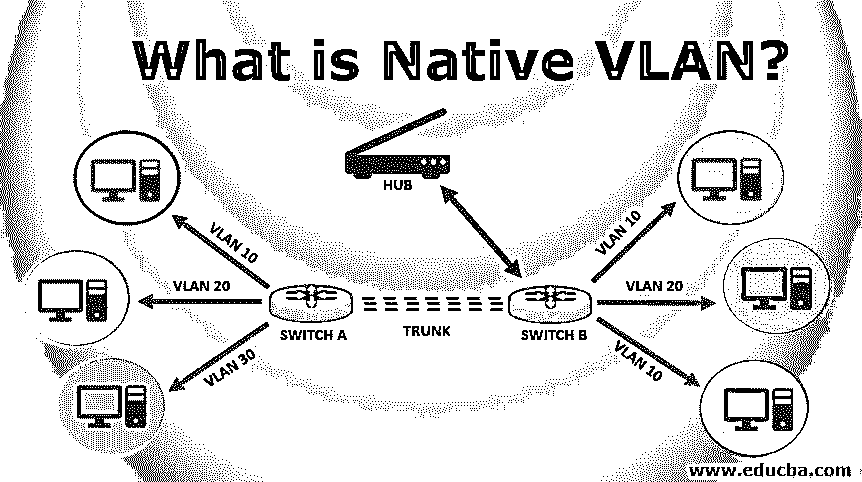
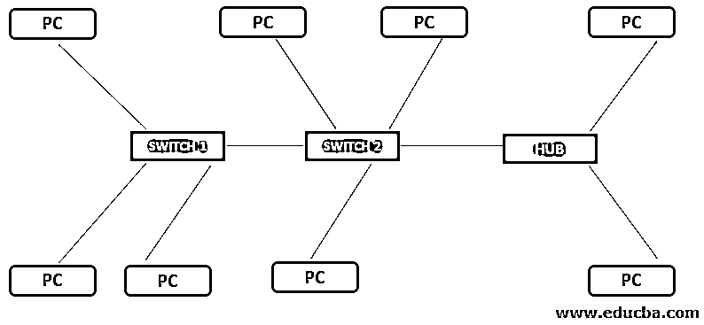

# 什么是 VLAN 本土？

> 原文：<https://www.educba.com/what-is-native-vlan/>

## VLAN 本土介绍

为支持不支持 VLAN 的旧设备而向后兼容开发的 VLAN 服务被称为本地 VLAN。原生 VLAN 在网络中不携带标签，因此旧设备很容易理解何时发送中继链路。可以使用 802.1Q 隧道帧 dot IQ 概念来配置交换机。为了配置本地 VLAN，使用交换机端口中继本地 VLAN 命令。如果本地 VLANs 没有被标记到任何中继，它们就会被识别。没有必要在树干上刻上 VLAN 土著。

### VLAN 本土是如何运作的？

我们举个例子，了解一下它的工作原理。我们可以看看下面的图表。有几台 PC 连接到交换机和集线器。交换机 1 和交换机 2 相互连接。此外，集线器连接到各种 PC，也连接到 switch2。我们正在连接到一个集线器，交换机 1 和交换机 2 之间有一条链路，这是一条中继链路。

<small>网页开发、编程语言、软件测试&其他</small>

有特定的流量到达交换机 1(假设是 10)，因此在它发送到中继链路之前，它会添加一个标记(帧标记处理)。这是为了确保 switch2 了解该帧属于哪个 VLAN。因此它们只能从端口转发出去。但在某些情况下，我们可能会收到没有任何标记的帧，特别是如果我们是通过集线器接收的，因为他们不理解标记的概念。交换机假设它属于 VLAN 本地，默认情况下，它会将它发送到 VLAN 本地。

众所周知，交换机有两种类型的端口，一种是中继端口，另一种是接入端口。由于端点不理解 VLAN 的概念，交换机希望在接入端口接收未标记的流量，而卡车端口应该接收标记的帧。因此，当接入端口接收到未标记的流量时，交换机会将来自该端口的流量与和该端口相关联的 VLAN 相关联。至于中继端口流量必须被标记，交换机使用此 VLAN 信息来决定它将与哪个 VLAN 相关联。

如果交换机接收到任何没有标记的特定帧，将会认为它是本地 VLAN。中继仅传输带标记的帧，目的是传输来自不同 VLANs 的数据。我们可以使用 ping 命令来查看相同的内容。每条中继只有一个本地 VLAN，它必须在负责所有未标记流量的中继两端匹配。

帧在通过中继之前被标记的原因是，当帧到达中继的另一端时，交换机可以读取该标记，并确定帧属于哪个 VLAN。因此，它可以将其转发给特定 VLAN。请记住，所有未标记的帧都由 VLAN 本地传输，而标记帧仅由主干传输。它也被称为无标记的 VLAN。

### VLAN 本土的重要性

以下是一些重要性，解释如下:

*   它是真正的 VLAN 及其成员，发送封装的帧，或者你可以说它是带标签的帧。
*   它还处理没有分配 VLAN 成员资格因而未加标签的帧。
*   这样，交换机就可以将中继端口上收到的任何第 2 层帧(无论有无标记)转发到预定的 VLAN。
*   中继端口上收到的任何未封装的帧都会被立即丢弃。
*   从中继端口传输的所有帧都是封装形式的。
*   一个攻击者试图使用 VLAN 跳跃攻击，它将最终在一个没有主机可以利用的死 VLAN 中结束。
*   每个物理端口都有一个称为端口 VLAN 标识符(PVID)的标识符。
*   所有未加标签的帧都被指派或分配给该 PVID。
*   它支持来自多个 VLAN 的标记流量和非单个 VLAN 的未标记流量。
*   使用 VLAN 而不是 VLAN1 作为原生 VLAN 总是好的。

### 我们为什么使用它？

下面给出了一些用途:

*   它用于在中继端口上支持和传输未标记的流量。
*   将设备发送到不同 PC 的流量分开。
*   以减少工作量。
*   不再需要昂贵的路由器。
*   它提供了更多的灵活性。
*   如果同一中继链路上的中继端口的本地 VLAN 配置错误，可能会出现第 2 层环路。
*   当它在 cisco 交换机上配置为 802.1Q 时，可以定义不同的本地 VLAN。
*   我们可以从已定义的本地 VLAN 访问 VLAN 的一个接入端口，该端口用于运行中继。
*   仅支持 Dot1Q。
*   默认情况下，所有交换机端口都分配给一个 VLAN1。
*   通过将处理敏感数据的主机放在单独的 VLAN 上来确保更好的安全性。

### 结论

最后，我们可以得出结论，本地 VLAN 的基本用途是作为中继链路两端的公共标识符。承载连接到交换机端口的计算机设备生成的未标记流量，该端口配置有本机 VLAN。

### 推荐文章

这是一本关于什么是 VLAN 本土的指南。在这里，我们讨论的基本概念，它是如何工作的，它的重要性和使用的本土 VLAN。您也可以浏览我们推荐的其他文章，了解更多信息——

1.  [WLAN vs WWAN](https://www.educba.com/wlan-vs-wwan/)
2.  [什么是路由器？](https://www.educba.com/what-is-router/)
3.  [什么是开关？](https://www.educba.com/what-is-switch/)
4.  [网络类型](https://www.educba.com/types-of-network/)

