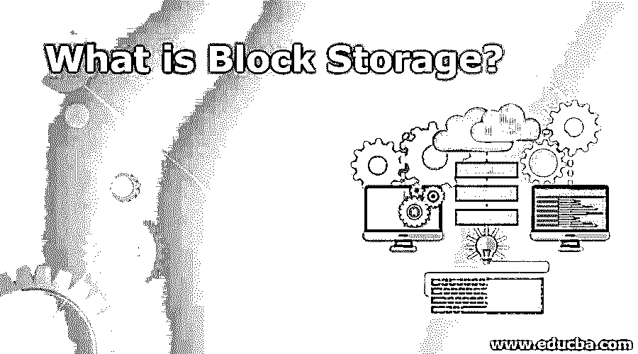

# 什么是块存储？

> 原文：<https://www.educba.com/what-is-block-storage/>

## 块存储简介

块存储也称为块级存储，是一种用于在存储区域网络(San)或基于云的存储网络上存储数据文件的技术。这是一种存储数据的方式，其中每个存储卷或区块都充当一个单独的硬盘驱动器，由存储管理员进行配置。在块级存储模型中，数据以固定大小的块(称为块)的形式保存在存储介质中。每个数据块都与一个唯一的地址相关联，该地址是存储到每个数据块的唯一元数据。

**什么是块存储？**

<small>网页开发、编程语言、软件测试&其他</small>

它是一种数据存储类型，将大量数据存储在卷、块或区块中，就像一个单独的硬盘驱动器(HDD)。块或组块用于存储数据、软件、代码和其他文件。每个包含数据的存储块都有自己的文件系统，并在分区之间调度不同的数据类型。将数据组织成块并将数据存储在现代存储设备上的常用方法很少，如文件级、对象级和块级。块级存储也特指将数据保存在称为块的卷中。当数据存储的原始卷用于从存储附加网络(SAN)呈现给服务器，并且数据块中的每个数据卷都可以作为单独的硬盘驱动器或存储库运行时，可以使用它。

### 块存储的优缺点

以下是优点和缺点:

#### 优势

*   **性能级别**:这是一种非常快速的存储，是每秒快速输入输出操作(IOPS)所需的应用程序(如数据库服务器(DB 服务器))最常用的存储之一。低延迟或快速 IO 数据访问是块存储非常受欢迎的重要原因之一。
*   **灵活**:数据卷非常灵活，随着您业务的增长，数据卷可以轻松扩展，无需时间，并且可以在需要时轻松添加新的数据块。
*   **敏捷性**:另一个重要的优势是它可以非常容易地从一台服务器转移到另一台服务器。通过灵活修改 iSCSI 目标路径，数据可以指向其他服务器。
*   文件系统开销:许多应用程序，如 PHP、Apache、share point 等。以块存储著称。当该软件可以直接写入存储块时，它消除了操作系统(OS)文件系统执行读取或写入活动的额外开销。这种方法几乎消除了 IO 瓶颈问题，因为系统在操作期间不需要写入数据两次。
*   **可引导**:操作系统可用于直接从通过存储区域网络(SAN)呈现的块存储引导。我们需要一台具有 SAN 启动功能的 BIOS 的物理或虚拟服务器。
*   **权限问题**:访问管理和数据权限有点容易管理，可以直接由块中的存储或者操作系统的主机来控制。

#### 不足之处

*   它在指定的时间链接到一个指定的服务器，用于存储数据。
*   数据块和文件系统具有非常有限的元数据，这些元数据涉及用于存储创建日期、文件系统所有者、文件大小等信息的数据区块。您试图存储的其他信息需要在应用程序级别和数据库级别进行管理，这是用户应该知道的一项额外工作。
*   我们需要为我们为系统中的数据分配的整个块存储空间付费，即使我们没有处理它。
*   我们只能通过一个运行中的服务器访问它。
*   工作和配置对象存储需要更多的实际操作，例如文件系统选择、文件系统的权限、文件的版本控制等。

由于块存储的有效和快速 IO 特性，其服务最适合将数据存储到传统和关系数据库中。此外，许多需要常规文件系统存储的文件系统应用程序也需要检查块存储设备，以便以块的形式存储数据。

### 如何横向扩展数据块存储？

QuantaStor 为我们提供了管理用于开放堆栈云部署计划的 Ceph 存储解决方案的最快、最可靠和最简单的方法。QuantaStor 还将开源 Ceph 技术集成到 QuantaStor 网格管理系统的帐户中，这有助于轻松设置、管理和监控横向扩展块存储。通过 iSCSI 和本地 Ceph RBD 客户端可以轻松访问存储，从而获得最佳性能。

**举例**:

基于云的块存储最好的例子是亚马逊 EBS(弹性块存储)。基于云的块级数据或区块存储一般不会提供像数据复制这样的可靠设施，或者将被用作备份服务。基于块级的存储区别于任何对象或数据存储，或者我们也可以说是“桶存储”，例如亚马逊 S3(简单存储服务系统)或任何传统数据库。这些操作处于数据抽象的较高层次，并且可能能够处理文件系统，如文件系统、相关文档、图片、视频或传统数据库记录。

Amazon EBS 实例存储是另一种云主机级块级存储。这些是“实例”的邻域，作为 Amazon EC2(弹性计算云)服务的例子。由于这些实例是作为 PC 资源而不是存储资源提供的，因此它们的存储系统相对来说不够坚固。即使云实例停止，这些内容也会丢失。因为它们的商店都作为一种实例的虚拟服务器，它们将为 EBS 实例提供更高的性能和有效的带宽。它们实际上需要用于临时存储，以存储大量数据，例如缓存或类似的临时文件，在服务器系统的独特风格上具有一致的存储。

在特定的时间场合，存储区域网络(SAN)提供了块级存储，NAS 也提供了文件级存储系统。内部托管从基于云的服务转向；提到的这种区别也发生了变化。此外，块存储现在被检查为不同的服务器(因此是 NAS ),而不是以前的干净磁盘阵列。

### 结论

它允许创建数据卷的原始存储，基于服务器的操作系统也可以连接到该存储。您可以将这些原始卷作为单独的硬盘来检查。这使您可以将它用于几乎任何类型的应用程序来存储数据，包括文件存储、数据库存储、虚拟机文件系统(VMFS)卷等等。

### 推荐文章

这是关于什么是数据块存储的指南。.在这里，我们讨论块存储的定义及其不同的示例，以及优缺点。您也可以浏览我们推荐的其他文章，了解更多信息——

1.  [Scala 版本](https://www.educba.com/scala-versions/)
2.  [Scala 数据类型](https://www.educba.com/scala-data-types/)
3.  [块级存储](https://www.educba.com/block-level-storage/)
4.  [块存储与文件存储](https://www.educba.com/block-storage-vs-file-storage/)

