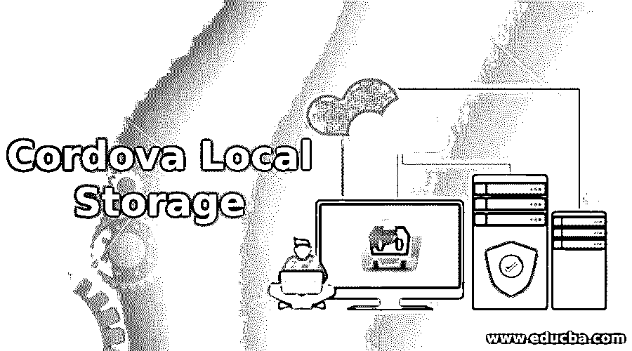

# 科尔多瓦本地存储

> 原文：<https://www.educba.com/cordova-local-storage/>

## 科尔多瓦本地存储简介

在创建任何应用程序的过程中，都会产生大量数据。为了将来在应用程序中使用，这些数据是必需的。因此，我们需要一定的存储空间来保护这些有用的数据。Cordova 提供了几个数据存储 API。这有助于用户在离线时使用应用程序，以增加应用程序的使用。这些存储 API 还可以增强应用程序的性能。在这种情况下，我们定义了不同的存储 API，这些 API 包含某些优点和缺点。您的规范的基础可以是任何 API。我们也可以在一个程序中使用各种不同的方法来达到不同的目的。

### 什么是本地存储？

几乎所有的移动设备都需要将数据存储在本地存储器中，以便可以从特定位置快速检索数据。因此，本地存储是存储有用信息的理想选择。

<small>网页开发、编程语言、软件测试&其他</small>

HTML5 引入了本地数据存储的新选项。我们可以结合各种插件机制使用 HTML5。它为键/值提供了简单、同步的成对存储。WebView 实现支持所有 Cordova 平台上的本地存储。基于插件的选项如下所示

*   当我们谈论文件系统 API 时，它是从 Chrome 浏览器实现的 W3C 标准。It API 从本地文件系统存储和恢复数据。插件文件在科尔多瓦的每个设备上提供了全面的实现。
*   **SQLite 插件:**第二个版本是 SQLite 模块，API 本质上和 WebSQL 一样。以下是它们之间的区别:
    *   它可通过 Windows 应用程序支持获得
    *   没有尺寸限制

*   **Cordova-SQLite-storage:** 支持 iOS & Windows 系统 Android。用 sqlite3 的实现设置核心版本。
*   **Cordova-SQLite-evfree:** 就像增强了内存处理的 Cordova SQLite-ext 一样。GPL v3 商业许可证是可用的。

### 优势

本地存储的优势如下:

*   这个程序是完全自主的。不可能与其他用户进行交互，因此所有可用的数据都可以存储在本地存储器中。
*   通过使用本地存储，我们还可以在线和离线同步数据，因此即使像 Evernote 一样离线，用户仍然可以使用程序。
*   我们可以通过在本地存储其他数据来节省对服务器的不必要调用。本地存储可以定义为基本存储选项，它可以在浏览器中存储高达 5 MB 的用户数据。本地存储通常被认为是低效的，因为它有一点不好的覆盖。我们可以从浏览器使用本地存储，因为它相对稳定和安全，是一种可行的存储替代方案。然而，对于某些应用，这并不适用。

### 不足之处

本地存储的缺点如下:

*   本地存储通常只能在缺少数据时使用。不应该存储敏感数据，因为这些数据很容易获取或泄露。
*   对于“记住我”这样的功能，本地存储可能是一个方便的选择因为如果数据丢失，什么也不会发生，我们只需要再次输入密码和用户名。

### 使用摘要

可以通过 window.localStorage 访问本地存储。下面的代码显示了返回的存储对象公开的关键方法:

*   var storage = window . local storage；//用键名检索利息。
*   var value = storage . getitem(key)；
*   storage.set Item(key，value) //对于添加或修改键，定义键名及其值

**WebSQL**

对于数据存储和查询，我们可以使用 SQL 数据库使用在线 SQL API。可以存储 50-200 MB 的数据。因此，确切的限制由网络决定。当超过存储限制时，WebView 将允许用户在适当的情况下使用更多的本地空间。你要意识到 API 并不支持每一个平台，所以你要使用 WebSQl Cordova 插件来使用。如果你想用它，你可以。

**索引编制单位**

IndexedDB 结合了 LocalStorageWebSQL APIs 的强大功能。它使您能够存储任意的键索引的 JavaScript 对象。它还为 SQL 表的用户提供了许多优势，而不会限制它们的布局，也不必在前面描述。IndexedDB 可以描述为一个简单的数据模型，比如 LocalStorage。代替 LocalStorage，我们可以构建几个存储库，在其中可以相应地访问许多存储。由于其搜索索引和异步 API，它提供了更好的性能。

### 推荐文章

这是科尔多瓦本地储物指南。在这里，我们还将讨论简介和什么是本地存储？有优点也有缺点。您也可以看看以下文章，了解更多信息–

1.  [PhoneGap vs Cordova](https://www.educba.com/phonegap-vs-cordova/)
2.  [Saltstack vs Ansible](https://www.educba.com/saltstack-vs-ansible/)
3.  [手机应用开发工具](https://www.educba.com/mobile-app-design-software/)
4.  [Azure 手机 App](https://www.educba.com/azure-mobile-app/)

