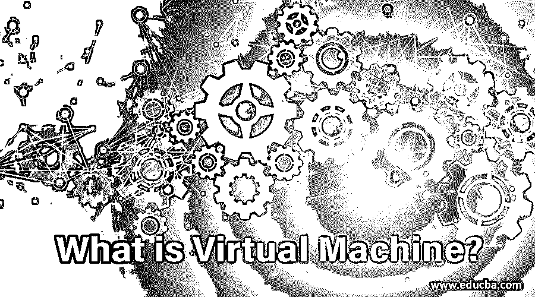

# 什么是虚拟机？

> 原文：<https://www.educba.com/what-is-virtual-machine/>

## 虚拟机简介

虚拟机被定义为计算机的软件，其提供类似于物理计算机的功能，即，它们在其上运行操作系统和应用，但是它们不同于物理计算机，并且事实上它们是计算机文件，称为使用管理程序在物理计算机上运行的映像，因此用户可以在主操作系统上运行多个操作系统，而无需购买额外的物理资源。

### 什么是虚拟机？

虚拟机是一种计算机文件，通常被称为映像，其行为类似于真实的计算机。这意味着计算机是在计算机内部创建的。像任何程序一样，它在窗口中工作，在主机操作系统上为最终用户提供相同的虚拟系统体验。从系统的其余部分来看，它是沙箱化的，因此程序不能从虚拟机内的设备中逃脱或篡改设备本身。这为测试操作系统创造了理想的环境，而不是访问受病毒感染的数据、测试版、运行操作系统软件或创建操作系统备份、应用程序，这些都不是最初设计的。许多虚拟机可以同时在同一台物理计算机上运行。对于服务器，几个操作系统与作为管理程序管理的软件并行运行，而台式计算机通常使用一个操作系统在其程序窗口中运行其他操作系统。

<small>网页开发、编程语言、软件测试&其他</small>

每个虚拟机都有自己的虚拟专用硬件，包括硬盘、CPU、网络接口内存和其他硬件。然后，虚拟硬件被映射到物理计算机上的实际硬件，这通过减少对物理硬件系统以及电力和更换需求来降低成本和相关的维护成本。

### 虚拟机是如何工作的？

虚拟化技术可以与大量虚拟环境共享一个网络。虚拟机管理程序控制并从虚拟环境中移除硬件。资产被适当地从物理环境隔离到虚拟机。如果虚拟机正在运行，虚拟机管理程序会对物理系统的资源请求进行编程，以便虚拟环境的操作系统和应用程序可以访问物理资源的组合池，这需要物理环境中的额外资源。虚拟机管理程序有多种类型。

#### 类型 1

虚拟机管理程序类型 1 构建在裸机上。虚拟机资源由虚拟机管理程序定向到硬件。KVM 是虚拟机管理程序类型 1 的一个例子。KVM 已经在 2007 年合并到 Linux 中，所以如果你使用的是现代的 Linux 版本，你已经可以访问 KVM 了。

#### 类型 2

托管是第 2 类虚拟机管理程序。虚拟机资源针对主机操作系统进行编程，并针对硬件运行。第 2 类虚拟机管理程序的示例包括 VMware Workstation 和 Oracle Virtual Box。一旦我们知道了这一点，当打开一个虚拟机(如 Virtual Box)时，我们就有了一个环境，在这个环境中，我们可以配置和分配它所模拟的每个物理组件。

*   我们希望硬盘分配的空间。
*   我们希望虚拟机分配的 RAM 内存。
*   我们需要的网络设置。

我们已经创建了一个虚拟机，用于在配置参数后安装一个工作系统。这意味着我们只需要打开并安装它，就像它是一台普通的计算机一样。

### 我们为什么要使用虚拟机？

服务器整合是使用虚拟机的主要原因。许多操作系统和设备实现使用少量的可用物理资源来裸机。通过虚拟化服务器来提高硬件利用率，您可以在每台物理服务器上放置许多虚拟服务器。您不需要购买额外的物理资源，并将数据中心的电力、空间和冷却需求降至最低。虚拟机允许故障转移和冗余，这在以前只能通过额外的硬件来实现。虚拟机提供了一个与设备其余部分隔离的环境，因此运行在主机硬件上的任何东西都不会干扰。由于虚拟机是隔离的，因此它们是测试或构建新应用程序开发环境的好方法。甚至，为了支持特定的流程，您可以运行单个虚拟机。

### 优点和缺点

以下是一些优点和缺点描述。

#### 优势

*   为灾难恢复和实施提供解决方案。
*   一般来说，数字计算机是可以管理、维护和访问的。
*   一台物理计算机可以运行多个操作系统环境。

#### 不足之处

*   运行多个虚拟机可能会导致不稳定的输出。
*   它比物理机器效率低，运行慢。

### 推荐文章

这是一本关于什么是虚拟机的指南？在这里，我们讨论了虚拟机的介绍、工作原理及其优缺点。您也可以阅读以下文章，了解更多信息——

1.  [存储虚拟化](https://www.educba.com/storage-virtualization/)
2.  [Java 虚拟机](https://www.educba.com/java-virtual-machine/)
3.  [Linux vs BSD](https://www.educba.com/linux-vs-bsd/)
4.  [容器 vs 虚拟机](https://www.educba.com/containers-vs-virtual-machines/)

