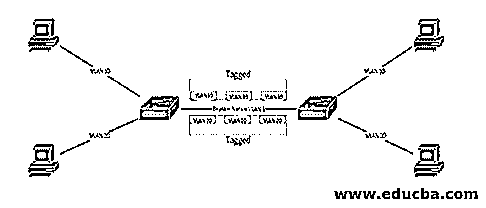

# 什么是中继端口？

> 原文：<https://www.educba.com/what-is-a-trunk-port/>

## 中继端口介绍

在这篇文章中，我们将看看什么是中继端口？中继是 IT 和电信行业使用的术语，指的是在多实体介质中发送方和接收方之间传递数据的网络配置。举一个例子，树干是如何把水运送到每一个分支的，类似于网络主干也是将多个数据传送到正确的位置。

交换机端口在一个称为中继端口的 VLAN 中多次传输流量。就让一组 VLANs 在这里发送流量而言，一个交换机端口将管理它。对于在两台或多台交换机之间交换流量的用户来说，在一个网络中配置两个或多个 VLANs 非常有用。识别流量时，使用 802.1 Q 标签或通用技术交换机间链路标签，也称为 ISL。

<small>网页开发、编程语言、软件测试&其他</small>

### 什么是中继端口？

中继端口将承载所有 VLANs 的信号流量，对特定交换机的访问称为中继。当它们在交换机之间移动时，中继端口将帧的标签标记为 802.1 Q 标签或通用技术交换机间链路标签，也称为 ISL。因此，每一个单独的框架都可以用来指定 VLAN。

当以太网发送数据包时，它既可以作为接入端口，也可以作为中继端口，但不能同时作为接入端口和中继端口。因此中继端口在这里被配置为在没有流量的情况下从多个 VLANs 发送数据包。

数据包需要从多个 VLANs 发送/传送到准确的目的地，这可以使用标记或 ISL 来完成，也称为封装。标记将在发送数据包时完成；标签将被插入帧的报头中。标签中包含哪些细节？它将包括发送 id、端口和交换机的详细信息。使用多个 VLANs 和交换机内的标记 id，数据包将到达正确的系统。这里，封装方法在管理或允许网络中的流量方面起着至关重要的作用。

默认情况下，中继端口访问所有 VLANs，并且允许中继。但是，它会通过从综合列表中删除 VLAN 来阻止来自特定 VLAN 的流量通过中继。

### 中继机制

主要机制是中继设备，允许来自多个 VLANs 的流量通过现代交换机中的中继传输。这里的任务是两种不同的方法:一个是原生 VLAN，另一个是标记机制。在设备之间发送的没有添加任何东西(如标签)的流量被称为本地 VLAN。在本机 VLAN 中，交换机的默认设置被设置为 VLAN 1，并且该设置允许流量在多台交换机的所有端口之间发送而无需任何额外的配置。标记机制是将标记添加到以太网接口的帧头中。

上图显示了 VLAN 的 PC 之间的所有流量都将被标记以到达目的地址。

### 为什么使用 VLAN 配置中继很重要？

在 VLAN 中继中，可以延伸到整个网络。但是，当网络中连接了多个 VLANss 时，有必要确保这些 VLAN 能够到达目的地址。当多个 VLAN 连接到一个端口时，情况会更复杂。

就在单个端口中配置多个 VLAN 而言，系统必须理解并路由信号。这里，中继 VLAN 用于标记帧头中的标签，以支持到达目的地。那么标签包括什么呢？它包括媒体访问控制(MAC)地址)。这将有助于帧通过中继链路和主机端口到达各自的目的端点系统。有时，当为多个供应商工作时，如何实现中继，可以使用哪种机制？是的，它使用的是思科 VLAN 中继协议。因此，当我们在 VTP 服务器中配置 VLAN 时，它会自动在交换机之间分发数据包，这将减少我们的配置时间。

有时在维护活动中使用中继。当网络拓扑发生一些变化[时，切换转发必须是最新的，因此可以使用中继机制。](https://www.educba.com/what-is-network-topology/)

他们使用两种类型的中继机制:

*   **对称中继:**将数据包发送到任意端口；在这里，传输速率非常高。
*   **不对称中继:**它将使用交换机中的一个端口发送数据包。

### 中继端口的使用

*   它可以从多个 VLANs 传输数据。
*   如果组织中有多台交换机或一个交换机网络，我们只需使用任何电缆实施一条链路来代替它。
*   这里的延迟更低。
*   All 将允许在单个中继链路中发送每个交换机中的所有信号。
*   带宽很高。

### 结论

我们已经了解了计算机网络中中继[的含义，介绍并解释了中继端口、要使用的机制、中继端口的目的和用途。](https://www.educba.com/what-is-computer-networks/)

### 推荐文章

这是一个什么是中继端口的指南？在这里，我们将讨论 VLAN 的简介、中继机制以及为什么配置中继很重要？你也可以看看下面的文章来了解更多-

1.  [Hadoop 版本](https://www.educba.com/hadoop-versions/)
2.  [CCNA 命令](https://www.educba.com/ccna-commands/)
3.  [备忘单 Python](https://www.educba.com/cheat-sheet-python/)
4.  [菊花链网络](https://www.educba.com/daisy-chain-network/)

