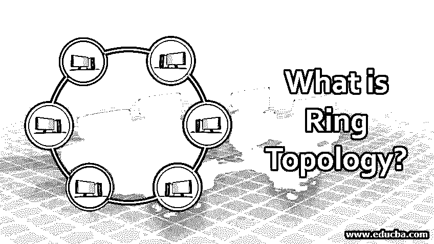

# 什么是环形拓扑？

> 原文：<https://www.educba.com/what-is-ring-topology/>

## 环形拓扑简介

环形拓扑也称为环形网络，是一种网络拓扑方法，其中前向和后向两个其他节点被精确地链接到每个节点，以形成用于信号通信的单个连续路径。基本上，环形拓扑分为双向和单向两种类型。大多数环形拓扑只允许数据包在一个方向上移动，称为单向环形网络。另一些允许数据双向传输，称为双向传输。

下面给出了网络中的 7 种拓扑结构:

<small>网页开发、编程语言、软件测试&其他</small>

*   点对点拓扑
*   总线拓扑
*   星形布局
*   环形拓扑
*   树形布局
*   [网状拓扑](https://www.educba.com/what-is-mesh-topology/)
*   [混合拓扑](https://www.educba.com/what-is-a-hybrid-topology/)

### 环形拓扑是如何形成的？

在环形拓扑中，每个设备与两个设备连接，多个这样的结构连接在一起形成一个环形路径，这个网络称为环形网络。环内拓扑数据从一台设备传递到下一台设备，依此类推，直到数据到达目的地。数据由发送节点通过令牌传输到目的节点，因此这种拓扑也被称为[令牌环拓扑](https://www.educba.com/token-ring-topology/)。这种拓扑要求所有节点保持活动，以便传输保持活动，因此也称为主动拓扑。

如果节点数量很大，令牌在到达目的地之前将不得不跳过几个节点，因此可能会有数据丢失。为了防止这种数据丢失，中继器被间歇地安装以增强信号强度。

**单向环形:**在单向环形网络中，数据只能沿顺时针或逆时针的一个方向流动，这样的网络称为半双工网络。一般来说，大多数环形网络只允许这种数据流。

**双向环:**单向环网可以通过在两个网络节点之间有两个连接转换成双向网。它也称为双环网络，其中创建了两个环以向相反方向发送数据。当在一个方向上发送数据时，如果任何中间节点发生故障，双环提供到达任何节点的备用路径。

### 环形拓扑是如何工作的？

遵循以下步骤在环形网络中的节点之间传输数据。

*   在擂台上，空的代币自由流通。环的速度是 16Mbps，然后上升到 100Mbps，更快的环正在开发中。
*   空令牌具有占位符，用于存储要传输的数据帧和保存发送方/接收方地址。
*   如果发送节点需要传输消息，它会获取一个令牌，并在令牌的相应空间中用数据、接收节点的 MAC 地址和自己的 ID 对其进行打包。
*   填充的令牌被发送到环中的下一个节点。
*   下一个节点接收该令牌，并检查所传输的数据是否是预定的。如果是，则将数据从该帧复制到该节点，并将该令牌设置为零并传递到下一个节点，否则该令牌按原样传递到下一个节点。
*   重复前面的步骤，直到数据到达正确的目的地。
*   当令牌到达发送方时，如果它发现接收方已经读取了数据，它将初始化消息。
*   令牌被再循环并准备好被任何节点消费。
*   如果环形路径中的某个节点处于非活动状态，并且通信中断，如果网络支持双环，则数据会反向发送到目的地。

### 我们为什么使用它？

网络拓扑的选择取决于:

*   组织的运营模式。
*   IT 环境的复杂性。
*   预期的最终用户性能水平。
*   预算分配。

选择正确的拓扑结构可确保网络的高性能、网络操作的易管理性以及数据效率的提高。

选择环形拓扑优于其他拓扑的五大理由。

1.  数据流是单向的，因此数据冲突的可能性极小。
2.  不需要任何网络控制服务器来管理数据传输。
3.  这种拓扑的管理不太复杂，并且可以无缝地添加任何新节点。
4.  在这种类型的网络中，数据传输速度更快。
5.  这些类型的网络的运行成本是经济的。

### 我们使用环形拓扑。

让我们知道使用环形拓扑的原因。

*   环形拓扑被部署在局域网(LAN)和广域网(MAN)中。
*   电信领域中的 SONET(同步光网络)光纤网络相当广泛地使用环形拓扑。
*   它为全球电信网络提供了一个标准，将取代许多旧系统，并提供了许多优势，如:

1.  可靠的网络
2.  低资本投资
3.  与多个服务提供商无缝连接
4.  未来科技

*   如果与某个节点的连接丢失，它还利用这种双环拓扑的双向功能将流量路由到另一个方向。
*   由于其较低的运营成本，它也用于教育机构，并且很少有商业机构也使用它。许多组织都有一个环形网络作为现有网络的后备系统。

### 利益

以下是给出的一些优点。

*   环形网络的管理更容易，任何故障都可以很容易地跟踪和纠正。
*   可以无缝地添加新节点，也可以轻松地删除节点。
*   这种网络的速度比其他拓扑结构相对更快，尤其是在负载较高的情况下。
*   数据流以有组织的方式从一个节点流向另一个节点
*   由于其简单的体系结构，无需服务器来控制网络运行，因此操作经济。
*   这种网络非常适合需要零延迟或最小延迟的应用。
*   双向数据流大大减少了该网络的停机时间。

### 结论

随着大型机计算的增长和对无延迟通信的需求，环形网络将会继续存在，并可能在未来取代以太网。环形网络的速度正在提高，这将不会成为其增长的限制因素。

### 推荐文章

这是什么是环形拓扑的指南？这里我们讨论环形拓扑的介绍、工作、使用和优点。您也可以看看以下文章，了解更多信息–

1.  [联网命令](https://www.educba.com/networking-commands/)
2.  [什么是网络拓扑？](https://www.educba.com/what-is-network-topology/)
3.  [联网设备](https://www.educba.com/networking-devices/)
4.  [混合网络拓扑](https://www.educba.com/hybrid-network-topology/)

