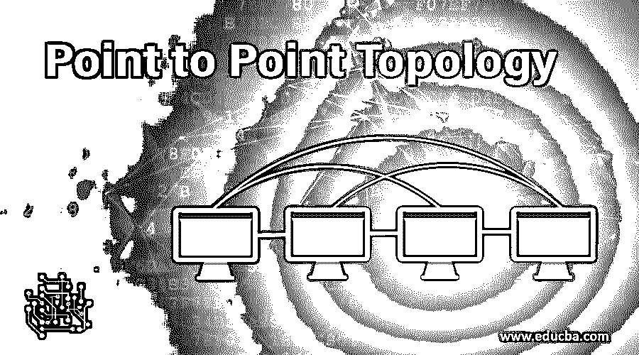

# 点对点拓扑

> 原文：<https://www.educba.com/point-to-point-topology/>

## 点对点拓扑简介

在网络世界中，拓扑这个词被广泛使用。网络拓扑是指组成网络的网络元素的节点和链路的排列。[网络拓扑可以在物理上或逻辑上定义](https://www.educba.com/what-is-network-topology/)。它用于定义不同电信网络的结构。[逻辑拓扑是指](https://www.educba.com/logical-topology/)数据在网络中的实际流动方式，[物理拓扑是指节点在网络中的放置方式。点对点拓扑意味着两个节点通过导线或其他介质直接连接。](https://www.educba.com/physical-topology/)

### 交流方式

它是一种网络拓扑，用于通过某种链路将网络节点直接相互连接。在这两个节点之间，数据通过该链路传输。带宽是为这两个节点之间的数据传输决定的，为了连接节点的两端，这种拓扑使用将两个节点直接相互连接的导线。这两个节点也可以通过一些其他介质连接，如卫星链路或任何其他介质。例如，遥控器和家中的电视机之间的连接。当用户使用遥控器控制电视时，在电视和遥控器之间存在点对点拓扑。这种拓扑结构之间的数据传输可以采用不同的模式，如单工模式、半双工模式和全双工模式。

<small>网页开发、编程语言、软件测试&其他</small>

#### **1。单工通信模式**

 **单工通信模式是一种仅在一个方向发送数据的通信信道。例如，无线电和电视是单工通信模式，因为信息总是只在一个方向上流动。广播和电视从来不会从用户那里获得信息，信息流的方向永远是从电视和广播到用户端。单工通信模式的一端用于发送信号，通信信道的另一端用于接收信号。在单工通信模式中，通信信道的全部带宽都用于传输信号。

#### **2。半双工通信模式**

 **半模式通信是一种双向发送数据的通信信道。单载波用于双向传输信号。唯一的条件是数据不能同时双向传输。它类似于传输数据的单工通信模式，但唯一的区别是数据可以双向传输。半双工通信模式的最佳例子是对讲机，其中有一个发射器和接收器按钮。“一键听”按钮用于发送信号，当按钮打开时，接收器按钮关闭时，它允许对讲机向一个方向发送信号。当这个人用步话机讲话时，他不能同时听到。对讲机的优点在于，与另一种模式的通信设备相比，该设备更便宜。

#### **3。全双工通信模式**

 **全双工通信模式是一种只能用于同时双向发送信息的通信信道。同一载波可用于同时传输信号。全双工模式包括有助于双向传输信号的简单链路。全双工模式的最好例子是电话。当两个用户使用电话时，他们可以同时听和说。全双工通信模式用于电话和移动电话。这是可能的，因为在两端之间有两条通信路径。全双工模式的优势是通信效率。

### 为什么我们要使用点对点拓扑？

它应该用于在网络中有效地传输信号和信息。由于拓扑结构通过一些导线或任何介质直接连接网络的两个节点，因此传输数据非常有效。当网络使用点对点拓扑并且数据将在不同模式的通信信道中流动时，通信的效率增加。通信信道包括通信信道的单工模式、半双工模式和全双工模式。这些不同的模式有助于非常有效地在网络中传输信号。

### 点对点拓扑的优点和缺点

它用于在通信中传输信息。传输信号的方式决定了点对点拓扑的效率。这种拓扑的优点和缺点讨论如下:

#### 优势

*   这是最简单的网络拓扑，易于理解和实施。
*   数据传输可以采用多条路径来传输信息。根据所使用的通信信道，数据可以单向或双向流动。
*   点对点拓扑的维护非常容易，实施起来也不需要时间。

#### 不足之处

*   它只支持两个节点，这使得它在同时需要两个以上节点时用处不大。
*   由于网络中只有两个节点，如果任何一个节点出现故障，就会导致整个网络瘫痪，这就给通过网络传输信息带来了问题。
*   如果任何一个节点发生故障，更换该节点是一个耗时的过程，并且该过程的成本非常高。

### 结论

这是在网络中实现的最简单的网络拓扑。它包括两个节点，这两个节点直接连接到有线或其他媒介，如卫星网络。点对点拓扑结构之间的信息流具有不同的通信信道模式，即单工、半双工和全双工模式。易于实现和维护数据传输。

### 推荐文章

这是点对点拓扑的指南。这里我们讨论点对点拓扑中的不同通信模式及其优缺点。您也可以阅读以下文章，了解更多信息——

1.  [以太网拓扑](https://www.educba.com/ethernet-topology/)
2.  [扎里斯基拓扑](https://www.educba.com/zariski-topology/)
3.  [星形总线拓扑](https://www.educba.com/star-bus-topology/)
4.  [部分网状拓扑](https://www.educba.com/partial-mesh-topology/)

******