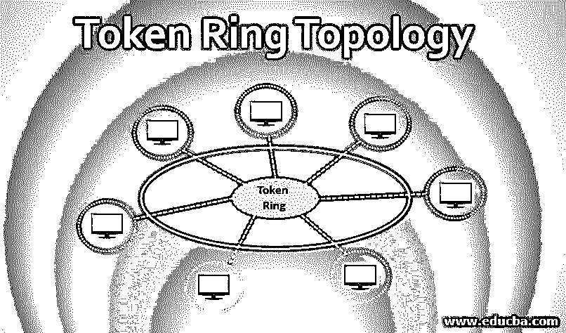

# 令牌环拓扑

> 原文：<https://www.educba.com/token-ring-topology/>

## 令牌环拓扑介绍

令牌环拓扑在 20 世纪 80 年代被引入，并成为以太网用户的强大竞争对手。这种拓扑结构与其标准相竞争，并与它的技术保持高度一致。令牌环是一种在环形结构的计算机之间进行数据通信的结构。计算机被视为主机，一台主机连接到两台相邻的主机，形成一个循环结构的网络。当一台主机试图发送一条消息时，它可以被发送到中间主机以识别它附近的机器。因此数据会一直传输，直到被特定的主机接收。当主机接收不到消息时，会导致整个环出现故障。那么连接到环的每个连接都会失败。可以通过部署另一个环来进行备份。用于从一台主机传输到另一台主机的帧称为令牌。这个令牌在一个逻辑环中传输，这个环可以是工作站或服务器。这种拓扑遍历介质中的数据，任何数据都可以发送到网络中连接的任何计算机，称为基于争用的访问方法。

### 我们为什么要使用令牌环拓扑？

令牌环拓扑具有 4 Mbps 到 16 Mbps 的传输速度。当被配置时，整体具有以相同速度传输令牌的一致性。在环中节点的环形连接中，使用 IBM 引入的称为多路访问单元的 MAU 来识别计算机。逻辑上它在 MAU 内部形成一个环。和活动监视器(默认情况下)一起使用。当令牌环与以太网相比时，减少冲突是网络的更大优势。以太网使用 CSMA，单向传输数据并阻塞通道。当另一台计算机同时尝试传输时，可能会发生冲突，导致无法传输数据。所以，它需要等待下一个事务。其中在令牌环中，节点同时授予传输消息的许可。因为主机会验证令牌并传输消息。如果它没有收到令牌，它必须等待轮到它。因此，通过平等共享网络，可以有效利用带宽。令牌环允许比以太网更大的数据包，并且使用令牌传递原理可以很好地执行。例如:当以太网以 10Mbps 的速度传输数据包时，令牌环网可以使用 4 Mbps 的令牌传递来执行相同的事务。

<small>网页开发、编程语言、软件测试&其他</small>

### 令牌环拓扑的重要性

下面列出了一些重要性。

*   令牌是在环形路径中传输的特殊位的模式；计算机发送包含附加令牌的消息。这种消息的连续传递被称为令牌传递。
*   令牌传递是一种确认计算机收到信号的方法，用于相互传递消息。因此，接收端获取数据，并将信号传递给源，并以信号作为确认。
*   令牌环拓扑的重要性在于，源发送一个带有消息和目的地址的空令牌。因此令牌检查连续的节点，即计算机/主机的地址。当令牌识别节点时，接收方复制数据并返回包含源地址的收据。
*   因此，在事务的循环路径中，当实际的源收到令牌时，它验证消息并复制它。最后，它清空令牌，让相同的流程在循环模型中继续。
*   这些在局域网和广域网中广泛使用。
*   这种拓扑结构最初是由 IBM 在局域网中作为 LAN 令牌环引入的。
*   令牌通常在单向环形拓扑中被遍历。但是令牌环也可以双向工作。单向拓扑中的数据传输称为半双工网络，双向拓扑传输(可以同时发送和接收数据)称为全双工网络。

### 令牌环拓扑的优点和缺点

以下是令牌环拓扑的优点和缺点:

**好处:**

*   减少了分组冲突，并且仅在一个方向上管理数据流，即在循环中。
*   工作站之间的高速数据传输。
*   更容易维护网络。
*   不需要服务器来控制每个工作站之间的连接。
*   需要时，可以将工作站添加到网络中，这不会影响网络的性能。
*   在单向网络中提供高速网络。
*   可以在远距离网络中高效工作。
*   虽然环形拓扑中的节点增加了，但性能将优于总线拓扑。
*   这是一个健壮的网络，因为环形拓扑管理大量的节点。
*   处理巨大的交通通信。
*   通过电缆连接，可以很容易地在网络中发现数据传输中的故障。
*   与其他网络拓扑相比，在成本上是兼容的。

**缺点:**

*   如果一个工作站也变慢了，整个网络就会崩溃。
*   数据的传输必须通过每个网络的工作站。它会比其他拓扑慢。
*   网络中的一个小的或单个的干扰会导致整个网络的故障。
*   需要硬件来连接网络中的工作站。
*   需要硬件来连接网络中的工作站。
*   当使用或引入集线器、交换机或以太网卡来提高效率时，成本会更高。
*   由于拓扑是单向的，数据(即令牌)应该通过整个网络，应该穿过所有节点。
*   虽然添加节点可以提高性能，但是向现有网络添加节点很困难，并且可能会导致问题。
*   在重负载情况下，环形拓扑可能比以太网慢。

### 结论

令牌环网在传输速度上与以太网相当。但是在目前的市场中，以太网在速度和价格上也超过了这种拓扑结构。与以太网卡相比，使用电缆和 MAU 卡的令牌环网变得过于昂贵。它比以太网卡高出五到六倍。以太网非常快地将它的处理速度提高到 100 Mbps。令牌环网试图用速度战胜以太网。但是随着时代和技术的发展，一切都为时已晚。

### 推荐文章

这是令牌环拓扑的指南。这里我们讨论基本概念，为什么我们使用令牌环拓扑和它的重要性，优点和缺点。您也可以浏览我们推荐的文章，了解更多信息——

1.  [什么是环形拓扑？](https://www.educba.com/what-is-ring-topology/)
2.  [网络拓扑类型](https://www.educba.com/types-of-network-topology/)
3.  [网络拓扑](https://www.educba.com/network-topologies/)
4.  [什么是网络拓扑？](https://www.educba.com/what-is-network-topology/)

