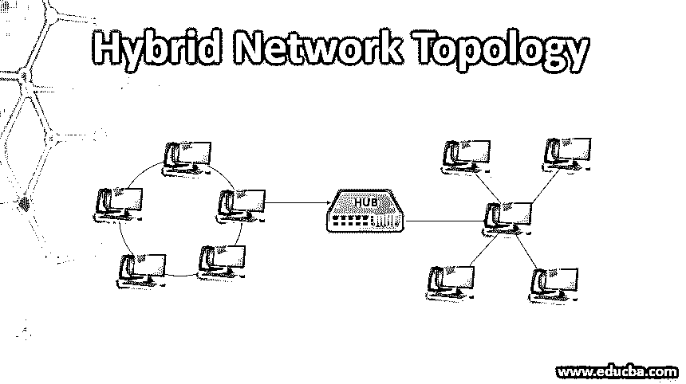
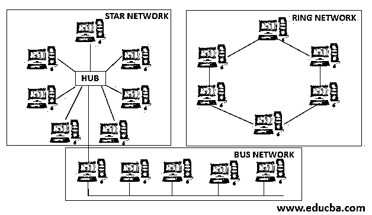

# 混合网络拓扑

> 原文：<https://www.educba.com/hybrid-network-topology/>

## 混合网络拓扑简介

混合网络拓扑在网络系统中非常普遍。它是一个以上相互连接的网络的组合，每个网络都包含节点。拓扑基本上是一组规则，而网络拓扑意味着提供一系列网络的规则。互连导致一个网络与相同拓扑中的另一个网络的通信，以及与其他拓扑中的网络的通信。

### 为什么我们使用混合网络拓扑？

在计算机网络中，我们使用各种类型的网络拓扑结构，如星形、网状、环形和总线式。然而，已经出现的最常见的网络拓扑是[混合拓扑](https://www.educba.com/what-is-a-hybrid-topology/)，它是一种以上拓扑的组合。

<small>网页开发、编程语言、软件测试&其他</small>

*   星形网络和网状网络的组合可以一起形成混合网络，或者星形网络和环形网络的组合可以形成混合网络。
*   所得互连的总体特征，即变成混合网络，继承了两种不同网络拓扑的特征。这给网络系统带来了整体的好处。
*   混合拓扑提供了一个非常复杂的结构，但就其整体实现而言，它比树形拓扑高级得多。
*   我们可以选择像集线器或交换机这样的主干网络，也可以选择主要因其拓扑结构而异的网段。网段由配置给它的网络拓扑组成。整个计算机网络系统依赖于与网段相连的主干网。
*   由于灵活性和易用性，混合网络可以很容易地建立在任何地方，在办公室或在家里。整体设置不需要任何复杂的架构，节省了时间和人力。
*   由于网络拓扑在本质上是混合的，小型到大型的组织都可以很容易地建立小型和子部门。布置混合网络的最佳方式是连接支持多层部门的家庭或办公室网络。
*   普通的基本拓扑在设置和联网故障方面存在许多缺点，而混合网络很容易解决这些缺点，解决了总体成本问题并提高了联网效率。
*   网络程序员开发混合拓扑，以找出每种拓扑的优点，并最大限度地减少其缺点。每种拓扑结构的优势通过互连获得，一种拓扑结构与另一种拓扑结构的组合提高了一起形成混合网络的拓扑结构的性能和效率。
*   由于其混合结构，每个拓扑的总体特征在网络链中平均分布，这提供了检测错误和帮助进行故障排除的最简单方法。

### 混合网络拓扑的重要性

混合网络拓扑结合了一种以上的拓扑，并在网络方面产生了最佳的特性。其有用性列表讨论如下:

#### 1.可靠性

在网络拓扑中，混合拓扑是最可靠、最安全的。由于它的分支因素，在 hybrid 中错误检测非常快，因此故障排除非常容易。因此，网络拓扑的整体可靠性非常高，因为它包含子网络。由于网络的子分支，如果任何网络停止工作或出现故障，整个网络不会因此受到影响，仍然可以运行。如果发生任何故障，分支系统由于其改进的容错性而限制了对网络工作的影响。

#### 2.网络的有效性

由于各种拓扑的组合使得混合结构更加有效，因此整体有效性大大提高，这不仅增强了网络的强度，而且中和了不同拓扑的弱网络。例如，具有高可靠性的环形拓扑和具有高容差的星形拓扑，这两种拓扑的特征可以组合在一起，形成一个功能丰富的混合星形-环形拓扑。

#### 3.灵活性

混合拓扑在使用上具有很大的灵活性，因为可以根据用户和组织的要求来规划和设计整体配置和修改，从而优化网络的整体资源。因此，为了在不同的网络环境中使用它，构建拓扑以支持功能及其使用。这种类型的网络可以很容易地扩展，因为它的特点是包含许多要连接的扩展点。

#### 4.可量测性

混合网络的一大特点是高度可扩展。混合网络的构建方式有助于我们整合多个网络分支状连接点。不管网络的规模如何，都可以以非常有效的方式添加或移除硬件组件，并且可以容易地装备新的网络元件，而不会干扰整个分支系统和架构。

#### 5.稳定的数据连接

由于混合拓扑利用了两种不同拓扑网络的特性，因此通过混合网络传输数据非常快速且稳定。如果不同节点之间存在干扰，它不会影响混合模型中网络的整体性能和效率。

#### 6.安全的传播方式

一旦系统中发生威胁或故障，整个网络不会受到影响而产生更好的安全性和故障排除功能。故障部分被分离，产生改进的容错，并且现有拓扑不需要任何改变来开发混合拓扑。

### 结论

事实证明，它比其他网络拓扑更加灵活、可靠、高效和可扩展，但同时也难以管理且成本高昂。尽管其复杂的结构可能会产生危害，但由于其坚固有效的特点而广受欢迎。

### 推荐文章

这是混合网络拓扑的指南。这里我们讨论使用混合网络拓扑的基本概念及其重要性。您也可以阅读以下文章，了解更多信息——

1.  [什么是环形拓扑？](https://www.educba.com/what-is-ring-topology/)
2.  [什么是网络拓扑？](https://www.educba.com/network-topologies/)
3.  [网络拓扑类型](https://www.educba.com/types-of-network-topology/)
4.  [以太网拓扑](https://www.educba.com/ethernet-topology/)

