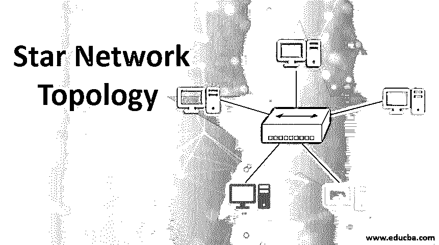

# 星形网络拓扑

> 原文：<https://www.educba.com/star-network-topology/>

## 星型网络拓扑介绍

星型网络拓扑在连接各种设备以实时共享信息和在线执行交易方面起着关键作用。拓扑的选择取决于组织的物理环境、最终用户要求和 IT 投资水平。不用说，在安装之前必须选择正确的网络拓扑，以后再改变它的成本太高。

任何计算机网络都可以大致分为三大类，即:

<small>网页开发、编程语言、软件测试&其他</small>

*   环形拓扑
*   星形布局
*   总线拓扑

在这三种拓扑中，星形网络广泛用于大多数行业、机构和家庭应用。

在本文中，让我们分析一下星型拓扑的独特功能、优点和缺点。

### 什么是星型拓扑？

在这种拓扑结构中，一组计算机设备分别连接到称为[集线器或交换机](https://www.educba.com/hub-vs-switch/)的中央网络设备。这些集线器/交换机又直接或通过[其他交换机/路由器](https://www.educba.com/switch-vs-router/)连接到数据中心和其他服务提供商网络。该网络的物理形状看起来不像星形，但所有节点都连接到集线器/交换机并由集线器/交换机集中控制，因此得名。

这是最传统的拓扑之一，主要用于局域网，它是通过电信技术发展起来的，在电信技术中，呼叫通过交换站集中路由，由交换机管理呼叫。

### 它是如何工作的？

如果办公室中的一台计算机要向远程办公室中的另一台计算机发送通信，它会将数据和收件人地址一起发送到它所连接的集线器/交换机。集线器/交换机通过路由器和其它网络资源将数据传输到最终目的地，网络管理软件跟踪数据传输。

交换机和集线器在数据通信中的作用解释如下。

#### 1.中心

每当集线器获得要传输到某个节点的数据包时，它只将数据包发送到连接到集线器的所有节点，而接收节点只消耗数据。这种广播模式增加了网络的负载，因为数据被传输到所有节点，并导致冲突。

集线器所服务的节点的带宽是有限的。Hub 中没有管理模块和其他智能功能，并且由于其采用的广播模型，网络流量很大。

#### 2.开关

交换机从它的节点收到一个请求，请求将数据传输到网络中的另一个节点。该请求包含一个数据帧以及收件人地址。数据通过路由器/其他网络资源传输到接收节点所连接的交换机。

每台交换机都维护一个内容可寻址存储器(CAM)表，其中包含连接到它的节点的 MAC 地址和端口号。每当数据帧到达交换机时，接收方的地址就会与 CAM 表中的 Mac 地址进行匹配，如果发现匹配，数据就会使用端口号传输到该节点。否则，数据被广播到它的所有节点一次，并且接收节点消耗该数据，并且它的 MAC 地址在表中被更新以供进一步使用。

其节点的带宽没有限制，可以达到 1Gbps 的水平。由于数据只发送到目标节点，因此与集线器相比，网络中的负载较低，并且不存在冲突的可能性。

#### 3.媒体

同轴电缆、双绞线和光纤是该网络中的常见介质。星型网络中使用屏蔽或非屏蔽双绞线铜缆。该电缆的一端连接到设备的网卡，另一端连接到集线器/交换机的端口。

#### 4.协议

[以太网是星型网络中使用的协议](https://www.educba.com/what-is-ethernet/)。它使用载波侦听多路访问(CSMA)和载波检测(CD)访问方法。为了避免冲突，在发送任何数据包之前检查线路中的流量，如果链路繁忙，节点将等待并重新发送数据包。

开放系统互连(OSI)模型的物理层(L1)协议用于本地通信的集线器中，而[数据链路层](https://www.educba.com/data-link-layer/) (L2)和网络层(L3)协议用于交换机中，以跨局域网和广域网进行通信。

### 为什么我们使用星型拓扑？

星型拓扑优于其他拓扑，因为它具有以下独特的特性。

#### 1.集中

集线器/交换机充当单个节点性能的中央监控机构，可以轻松跟踪和纠正性能中的故障。如果交换机/集线器是瓶颈，可以提高集线器/交换机的容量。

#### 2.可量测性

新节点可以很容易地添加到网络中，而不会影响网络性能。网络的集中控制有助于星型网络的易管理性和快速可扩展性。

#### 3.维护

每个节点通过单独的链路连接到该网络中的中央集线器，并且在网络中的任何节点出现任何问题的情况下，有问题的节点可以被隔离，并且网络的其余部分可以不受影响地运行。这种拓扑结构易于理解和故障排除，因此这些网络的停机时间显著降低。

#### 4.高性能水平

这种拓扑通过将数据包直接发送到目标节点来避免网络中不必要的流量，因此这种网络的性能优于任何其他拓扑。与其他网络不同，数据包会在最短的时间内送达接收方。

### 星型拓扑的缺点

以下列出了以下缺点:

#### 1.成本更高

与其他拓扑相比，这种网络成本较高，原因有二:1 .由于其架构的性质，消耗更多的电缆长度，2。集线器/交换机是一种非常昂贵的网络设备。

#### 2.中央集线器/交换机就是一切

整个网络都围绕着中央设备的运行，这方面的任何故障都会导致网络中断，这是一个单点故障。网络的性能完全取决于中央集线器有效管理现有通信负载和容纳新节点的能力。

### 结论

星型拓扑广泛应用于局域网中，也与总线拓扑一起作为混合网络使用。

### 推荐文章

这是一份星型网络拓扑指南。这里我们讨论一下引言，我们为什么要使用星型拓扑？伴随着缺点。您也可以浏览我们的其他相关文章，了解更多信息——

1.  [互联网的使用](https://www.educba.com/uses-of-internet/)
2.  [Tableau 动作过滤器](https://www.educba.com/tableau-action-filter/)
3.  [联网设备](https://www.educba.com/networking-devices/)
4.  数据挖掘中的决策树

