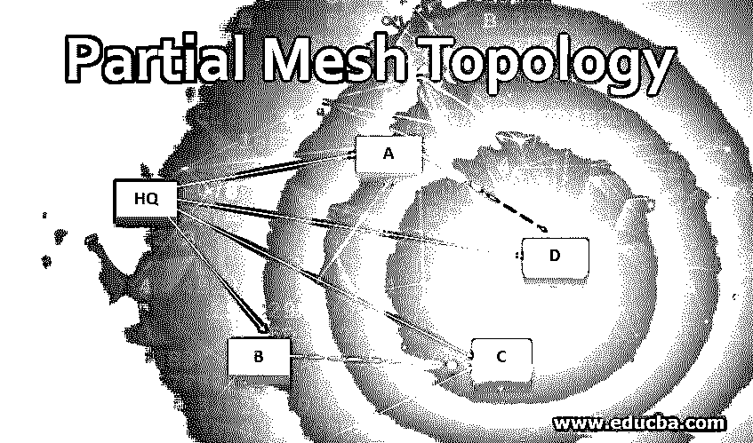
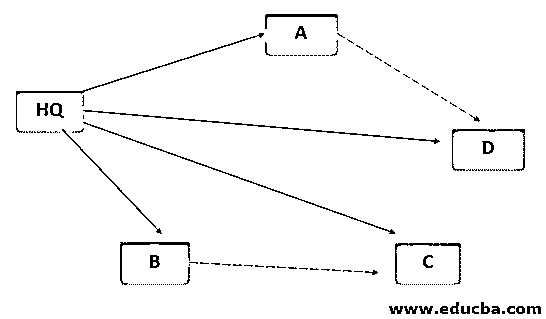

# 部分网状拓扑

> 原文：<https://www.educba.com/partial-mesh-topology/>

## 什么是部分网状拓扑？

拓扑学的意思是研究事物之间的映射。部分网状拓扑是一种映射多个路由器的方式，通过这种方式，路由器之间紧密耦合，但不完全互连。谈到部分网格，我们有必要简要讨论一下网格，因为两者是相互关联的。[网状拓扑是](https://www.educba.com/what-is-mesh-topology/)一种网络结构，其中每个系统或[网络设备](https://www.educba.com/types-of-network-devices/)连接到所有其他设备系统。这些主要用于无线通信。

### 框图

我们举例说明了一个包含以下组件的框图:让我们先看看它们——这是一个例子

<small>网页开发、编程语言、软件测试&其他</small>

*   在这里，总部是所有细节的中心(类似于主中心)
*   **答:**是研究&发展(如)
*   **B:** 是 HR(人力资源)(例如)
*   **C:** 是工资单(例如)
*   **D:** 是工程现场(例如)

**Note:** That (A and D communicate frequently) & (B & C communicate frequently)

我们已经看到了这个图表，并理解了块的构成，现在来看线条(红色和黑色)，

*   红色虚线表示交流频繁，但没有直接联系
*   黑线表示这些连接之间有频繁的通信

**解释:**有了 AD 和 BC 之间的这些红色虚线，我们就不再需要一直去总部才能完成通信，因此我们在这些端点之间添加了这些部分连接线。因此，部分网状拓扑是全网状拓扑的一个子集，在这里，我们不需要总是去头部中心，而是进行部分连接来简化我们的过程。在部分网状网络中，基于频繁的操作路径或信号战略性地安排链路，以便于使用。

### 需要部分网状拓扑

部分网状网络的用户无疑具有更好的可用性和时间管理，但是在您的组织中拥有部分网状网络还有额外的好处。

*   在部分网状拓扑中，不存在所谓的集中监管，对于网络中的任意数量的连接，不存在管理员或控制器。
*   它们适用于广域网，因此它们肯定可以覆盖非常大的地理区域。众所周知，广域网是一种广域网，适用于处理大量人群、大量设备或远程覆盖的区域。
*   部分 WAN 拓扑比中心辐射型 WAN 拓扑更冗余，就费用而言，部分 WAN 位于网状和辐射型之间。它比网状的便宜，但比辐条的贵。
*   该网络非常稳定，几乎很难关闭。此外，如果出现连接故障，用户也不会丢失任何数据，因为它不是集中托管在一个位置。
*   在拓扑使用下有一些黄金法则，并且由于部分网状继承了拓扑架构的所有质量，我们可以说部分网状拓扑创建了具有更好管理能力和更大数据完整性设施的数据集。容易验证和跟踪任何不当行为发生的设施。

### 部分网状拓扑的重要性

在您的组织中使用部分网状网络有多种优势，如下所示:

1.  高容量数据传输非常有用，可以说是网络中采用部分网状拓扑的最大好处。在这里，数据可以以非常快的速率传输到任意数量的设备。因此，可以说这种网络拓扑结构本身可以容纳大量数据。
2.  即使其中一个集线器、终端或终端被停用，也不会有任何故障影响。事情是以这样的方式安排的，过程不会过载，最佳路径会自动定向。
3.  在部分网状拓扑中，任何意义上的扩展和修改都是可能的，并且可以在任何意义上进行，而不会损害现有的节点或终端。
4.  与其他网络模式相比，它是最佳解决方案，因为它以最小的过载费用提供了更好的用户体验。
5.  有几个组织负担不起部分网状拓扑的设置，这种技术可以同时在价格和生产率方面为他们充当桥梁。
6.  它的结构非常健壮，一个连接只有在被允许的情况下才能与其他连接通信。这消除了任何不当行为的机会。
7.  如果偶然存在任何故障，那么识别和诊断该特定故障就变得非常容易。
8.  借助它提供的自定义功能，它为用户提供了安全性和隐私性。

### 结论

在网络中，我们需要一次又一次地访问不同的数据集，维护一套针对数据访问的规则对我们来说非常重要。对于任何组织来说，设置一个最佳的方法或媒介来做到这一点都是有帮助的。如果在给定的时间范围内没有检索到细节，事情会变得非常严重。更好和更有效的联网总是能节省时间和更好地管理。

### 推荐文章

这是部分网状拓扑的指南。这里我们讨论什么是部分网格技术？需求和重要性以及框图。您也可以浏览我们的其他相关文章，了解更多信息——

1.  [网络拓扑类型](https://www.educba.com/types-of-network-topology/)
2.  [联网设备](https://www.educba.com/networking-devices/)
3.  [点对点拓扑](https://www.educba.com/point-to-point-topology/)
4.  [以太网拓扑](https://www.educba.com/ethernet-topology/)

