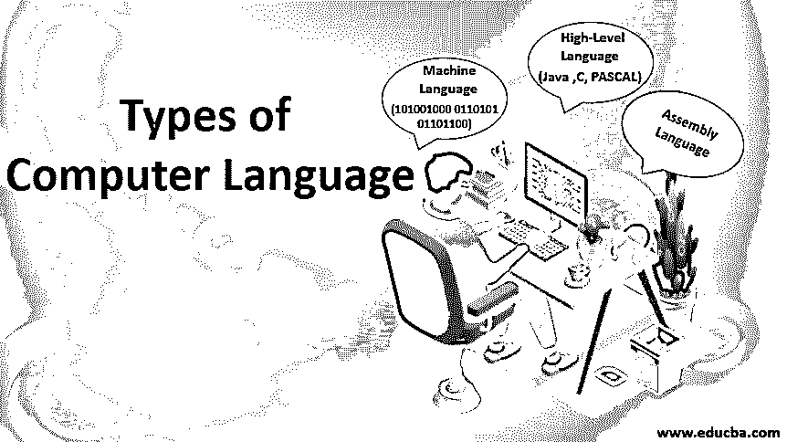

# 计算机语言的类型

> 原文：<https://www.educba.com/types-of-computer-language/>

## 计算机语言类型介绍

计算机语言被定义为用于编写程序或任何特定应用的代码或语法。它是用来和电脑交流的。广义地说，计算机语言可以分为三类:汇编语言、机器语言和高级语言。机器语言被认为是这三种语言中最古老的计算机语言。在机器语言中，输入直接以二进制输入的形式给出，由机器处理。二进制输入意味着一和零的形式。对于计算机语言处理，系统需要一个编译器和解释器来把语言转换成计算机语言，以便它能被机器处理。

### 不同类型的计算机语言

以下是三种最常见的计算机语言:

<small>网页开发、编程语言、软件测试&其他</small>

#### 1.机器语言

机器语言有时被称为机器代码或目标代码，是一组二进制数字 0 和 1。这些二进制数字可以被计算机系统理解和读取，并且很容易解释。它被认为是一种母语，因为它可以被中央处理器(CPU)直接理解。机器语言不太容易理解，因为这种语言使用二进制系统，其中命令以 1 和 0 的形式编写，不容易解释。只有一种语言是计算机能理解的，那就是机器语言。计算机系统的操作系统用于识别用于该特定系统的确切的机器语言。

操作系统定义了程序应该如何编写，以便它可以被转换成机器语言，系统采取适当的行动。计算机程序和脚本也可以用其他编程语言编写，如 C、C++和 JAVA。然而，这些语言不能被计算机系统直接理解，因此需要一个程序将这些计算机程序转换成机器语言。编译器用来把程序转换成计算机系统容易理解的机器语言。编译器生成二进制文件和可执行文件。

文本“Hello World”的机器语言示例:

01001000 0110101 01101100 01101100 01101111 00100000 01010111 01101111 01110010 01101100 01100100

#### 2.汇编语言

汇编语言被认为是微处理器和许多其他可编程设备的低级语言。汇编语言也被认为是第二代语言。第一代语言是机器语言。汇编语言以编写操作系统和不同的桌面应用程序而闻名。程序员使用汇编语言执行的操作是内存管理、注册表访问和时钟周期操作。汇编语言的缺点是代码不能重用，而且语言不容易理解。汇编语言被认为是一组其他语言。它用于实现用于编程 CPU 架构的机器代码的符号表示。汇编语言的另一个名字是汇编代码。对于任何处理器，使用最多的编程语言是汇编语言。

在汇编语言中，程序员完成可以在中央处理器(CPU)上直接执行的操作。该语言具有某些缺点，因为它在程序中不包含任何变量或函数，并且该程序不能在不同的处理器上移植。汇编语言使用与机器语言相同的结构和命令，但是它用名字代替数字。使用汇编语言执行的操作非常快。与高级语言相比，它的运算要快得多。

#### 3.高级语言

高级语言的发展是在程序员面临编写程序的问题时完成的，因为旧语言有可移植性问题，这意味着在一台机器上编写的代码不能转移到其他机器上。这导致了高级语言的发展。高级语言易于理解，代码也易于编写，因为用高级语言编写的程序是用户友好的。用高级语言编写代码的另一个优点是代码独立于计算机系统，这意味着代码可以转移到其他机器上。高级语言使用抽象的概念，也关注编程语言，而不是关注计算机硬件组件，如寄存器利用率或内存利用率。

高级语言的开发是为了让程序员写出任何用户都能容易理解的人类可读的程序。如果与低级语言相比，使用的语法和编程风格可以很容易被人类理解。对高级语言的唯一要求是需要一个编译器。因为用高级语言编写的程序不能被计算机系统直接理解。在执行高级程序之前，需要将其转换成机器语言。高级语言的例子有 C++、C、JAVA、FORTRAN、Pascal、Perl、Ruby 和 Visual Basic。

*   **JAVA:**JAVA 编程语言是一种基于对象和类的面向对象的语言。这种语言发展的主要宗旨是使计算机程序能在任何系统上运行。JAVA 代码是独立于机器的代码，这意味着代码只需编写一次，就可以在任何机器上执行。内存管理在 [java 编程语言](https://www.educba.com/java-programming-language-features/)中自动完成。
*   C:C 是一种用于编写程序的过程化通用编程语言。这种语言主要用于编写操作系统应用程序和桌面应用程序。
*   PASCAL: Pascal 是一种基于[数据结构](https://www.educba.com/what-is-data-structure/)的程序编程语言。它使用了递归数据结构的概念，比如图、列表和图。

### 结论

随着编程语言领域从机器语言到低级语言再到高级语言的不断发展，程序员获得了最大的好处，因为他们不必编写复杂的程序。这些程序可以很容易地编写，并且很容易被人理解。唯一需要的就是将其转换成机器语言。

### 推荐文章

这是计算机语言类型的指南。在这里，我们详细讨论了 3 种计算机语言的基本概念。您也可以阅读以下文章，了解更多信息——

1.  [计算机新技术](https://www.educba.com/new-technologies-of-computer/)
2.  [计算机软件的种类](https://www.educba.com/types-of-computer-software/)
3.  [计算机内存的类型](https://www.educba.com/types-of-memory-in-computer/)
4.  [数据库类型](https://www.educba.com/types-of-database/)

