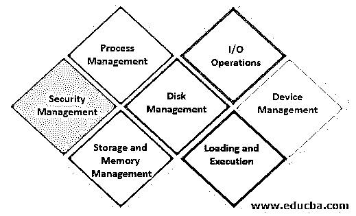
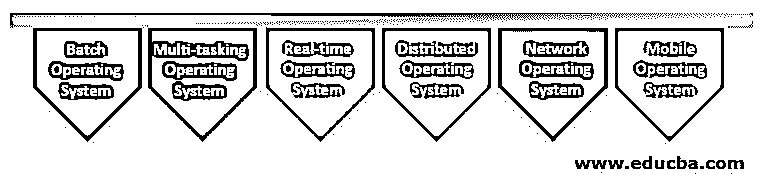

# 操作系统的特性

> 原文：<https://www.educba.com/features-of-operating-system/>

## 操作系统功能概述

所有应用程序，如游戏、MS office、Firefox，都需要一个合适的环境来执行任务。操作系统帮助用户在不知道使用计算机语言的情况下与系统进行交互。不部署操作系统，任何人使用任何智能手机或电脑都是不可行的。必须至少有一个操作系统来执行程序和任务。所以简单来说，操作系统被定义为充当计算机硬件和最终用户之间的线路的软件，以便于交互来有效地完成任务。

### 操作系统的特性

日益发展的操作系统有着广泛的显著特征。操作系统的发展令人钦佩，因为它是在 1950 年为处理存储磁带而开发的，现在它作为一个界面，通过抛出亮丽的色彩为最终用户提供视觉享受。下面给出了操作系统的功能:

<small>网页开发、编程语言、软件测试&其他</small>

#### 1.安全管理

存储在系统中的信息和机密数据受到操作系统的保护，并通过向用户提供强授权密钥来阻止系统，从而保护系统[免受恶意软件攻击](https://www.educba.com/what-is-malware/)。操作系统充当管理员模式，并为系统提供强大的防火墙保护。操作系统毫无困难地尽快处理和纠正错误。

#### 2.进程管理

程序执行由操作系统有效管理，没有任何重叠或时间延迟。进程管理支持操作系统开发和删除进程，并提供多个进程之间的通信和同步机制。

#### 3.存储和内存管理

操作系统执行内存管理和虚拟内存多任务处理。操作系统中内存管理的需求是分配和取消分配内存空间，以便在需要资源时进行处理，或者在内存不足时进行处理，这将导致文件系统和磁盘空间过高或已满的警报。因此，建议定期查看和备份内存和存储设备。该系统有许多存储层次结构，如主存储、辅助存储和缓存存储。伪代码和数据应该保存在缓存中，以便运行的进程在出现任何问题时可以引用它。操作系统可以做资源分配，防止系统过载。

#### 4.磁盘管理

操作系统允许通过磁盘访问来管理文件系统、文件系统设备驱动程序和文件的相关活动，如文件的检索、命名、共享、存储和保护。

#### 5.输入输出操作

操作系统可以有效地处理 I/O 操作，对最终用户隐藏硬件的特殊行为。

#### 6.加载和执行

命令解释用于解释给定的命令，并通过处理命令使资源作用于系统。不共享内存或硬件设备的一组处理器被称为分布式系统，其中处理器通过网络与另一个设备交互。OS 协调并分配计算机系统不同用途的解释程序、编译器和其他软件资源。引导是[操作系统](https://www.educba.com/functions-of-operating-system/)的重要功能之一，即让计算机的 OS 启动并加载计算机工作。它也被称为计算机系统的加载和执行。

#### 7.设备管理

设备和打印机控制由操作系统通过允许正确的流程来管理。执行磁盘管理是为了跟踪连接到系统的所有硬件，以及不同作业和用户使用的资源。它是负责 I/O 的控制器之一。

### 操作系统的类型

最常用的操作系统是微软视窗、Linux、苹果 macOS、谷歌 Android 和苹果 iOS。

#### 1.批处理操作系统

批处理操作系统是一个非常冗长和省时的过程。为了加速相同的过程，具有相同类型需求的作业被组合在一起并作为一个组来执行。批处理操作系统的用户不与计算机直接交互。在这里，每个用户必须离线安排工作，如打孔卡，并提交给计算机。

#### 2.多任务操作系统

多任务操作系统使得位于不同终端的人们能够同时访问单个计算机系统。将 CPU 的处理器时间分配给许多用户称为分时。

#### 3.实时操作系统

军事和空间软件系统是一个实时操作系统，在获取和执行输入命令时具有最短的响应时间。

#### 4.分布式操作系统

分布式操作系统类似于分时系统，分布式系统使用位于不同位置的许多处理器为用户提供快速计算。

#### 5.网络操作系统

网络操作系统在能够服务和管理数据、组、用户、安全性、应用和其他网络功能的服务器上执行。

#### 6.移动操作系统

移动操作系统是为平板电脑、可穿戴设备和智能手机设计的操作系统。一些智能手机操作系统包括黑莓、Web、watchOS、Android 和 iOS。

操作系统允许用户通过构建抽象来隐藏硬件信息，并且很容易与 GUI 一起使用。它是一个用于轻松部署应用程序的平台。它确保计算机系统使用起来舒适。但是如果操作系统出现任何故障，都会导致数据丢失。所以应该高效管理。对一家小公司来说，它很贵，但它提供了许多功能。

内核是操作系统的主要组成部分，它管理软件和硬件之间的通信。微内核和单片内核是两种流行的用于通信目的的内核。操作系统的独特功能包括进程、设备、I/O、文件和内存管理。操作系统的重要类型有批处理、多任务、实时、网络和移动操作系统。

### 推荐文章

这是操作系统特性的指南。这里我们讨论操作系统的介绍、特性和类型。您也可以看看以下文章，了解更多信息–

1.  [操作系统中的线程](https://www.educba.com/threads-in-operating-system/)
2.  [操作系统中的多线程](https://www.educba.com/multithreading-in-operating-system/)
3.  [操作系统的功能](https://www.educba.com/functions-of-operating-system/)
4.  [操作系统的演变](https://www.educba.com/evolution-of-operating-system/)

