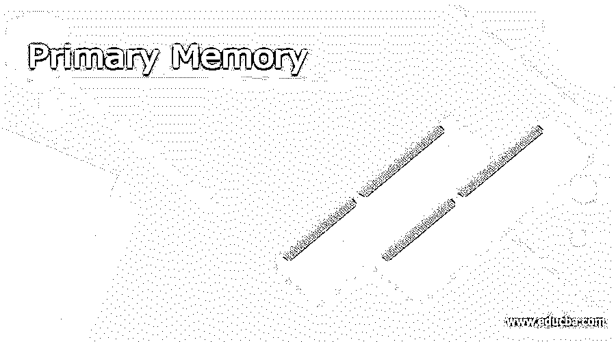

# 主存储器

> 原文：<https://www.educba.com/primary-memory/>

## 主存储器介绍

为了存储数据和命令，计算机需要内存。记忆是由大量的单元机械排列而成的，每个单元只能存储一位信息。它们在逻辑上以字的形式排列，这些字是给定地址的一组位。这些内存地址用于访问数据和指令。成本由访问这些内存地址的速度决定。内存的成本取决于访问这些内存地址的速度。内存级别越高，越贵。

计算机中的内存以分层的方式排列，最快的访问速度和最高的成本在顶部，最慢的访问速度和最低的成本在底部。

<small>网页开发、编程语言、软件测试&其他</small>

主存储器被称为主存储器和“内部存储器”它也称为主存储器。主存储器是指处理器通过数据总线直接访问的所有类型的计算存储器。这有助于处理器进入存储正在运行的程序和当前正在处理的数据的存储器位置。

因为主存储器很贵，所以正在设计技术使它更有效。有不同形式的主存储器可用。

因此，所有使用微处理器的应用程序，像机器一样，都会使用内存。存储程序的 RAM 和 ROM 是主存储器的例子。这些存储器的容量很小，并且它们是用集成电路(IC)或半导体器件制成的。它比辅助存储器具有更高的数据存取速度。它的价格高于二级存储器。

随机存取存储器

随机存取存储器(RAM)是一种用于存储数据的存储器。由于处理器显式地访问所有存储器地址，不管字长如何，存储和检索都很快。RAM 是目前最快也是最贵的内存。由于这两个变量，RAM 最多只能提供 1GB 的有限容量。虽然 RAM 不可预测，但它可能是这两种形式中的一种。

**DRAM 是所使用的一种存储器(动态 RAM)**

在 DRAM 中，每个存储单元由一个晶体管和一个电容器组成，每个存储单元存储一位数据。然而，当这种电池失去电荷时，存储的数据会在不到千分之一秒的时间内丢失。因此，它必须每秒刷新数千次，这会消耗处理器资源。然而，由于每个单元都很小，单个 DRAM 可能具有大量的单元。

**SRAM 是一家制造半导体(SRAM)的公司**

SRAM 由触发器组成，每个单元存储一位。它不需要像 DRAM 一样更新，因为它会保持它的位，直到电源打开。与 DRAM 相比，它的读写时间也更短。SRAM 是一种用于特殊应用的存储器。

【T0 罗马】T1

只读存储器被称为 ROM。顾名思义，处理器是唯一可以读取 ROM 的处理器。不可能将新数据写入 ROM。ROM 存储的数据是在生产过程中写入的。它们存储不需要改变的数据，例如计算机的引导序列或数学应用的算法表。因为 ROM 比 RAM 慢，所以它不太贵。

它是非易失性的，这意味着即使电源关闭，它也能保存数据。虽然 rom 不能像 RAM 那样被修改，但是存在对这些类型的 rom 进行编程的技术。

**PROM(可编程 ROM)**

PROM 编程器或 PROM 刻录机是一种特殊的硬件设备，可用于编程 PROM。

**EPROM(可擦除可编程只读存储器)**

EPROMs 可以被擦除，然后在特殊电信号或紫外线的帮助下被编程。UVEPROMs 是可以用紫外线擦除的 eprom，而 EEPROMs 是可以用电信号擦除的 eprom。另一方面，电脉冲比紫外线更容易操作，也更安全。

**高速缓冲存储器**

高速缓冲存储器是处理器可访问以进行快速处理的一小块高速易失性存储器。高速缓存可以是已预留的主存储器的一部分、CPU 上的另一个芯片或单独的高速存储单元。静态随机存取存储器用于制造高速缓冲存储器。高速缓存是将某些数据和指令存储在高速缓冲存储器中以实现更快访问的方法。

当处理器需要数据或指令时，它首先在高速缓存中查找。如果不能访问，首先访问主存储器，然后是辅助存储器。由于缓存速度极快，因此与数据仍在缓存中所节省的时间相比，访问缓存所花费的时间和时间微不足道。当在高速缓存中找到数据或指令时，发生高速缓存命中。

### 结论

在这篇文章中，我们已经看到了什么是初级记忆，它的类型和子类型。我们希望这篇文章对您有所帮助。

### 推荐文章

这是主内存指南。我们在这里讨论导论，什么是主记忆及其类型？.您也可以阅读以下文章来了解更多信息—

1.  [寄存器内存](https://www.educba.com/register-memory/)
2.  [高速缓冲存储器](https://www.educba.com/cache-memory/)
3.  [缓存类型](https://www.educba.com/cache-memory-types/)
4.  [主存储器的类型](https://www.educba.com/types-of-primary-memory/)

