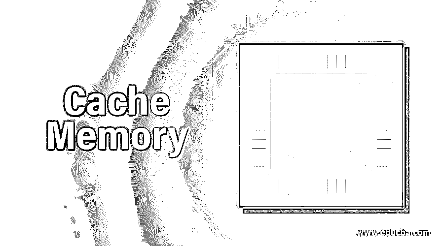

# 高速缓冲存储器

> 原文：<https://www.educba.com/cache-memory/>

## 什么是高速缓存？

它是一个存储常用数据的内存组件。在操作中，为了获取一条信息，CPU 将首先访问高速缓存。虽然说 RAM 也是一种快速设备是必要的，但它没有高速缓冲存储器快。因此，计算机是以这样一种方式设计的，通常使用的数据首先从内存中检索。这增加了计算速度。

### 高速缓存的重要性

上面的场景让我们看到了一个特性是多么重要。让我们深入研究一下。

<small>网页开发、编程语言、软件测试&其他</small>

存储器的发展与计算机本身的发展是并行的。工程师想要制造的计算机越快，内存就变得越强大。

然而，成为最快的内存集的一个缺陷是明显缺乏大小。高速缓冲存储器虽然比 RAM 快，但在大小上却比不上后者。然而，由于其整体复杂性，内存往往更昂贵。

它也是易失性存储器的一个例子。这里要问的问题是什么是易失性存储器？

易失性存储器本质上是暂时的。存储器存储 CPU 运行或开启期间的数据。当我们关掉它的时候，数据就被机械地删除了。ROM 或只读存储器等非易失性存储器是一种即使在 CPU 关闭后也能保持内存的存储器。这使得 ROM 比高速缓存慢。

这就把我们带到了记忆的类型。

### 高速缓存的类型

有两种类型:

*   初级的
*   副手

主高速缓冲存储器或者集成到处理器中，或者离处理器最近。除了基于硬件之外，存储器还可以基于磁盘。方法保持不变。为了存储数据而接近磁盘的一部分。

### 高速缓存是如何工作的？

如前所述，记忆主要有两种类型。然而，现代计算机系统有三级内存:L1、L2 和 L3。L1 通常是最小的高速缓冲存储器。其大小从 8kb 到 64kb 不等。但是，由于其接近 CPU，其可访问性远远超过 L2 和 L3。L2 和 L3 的访问时间更长。

高速缓存在不同的配置下工作:

*   直接映射
*   完全关联映射
*   集合关联映射

**直接映射:**此功能使高速缓存能够将数据分块存储到高速缓存内的指定位置。

**全联想记忆:**不像直接映射，不会破坏任何特定的映射。允许完全映射到任何位置。

**设置关联映射**:介于前两者之间。在内存中，每个块都映射到一个较小的集合。

### 体系结构

高速缓冲存储器分为三个主要部分:目录存储、数据段和信息状态。

存储器的实际作用是存储从主存储器中读取的数据。这条信息然后被存储在数据段中。

然而，为了实现这一点，存储器需要定位存储信息的高速缓存行。这很重要，因为每个高速缓存行都由存储在目录存储中的地址来标识。该特定的目录条目被称为缓存标签。

缓存的大小有其特殊的意义。它是可以从主存储器中存储的数据量。但是，该大小不包括支持缓存标签或状态位的内存。

这是一个内存定位的基本框图。

总结一下存储器的操作:

**第一步:**每当 CPU 需要访问数据时，都会在缓存中寻找。如果找到那个特定的内存，它将被读取。这使得整个操作很快。

**步骤 2:** 如果现在没有在内存中找到，那么就必须访问主内存。

**第三步:**现在你已经访问了主存储器，并得到了你想找的东西，数据被传送到高速缓冲存储器，以备将来参考。

**第四步:**内存性能的好坏被称为命中率

**步骤 5:** 如果发现某个特定的内存存在于该内存中，则称之为命中

**步骤 6:** 如果在内存中找不到特定的内存，而必须访问主内存，那么就是未命中。

### 结论

根据这些功能，可以看出高速缓冲存储器是计算机中最重要的功能之一。CPU 变得更快更聪明的原因之一是因为内存的进步。多年来，人们对它们的效率进行了大量研究，结果是显而易见的。高速缓冲存储器已经成为任何计算系统的支柱之一，并且随着技术的进步，它们将变得日益进步。

### 推荐文章

这是一个高速缓冲存储器的指南。在这里，我们讨论了高速缓存的重要性、不同类型、体系结构及其工作原理。您也可以看看以下文章，了解更多信息–

1.  [数据存储设备](https://www.educba.com/data-storage-devices/)
2.  [分布式数据库系统](https://www.educba.com/distributed-database-system/)
3.  [NAS 存储设备](https://www.educba.com/nas-storage-device/)
4.  [Java 中的内存类型](https://www.educba.com/types-of-memory-in-java/)

