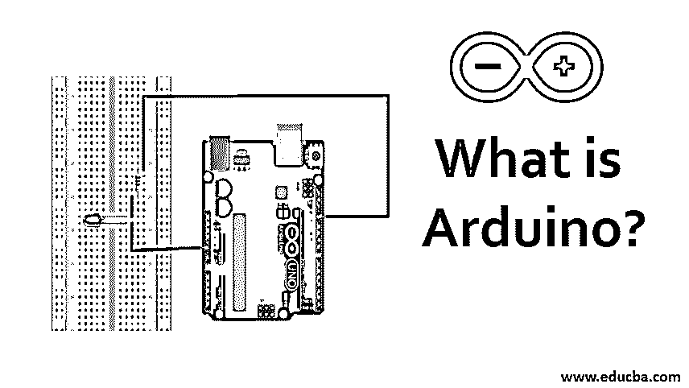
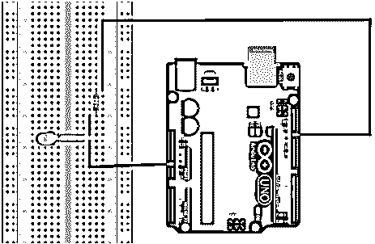

# Arduino 是什么？

> 原文：<https://www.educba.com/what-is-arduino/>




## Arduino 简介

Arduino 是一家开源软件和硬件公司，设计和制造单板微控制器和套件来构建数字设备。他们开发的板被称为 Arduino 板，能够使用雷达、传感器上的光、按钮的按压等读取输入，如部门信息。可以将它们转换成输出，如激活 led 灯、马达、蜂鸣器等。市场上有不同版本的 Arduino 板，例如 Nano、Uno、Atmega 等。每一个都有不同形状和大小。它还为他们的板提供了一个软件 IDE，帮助开发人员用语言对板进行编程，这个 IDE 还允许用户直接从系统提供输入指令。

### Arduino 的类型

让我们看看他们自己提供的几种不同类型的板:

<small>网页开发、编程语言、软件测试&其他</small>

1.  Arduino USB: UNO，Duemilanove，Extreme，NG 240
2.  蓝牙
3.  连续的
4.  单面串行
5.  非常
6.  荷
7.  毫微；纤（10 的负九次方）
8.  微型汽车
9.  迷你 USB 适配器

Arduino 软件使用基于 C 的 Arduino 编程语言来编写代码。由于[编程语言是基于](https://www.educba.com/what-is-a-programming-language/) C 的，用汇编语言编写[程序的困难被消除了。因为软件在内部将基于 C 的程序转换成汇编代码，然后将其上传到主板。除了代码编辑器，该软件还包括一个编译器、一个上传器、用于外围设备的库。](https://www.educba.com/what-is-assembly-language/)

### Arduino 是如何工作的？

我们将通过闪烁一个小 LED 来观察工作情况。

**所需组件:** Arduino UNO、LED、跳线、试验板和一个 1k 电阻

#### 工作

以下是使用 Arduino 使 LED 闪烁的步骤

**第一步:**根据电路图连接组件，然后使用 USB 线将 Arduino UNO 连接到系统。




**来源链接:**[https://create . arduino . cc/project hub/rowan 07/make-a-simple-led-circuit-ce 8308](https://create.arduino.cc/projecthub/rowan07/make-a-simple-led-circuit-ce8308)

确保 LED 的负极端子，靠近头部的 LED 的较短引脚表示负极端子。

**第二步:**从 https://www.arduino.cc/en/software[下载 Arduino IDE 到你的系统中](https://www.arduino.cc/en/software)

**步骤 3:** 设置 Arduino IDE:打开 IDE，进入工具- >板卡，选择 Arduino UNO。然后进入工具- >端口，选择 UNO 连接的端口。

**步骤 4:** 编码逻辑:实现 LED 代码很简单。Arduino 的所有代码主要由两个函数组成:

**代码:**

```
void setput(){
}
Void loop(){
}
```

当 Arduino 启动时调用 Void setup，Void 循环在无限循环中不断迭代，直到电源关闭。

使 LED 闪烁的代码如下:

**代码:**

```
void setup(){
//put your setup code here, to run only once:
pinMode(13, OUTPUT); // define pin 13 as the output
}
void loop(){
// put your main code here, to run in a loop:
digitalWrite(13, HIGH);
delay (1000); // delay for1s
digitalWrite(13, LOW);
delay (1000);
}
```

**第五步:**编译和上传:写完代码后，你可以点击编译按钮，然后上传，或者你可以直接点击上传按钮，因为它会编译代码，如果没有错误，它会上传到 Arduino。在我们的例子中，如果代码上传成功，那么您应该会得到如下消息:


如果您的连接是正确的，那么您可以看到您的 LED 以 1 秒的间隔闪烁。

### Arduino 的特点及应用

特性和应用如下所述:

#### 特点:

*   它在硬件和软件方面都是开源
*   它可以使用 USB 与计算机进行串行通信。
*   它只需要 5V 的电源
*   它可以处理数字和模拟信号、传感器和执行器。
*   对于大多数 Arduino 板，建议的输入电压为 7-12V，而工作电压为 5V。

#### 应用:

以下是几个受欢迎的应用:

*   为了简化原型制作
*   控制电机
*   机器人和控制系统
*   设计基本电路图
*   家庭和工业自动化
*   独立项目

### 优点和缺点

以下是优点和缺点:

#### 优势

*   **便宜:**与其他微控制器相比，平台板便宜。最便宜的可以手工操作，而预组装的模型不到 50 美元。
*   **跨平台:**大部分微控制器仅限于 windows，而 Arduino 代码可以在 Linux、Mac、windows 上运行。
*   **所有 Arduino 板的通用 IDE:**对于 Arduino 推出的所有不同板，我们可以使用 Arduino IDE 来编程和上传代码。不需要安装任何其他软件。
*   **Opensource:** 它是在开源硬件下发布的，因此电路设计人员可以使用它来实现他们的模块。
*   **大型社区支持:** Arduino 社区在解决问题、提供解决方案和代码方面非常有帮助。Arduino 之家有许多免费的项目。

#### 不足之处

*   有限的内存和处理能力:与 Raspberry pi 等微处理器相比，Arduino 并不强大。因此，在某些情况下，选择像 Raspberry pi 这样的微处理器比选择微控制器更好。
*   **未针对特定用途进行优化** : Arduino 旨在满足多种用途。它更多的是用于原型项目，而不是用作特定的 PCB。
*   **易用性:**是的，易用性也是一个缺点，在电气项目中使用它会导致对 AVR 微控制器的不了解。
*   **调试器不可用:**IDE 没有调试器，因此有时很难调试长代码。
*   互联网连接:连接互联网并非不可能，但也不容易，因为它有屏蔽和图书馆。

### 结论

由于大小的限制，我们没有讨论不同类型的 Arduino 板，但即使在这篇文章中，我们看到了它的优点和缺点。我们知道如何在其中编写第一个代码。到现在为止，你应该有足够的信心编写程序并在你的模块中使用它们。

### 推荐文章

这是一本什么是 Arduino 的指南？在这里，我们将讨论 Ardunio 的工作方式、类型、应用、特性以及优缺点。您也可以浏览我们的其他相关文章，了解更多信息——

1.  [Arduino 操作员](https://www.educba.com/arduino-operators/)
2.  [Elegoo vs Arduino](https://www.educba.com/elegoo-vs-arduino/)
3.  [树莓 Pi 3 vs Arduino](https://www.educba.com/raspberry-pi-3-vs-arduino/)
4.  [树莓派 vs Arduino](https://www.educba.com/raspberry-pi-vs-arduino/)


