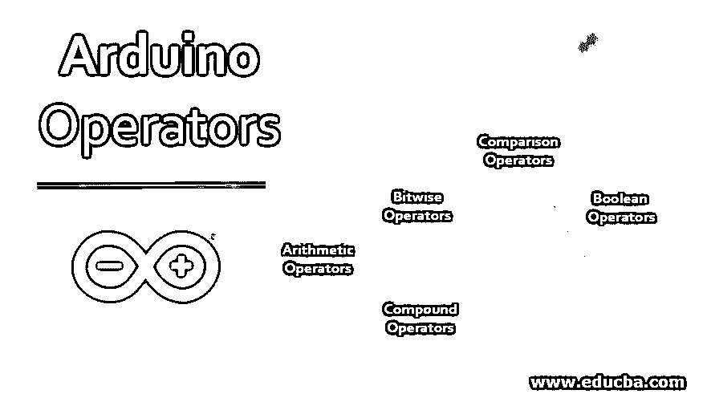

# Arduino 运算符

> 原文：<https://www.educba.com/arduino-operators/>

## Arduino 运算符简介

在 Arduino 编程中，Arduino 操作符是最重要的主题之一。它用于执行赋值、逻辑、特殊、增量等操作。了解这些运算符对于在 Arduino 中执行数学和逻辑计算非常重要。所以基本上操作员负责操作数据。例如，如果我们必须执行两个数的加法，那么我们将使用加法运算符，因为它负责对数据执行加法运算。在 Arduino 编程中，所有这些操作符根据它们的操作分为五个不同的类别。

### Arduino 编程中使用的各种运算符

以下是我们可以在 Arduino 编程中使用的一组运算符:

<small>网页开发、编程语言、软件测试&其他</small>

*   算术运算符
*   按位运算符
*   比较运算符
*   布尔运算符
*   复合运算符

#### 1.算术运算符

程序被广泛用于进行数学计算。在 Arduino 中，我们可以编写简单的程序来执行数学计算，如加、减、乘、除等等。

| **操作员** | **符号** | **描述** | **例子** |
| **赋值运算符** | **=** | 它用于将等号右边的值赋给左边的变量。 | 要给 B 赋值 10，写 B=10。 |
| **加法运算符** | **+** | 它用于将两个操作数相加。 | 假设 A=10，B=20，那么 A+B 将给出 30。 |
| **减法运算符** | **–** | 它用于减去两个操作数。 | 假设 A=30，B=20，那么 A-B 将给出 10。 |
| **乘法运算符** | ***** | 它被用来乘操作数。 | 假设 A=10，B=2，那么 A*B 将给出 20。 |
| **除法运算符** | **/** | 它用于将两个操作数相除。 | 假设 A=10，B=20，那么 B/A 会给出 2。 |
| **模运算符** | **%** | 它用于获取两个操作数相除后的余数。 | 假设 A=10，B=23，那么 B%A 会给出 3。 |

#### 2.比较运算符

这些运算符用于比较操作数的值。执行的比较类型有相等、不相等、小于、大于等等。这些比较运算符返回布尔值(真/假)。

| **操作员** | **符号** | **描述** | **例子** |
| **等于运算符** | **= =** | 它用于检查两个操作数的值是否相等。如果不相等，它将返回 False，否则将返回 True。 | 假设 A=20，B=22 检查 A 是否等于 B，写 A==B，会返回 False。 |
| **不等于** | **！=** | 它用于检查两个操作数的值是否相等。如果不相等，它将返回 true，否则将返回 False。 | 假设 A=20，B=22 检查 A 是否不等于 B，写 A！=B .它将返回 True。 |
| **小于** | **<T1】** | 它用于检查左边的操作数是否小于右边的操作数。在这种情况下，如果条件有效，则返回 true，否则返回 false。 | 假设 A=20，B=22 要检查 A 是否小于 B，写 A |
| **大于** | **>T1】** | 它用于检查左边的操作数是否大于右边的操作数。在这种情况下，如果条件有效，则返回 true，否则返回 false。 | 假设 A=20，B=22 检查 A 是否大于 B，写 A>B，会返回 False。 |
| **小于等于** | **< =** | 它用于检查左边的操作数是否小于或等于右边的操作数。在这种情况下，如果条件有效，则返回 true，否则返回 false。 | 假设 A=20，B=22 检查 A 是否小于等于 B，写 A<=B，会返回 True。 |
| **大于等于** | **> =** | 它用于检查左边的操作数是否大于或等于右边的操作数。在这种情况下，如果条件有效，则返回 true，否则返回 false。 | 假设 A=20，B=22 检查 A 是否大于等于 B，写 A>=B，会返回 False。 |

#### 3.逻辑运算符

这些运算符有助于根据条件做出决策。在这种情况下，我们必须结合两个条件的结果。因此，这些值会产生一个布尔值。

| **操作员** | **符号** | **描述** | **例子** |
| **逻辑与** | **&&T1】** | 它检查两个操作数是否都是非零的。在这种情况下，如果两个操作符都不为零，那么条件就有效，它将返回 true，否则将返回 False。 | 假设 A 是 10，B 是 20，那么 A & B 为真。 |
| **逻辑或** | **&#124;&#124;** | 它检查两个操作数中是否有一个非零。在这种情况下，如果其中任何一个非零，那么条件就有效，它将返回真，否则将返回假。 | 假设 A 是 10，B 是 20，那么 A&&B 为真，假设 A=0，B=0，那么结果将为假。 |
| **逻辑非** | **！** | 它改变操作数的逻辑状态。如果操作数为 False，则操作数的 not 将导致 True。 | 假设 A =真那么，！a 会给假。 |

#### 4.按位运算符

这些运算符在二进制级别执行运算，并以十进制表示给出结果。

| **操作员** | **符号** | **描述** | **例子** |
| **按位与** | **&T1】** | 它将操作数的值增加 1 | Suppose A = 10 and B=20, then A&B will give 2.

A = 01010 (10)

B = 10100 (20)

A&B = 00010 (2)

 |
| **按位或** | **&#124;** | 如果任一操作数的位被置位，它会在结果中放置一个置位。 | Suppose A = 10 and B=20, then A&B will give 30.A = 01010 (10)B = 10100 (20)A&#124;B = 11110 (30) |
| **按位异或** | **^** | 如果仅在一个操作数中设置了位，则将它复制到结果中。 | Suppose A = 42 and B=27, then A^B will give 49.A = 00101010 (42)B = 00011011 (27)A^B = 00110001 (49) |
| **按位非** | **~** | 这是一个二元运算符，它翻转操作数的位。 | Suppose A =10 then ~A will give 21.A = 01010 (10)~A = 10101 (21) |
| **左移** | **<<T1】** | 基于左移运算符右侧操作数的值，左移运算符左侧操作数的位向左侧移动。 | Suppose A = 42 and B=2, then A<<B will give 168.A = 00101010 (42)A< |
| **右移** | **>>T1】** | 基于右移运算符右侧操作数的值，右移运算符左侧操作数的位移向右侧。 | Suppose A = 42 and B=2, then A>>B will give 10.

A = 00101010 (42)

A>>B = 00001010 (10)

 |

#### 5.复合运算符

| **操作员** | **符号** | **描述** | **例子** |
| **增量** | **++** | 它将操作数的值增加 1。 | 假设 A=10，那么 A++将给出 11 |
| **减量** | **—** | 它将操作数的值减 1。 | 假设 A=10，那么 A–将给出 9 |
| **复合加法** | **+=** | 它将右操作数与左操作数相加，然后将结果存储在左操作数中。 | 假设 A=10，那么 A+=5 的结果是 15 |
| **复合减法** | **-=** | 它从左操作数中减去右操作数，然后将结果存储在左操作数本身中。 | 假设 A=10，那么 A-=5，结果是 5 |
| **复合乘法** | ***=** | 它将右操作数乘以左操作数，然后将结果存储在左操作数中。 | 假设 A=10，那么 A*=5，结果 A=50 |
| **复合除法** | **/=** | 它将右操作数乘以左操作数，然后将结果存储在左操作数中。 | 假设 A=10，那么 A*=5，结果 A=50 |
| **复合模** | **+=** | 它对操作数取模，然后将取模结果存储在左操作数中。 | 假设 A=10，那么 A%=5，结果 A = 0 |
| **复合加法** | **+=** | 它将右操作数与左操作数相加，然后将结果存储在左操作数中。 | 假设 A=10，那么 A+=5，结果 A=15 |
| **按位异或** | **！=** | 它将右操作数与左操作数进行按位“或”运算，然后将结果存储在左操作数中。 | 假设 A=10，B=20，那么 *A！=B* 将设置 A=30 |
| **按位异或** | **& =** | 它将右操作数与左操作数进行位与运算，然后将结果存储在左操作数中。 | 假设 A=10，B=20，那么 *A & =B* 将设置 A=2 |

### 结论

在本文中，我们看到了在进行 Arduino 编程时可以使用的各种操作符。您可以使用这些操作符来构建您的逻辑，所以继续尝试在 Arduino IDE 中实现这些操作符，并在您的 Arduino 上运行它。

### 推荐文章

这是 Arduino 操作员指南。在这里，我们详细讨论 Arduino 编程中使用的 5 种不同运算符的基本概念。您也可以浏览我们的其他相关文章，了解更多信息——

1.  [MySQL 操作符](https://www.educba.com/mysql-operators/)
2.  [C 运算符](https://www.educba.com/c-operators/)
3.  [Swift 运营商](https://www.educba.com/swift-operators/)
4.  [Go 运算符](https://www.educba.com/go-operators/)

