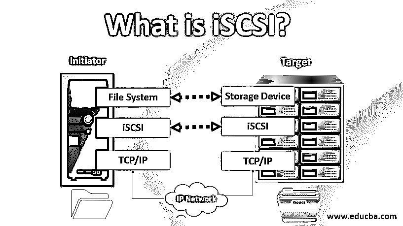
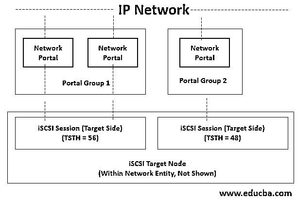

# 什么是 iSCSI？

> 原文：<https://www.educba.com/what-is-iscsi/>

## iSCSI 简介

互联网小型计算机系统接口是建立在 TCP 协议之上的传输层协议。它确保 iSCSI 启动器和存储目标之间在数据块级别通过 [TCP/IP 网络进行数据传输。它还支持对传输的数据包进行高级加密，并在数据包到达目标端时进行解密。](https://www.educba.com/what-is-tcp-ip/)

### 什么是 iSCSI？

互联网小型计算机系统接口是一个块传输层协议，工作在块级协议接口上。块协议也可以直接访问存储器，并通过协议 SCSI 控制数据流入或流出。由于来自源和目标的数据在 iSCSI 启动器(源)级别高度加密，并在到达 iSCSI 目标(目标)级别时解密，因此这些数据将被加密。只有在 LAN(局域网)或 WAN(广域网)之间有数据传输时才能考虑这一点，因为数据访问速度非常快。

<small>网页开发、编程语言、软件测试&其他</small>

### iSCSI 是如何工作的？

它是一组基于块的命令，将计算设备连接到介质的网络存储和数据的读写。iSCSI 协议使用启动器向服务器上的存储目标发送一组 SCSI 命令。这些存储目标可能包括 SAN、NAS 等。该协议允许将数据存储到远程网络存储中，并为需要存储的应用程序提取数据。

它的工作原理是通过设备上的服务器在启动器和目标之间传输块级的数据。该协议收集命令集，并收集要通过 TCP/IP 传输的数据包形式的数据。这些数据包使用单点连接通过服务器发送。一旦这些数据包到达目标，iSCSI 协议就使用提供的 SCSI 命令集来分解数据包，这样操作系统就能判断出它是否是本地 SCSI 设备。

### iSCSI 建筑

简而言之，我们可以说 iSCSI 是一个客户端-服务器架构。iSCSI 接口的客户端称为“启动器”，共享存储区域的服务器称为“目标”。

它建立在 TCP/IP 协议之上，用于在网络中共享数据。

### iSCSI 组件

iSCSI 有两个最重要的组成部分，通过它们在网络上传输数据。下面简要讨论了这些问题:

#### 发起人

这些启动器将命令分组到网络数据包中，并指示它们在 iSCSI 目标上传输。通常，在操作系统中使用基于软件的启动器来执行这种数据包传输。还有像 HBA(基于主机的适配器)这样的具有高级加密功能的硬件设备。这种硬件设备的另一种替代方案是 iSOE 卡，它带有一个从主机级运行的引擎，可以释放主机服务器上的 CPU 周期。

#### 目标

iSCSI 目标是存储设备，它是主机系统的本地驱动器。当数据包到达目标时，在操作系统中执行该组命令来分解它们。如果在发起者级别，数据分组被加密，那么在目标级别，它们被解密。

### iSCSI 的局限性和特点

以下是限制和功能:

#### iSCSI 的局限性

*   iSCSI 存储网络的主要限制是其在光纤通道上的性能。现在随着新兴技术的出现，性能之间的差距得到了改善。
*   现在，iSCSI 和 FC 的存储性能几乎相差无几。

#### iSCSI 的特色

*   **IP 路由:**ISCSI 的一个重要优势就是使用了 TCP/IP 协议。TCP/IP 允许长距离 IP 路由，而不需要外部网关硬件。它还提供了高度的灵活性和巨大的存储网络环境。
*   **安全**:互联网安全协议通过对网络中收到的每个数据包进行认证和加密，来保护网络中的 IP 流量。
*   **存储阵列:** iSCSI 目标所在的大型存储阵列。阵列可以是基于自由软件的产品或商业产品。它通常为客户端或用户的数量提供唯一的 iSCSI 目标。
*   标准以太网:它使用标准以太网，因此不需要为该协议构建昂贵的组件。

### 重要

下面列出了一些重要的功能:

*   iSCSI 是一种存储网络协议，用于通过 TCP/IP 网络传输输入输出数据。
*   它类似于 FC 协议，用于以较低的开销和较短的延迟传输大量数据。
*   更多的受益者是希望利用 SAN 优势的用户，他们普遍认为 iSCSI 比 FC 好。
*   块级文件共享比任何其他文件传输协议都更高效、更快速。
*   iSCSI 可以处理更远的本地距离来共享文件。存储网络可能离用户或客户端有一定的距离，这是很常见的。iSCSI 可以用比 FC 好得多的方式来处理这个问题。
*   它支持 CHAP(挑战/握手认证协议),确保用户或服务器拥有登录 SAN 上特定服务器的凭证。

### iSCSI 福利

*   **经济高效的** **:** 与 FC 相比，它提供了一个廉价的连接网络来传输数据块级的文件。
*   **可重用性**:可以重用现有的服务器来配置 iSCSI 实现。
*   **高效**:由于 iSCSI 用于块存储，所以速度非常快。
*   **可靠**:用户不需要太多 iSCSI 存储系统的知识，因为它非常容易理解和配置。
*   **杠杆**:它是一个基于互联网的协议。它利用了 TCP/IP 和以太网的互操作性优势。

### 结论

支持 ISCSI 的网络应远离外部资源或外部访问，这是最佳做法。iSCSI 存储区域网络的主要安全风险是黑客可以侵入系统或服务器的存储数据。借助 ACL(访问控制列表)，存储管理员可以采取预防措施锁定用户权限信息。

### 推荐文章

这是一本什么是 iSCSI 的指南？在这里，我们将讨论简介、工作原理、重要性以及架构、组件、特性、限制和优势。您也可以浏览我们的其他相关文章，了解更多信息——

1.  [CIFS 协议](https://www.educba.com/cifs-protocol/)
2.  IP 地址是如何工作的？
3.  [iSCSI 对 NFS](https://www.educba.com/iscsi-vs-nfs/)
4.  [什么是以太网？](https://www.educba.com/what-is-ethernet/)

