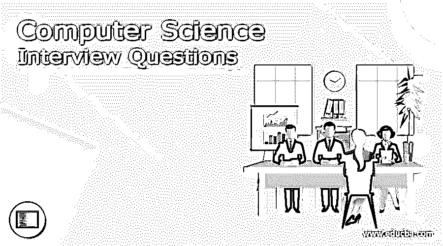

# 计算机科学面试问题

> 原文：<https://www.educba.com/computer-science-interview-questions/>

## 计算机科学导论面试问答

所以你终于在计算机科学领域找到了你的梦想工作，但是想知道如何破解 2022 年的计算机科学面试，以及可能的计算机科学面试问题。每个计算机科学面试都是不同的，工作范围也是不同的。牢记这一点，我们设计了最常见的计算机科学面试问题和答案，以帮助您在面试中取得成功。

以下是 2022 年计算机科学面试中最常被问到的 25 个问题:

<small>网页开发、编程语言、软件测试&其他</small>

### 1.什么是文件？

**答:**
文件是永久存储数据或信息的命名位置。文件总是使用文件名(例如，学生)存储在存储设备中。标记)。文件名通常有主要名称和次要名称，用“.”隔开(点)。

### 2.什么是课？

**答案:**
类是一个蓝图，从这个蓝图中创建对象。类包含与类的实例相关联的方法和变量。

### 3.什么是对象？

**答案:**
一个对象就是一个类的实例。例如
Abc 类{——这是一个
int a 类；——这是一个变量
公共 Abc()；——这是 contractor
public static void main(String args[])——这是一个方法
{
Abc a = new Abc()；——这是对象创建，其中“a”是参考变量或对象名
}
}

### 4.什么是构造函数？

**答案:**
构造函数是用来创建类的对象的方法。构造函数默认有两种类型&参数化构造函数。

**5。不同的 OOPS 原理是什么？**

**答案:**
基本的 OOPS 原理如下

*   包装
*   抽象
*   遗产
*   多态性

### 6.什么是继承？

**答案:**
继承是父类(超类)的属性传递给子类(子类)的属性。例如
Abc 类{——这是一个
int a 类；——这是一个变量
public void abc(){ }—Methods
}
class Xyz 扩展 Abc ——( Extend 是关键字，Xyz 是继承 Abc 父类属性的子类。)
{
public static void main(String args[])——这是一个方法
{
Abc a = new Abc()；——这是对象创建，其中“a”是参考变量或对象名
}
}

### 7.什么是多态性？

**答案:**
多态性是一个对象呈现多种形式的能力。在 OOP 中，当一个父类引用被用来引用一个子类对象时，通常会用到多态。

### 8.什么是实例和类变量？

**答案:**
实例变量属于该类的一个特定实例，而类变量。类变量也称为静态变量。比如
public class Abc {
public int a；……..这是一个实例变量
public static int a1；……..这是一个静态或类变量
..
……………..
}

### 9.比较方法和构造函数？

**答案:**
构造函数:用于初始化一个类的实例。
方法:用于执行某种功能或操作。

构造函数:没有返回类型。
方法:有一个返回类型。

### 10.什么是单例类？

**答:**
单例类将为一个类创建的对象数量限制为一个，但如果情况发生变化，它可以灵活地创建更多的对象。

### 11.创建对象的步骤是什么？

**答:**
一个对象先声明再实例化，最后声明。例如
Abc a = new Abc()；

### 12.什么是不同类型的访问修饰符？

**答:**
下面给出了四种类型的访问修饰符:-
对整个包可见。不需要修改器。
私有–仅对班级可见。
·公开——对全世界可见。
·受保护——对包和子类可见。

### 13.Java 中哪个运算符优先级最高

**答案:**
优先级最高的运算符是后缀运算符即()[]。

### 14.什么是数组？

**答案:**
数组是保存固定数量的相似数据类型的容器。

### 15.equals()和 method and ==运算符有什么区别？

**答:**
equals()是一个方法，它匹配字符串的内容，而==是一个运算符，匹配字符串的对象或引用。

### 16.字符串类是 final 吗？

**答案:**
是的

### 17.什么是包装类？

**答案:**
访问作为对象的原始数据类型我们使用包装类。他们如下:-

| **原始类型** | **包装类** |
| 布尔型 | 布尔代数学体系的 |
| 茶 | 字符 |
| 字节 | 字节 |
| 短的 | 短的 |
| （同 Internationalorganizations）国际组织 | 整数 |
| 长的 | 长的 |
| 漂浮物 | 浮动 |
| 两倍 | 两倍 |

### 18.重载和重写的区别？

**答:**
重载是指同一个类中的两个或两个以上的方法有相同的方法名但不同的参数(即不同的方法签名)。
覆盖是指两个方法具有相同的方法名和参数(即方法签名)，但其中一个方法在父类中，另一个在子类中。

### 19.Java 中的多重继承是什么？

**答:**
Java 支持多重继承，即一个类可以实现多个接口。一个类可以实现多个接口，但不能扩展多个类。

### 20.什么是溪流？

**答案:**
一个流可以定义为数据的序列。有两种类型流。
InputStream:用于从数据源读取数据。
输出流:用于将数据写入目的地。

### 21.什么是字符流？

**答案:**
Java 字符流基本上是用来对 16 位 Unicode 进行输入输出的。主要的类用户是 FileReader 和 filerewriter，它们在内部使用 FileInputStream 和 FileOutputStream，所以基本的区别是 FileReader 和 filerewriter 分别一次读取和写入两个字节。

### 22.什么是字节流？

**答案:**
Java 字节流基本上是用来对 8 位 Unicode 进行输入输出的。
与字节流相关的主要类有 FileInputStream 和 FileOutputStream。

### 23.什么是接口？

**答案:**
接口是 Java 中的引用类型，类似于类但它是抽象方法的集合。一个类可以实现多个接口。

### 24.类和接口的区别？

**答案:**
下面是接口和类的区别:-

*   无法实例化该接口。
*   接口没有任何构造函数。
*   接口只有抽象方法。
*   一个类实现一个接口并扩展一个类。
*   一个接口可以扩展多个接口。

### 25.什么是抽象类？

**答案:**
在声明中包含抽象关键字的类称为抽象类。抽象类的属性如下

*   抽象类可以包含也可以不包含抽象方法，但是如果一个类至少有一个抽象方法，那么它必须被声明为抽象的。
*   抽象类无法实例化。
*   要使用一个抽象类，我们必须从另一个类继承它。
*   如果我们继承了一个抽象类，那么我们必须为其中的所有抽象方法提供实现。

### 推荐文章

这是一个计算机科学面试问题和答案的综合指南，以便考生可以轻松地解决这些计算机科学面试问题。这篇文章包括所有顶级计算机科学面试问题和答案。您也可以阅读以下文章，了解更多信息——

1.  [熊猫面试问题](https://www.educba.com/pandas-interview-questions/)
2.  [EIGRP 面试问题](https://www.educba.com/eigrp-interview-questions/)
3.  [控制系统面试问题](https://www.educba.com/control-system-interview-questions/)
4.  [Xamarin 面试问题](https://www.educba.com/xamarin-interview-questions/)

