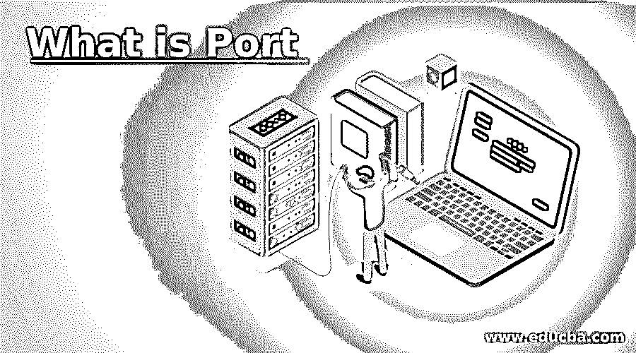

# 什么是港口

> 原文：<https://www.educba.com/what-is-port/>

## 港口简介

计算机系统内部帮助它连接到网络中其他设备或任何其他硬件的连接设备称为端口。它充当计算机和其他设备之间的交互点，并帮助这些设备进行通信。端口是根据系统执行的通信或连接到系统的设备分配给系统的。每个端口都有一个编号，以便在设备和系统之间进行通信时，网络可以找出通信的类型以及通信期间获取的数据。

### 港口的重要性

*   它可以是两个系统之间的连接设备，也可以是网络地址的一部分。无论哪种方式，它都有助于系统将信息从一个设备传递到另一个设备，并检查系统工作的网络。这有助于设备在执行信息交易时维护协议。
*   插槽在主板上创建，并连接到数据存储或声音系统或视频或文件系统。当设备连接到任何端口时，插槽检查其功能，并将相关数据提供给端口。插座提供声音，VGI 连接到视频，USB 连接到文件存储。当给出无数据传输的选项时，对设备进行充电。
*   这在软件中使用，以便在网络中可以知道应用程序进程。它的工作方式是将每个进程连接到一个端口，因此通过网络与处理该进程进行适当的通信。
*   在所有端口中进行扫描，从而不会危及系统的安全性。如果一个被攻击的设备被插入到系统中，它会使数据变得脆弱，任何处理攻击的人都可以获得这些数据。因此，优先扫描端口中的设备。

### 端口类型

*   端口的类型取决于用途以及它帮助系统控制流量的方式。
*   HDMI 或高清媒体接口有助于系统连接到任何投影仪，以显示用户想要向观众展示的内容。HDMI 是一个楔形端口，存在于任何台式机和笔记本电脑中。这是借助电缆连接到投影机。
*   设备中使用 USB 或通用串行总线来连接任何小工具，如笔驱动器、硬盘、移动电话等。这作为一个多用途端口，它有助于连接任何具有相同端口的小工具。USB 充当覆盖数字通信的短距离代理，它们存在于几乎所有的系统中。数据传输更快，如果设备是可充电的，那么它们通过 USB 充电。
*   串行端口有助于以比特为单位传输通信设备的信息。这是最古老的端口类型，通过外部调制解调器传输信息，在市场上有不同的版本。
*   并行端口的工作方式类似于串行端口，但信息传输是一次以几个比特的形式进行的。这甚至被用在许多外部设备中，如打印机和扫描仪。根据其用途，有些人称之为打印机端口或扫描仪端口，市场上只有一种型号。这表现为并行通信接口的形式。
*   系统中还使用了迷你连接器来连接键盘和鼠标。它们被称为 PS/2 端口，也称为鼠标端口。这些端口主要用于旧系统，有助于保护系统，因此许多组织还没有更换它。系统中没有限制，这有助于管理系统中的键盘或鼠标。
*   系统中使用调制解调器端口，以便调制解调器可以连接到电话或任何其他通信网络。这有助于使用数据连接和管理网络中的设备。
*   以太网电缆通过以太网端口连接，因此设备中的数据传输速度更快。这管理数据传输，并且用户知道设备中要传输的数据量。
*   系统中使用游戏端口来连接操纵杆，这样游戏爱好者会发现与应用程序交互比通过鼠标更容易。不过，现在它被 USB 取代，不再用于设备中。
*   数字视频接口是系统中使用的一个端口，用于将其连接到任何显示器或 LCD，以便图像或视频以更大的尺寸显示，并帮助用户注意到视频中的微小变化。通过该设备可以看到高端图形，这使得系统可以检查视频的分辨率。
*   虽然插座不被认为是合适的端口，但它们有助于将音频设备连接到计算机的音响系统，从而帮助用户避免在拥挤的区域产生噪音。
*   视频图形阵列连接器(VGA)在系统或投影仪中用于将视频卡连接到任何设备的显示器。连接器中使用模拟信号，因此现在使用不多。它们对降低视频的分辨率有很大的帮助。
*   Firewire 端口用于将设备连接到任何视频设备或录像机。数据传输更快，是苹果发明的。4 引脚、6 引脚和 9 引脚型号用作器件的端口。

### 结论

任何适合系统端口的外部设备都可以通过电缆或外部设备本身的端口连接到系统。这在传输数据以及检查图像和视频时帮助更大。

<small>网页开发、编程语言、软件测试&其他</small>

### 推荐文章

这是什么是港口的指南。在这里我们详细讨论了端口的介绍、重要性、类型。您也可以浏览我们的其他相关文章，了解更多信息——

1.  什么是计算机网络？
2.  [计算机硬件的类型](https://www.educba.com/types-of-computer-hardware/)
3.  [计算机新技术](https://www.educba.com/new-technologies-of-computer/)
4.  [电脑线缆的种类](https://www.educba.com/types-of-computer-cables/)

