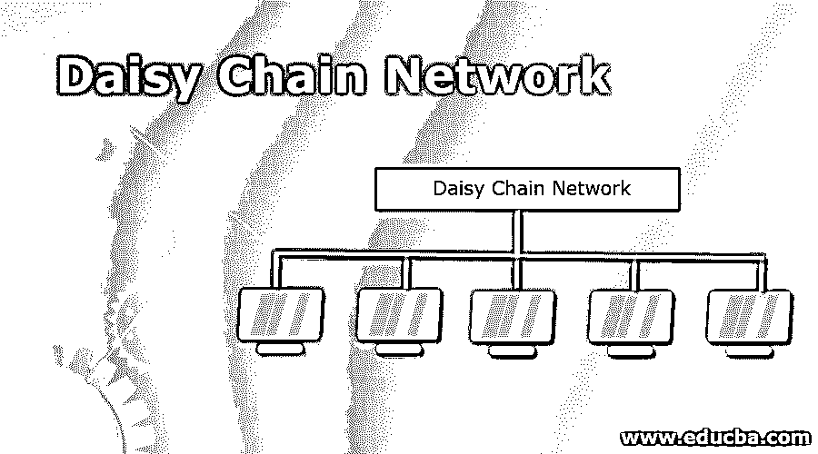

# 菊花链网络

> 原文[https://www.educba.com/daisy-chain-network/](https://www.educba.com/daisy-chain-network/)

## 菊花链网络简介

菊花链网络是一种接线模式，其中多个设备以典型的环形序列或结构连接在一起。它类似于雏菊花环。除了全环，单环系统包括多个内部环，但不能说是菊花链。菊花链大多用于电源系统、模拟信号、数字信息，很少用于所有这些的组合。单词 daisy system 表示与类似电源板的系列相关联的大规模设备，这些电源板相互插入以形成一个单元长线或设备内部的嵌入式布线序列。其他几个例子是基于 USB、以太网、FireWire 和 thunderbolt 的菊花链网络。

### 什么是菊花链网络？

菊花链用于指导网络节点和计算机节点的连接。这是一种典型的网络拓扑。多样的拓扑支持目标、持久、容错和用户友好。实现起来也很简单。网络的一个节点连接到线或链中的下一个节点。它可以是线性的，初始节点和最后一个节点没有链接，也可以通过连接初始节点和最后一个节点形成一个环。环形拓扑支持双向传递，而在线性拓扑中，消息必须从一个系统单向流向另一个系统。它适应性差，但它类似于串联电路，其中一个系统中的故障会影响到其他相连的组件。一个构建良好的网络可以隔离故障部分，而不会干扰其他系统的进程。在环形结构中，数据的传输是双向的。因此，如果出现任何故障节点，它会将相关部分从网络的其余部分切断。

<small>网页开发、编程语言、软件测试&其他</small>

其他网络拓扑包括作为中央系统的集线器，用于传递来自其他节点的消息。星型拓扑能够在不断开工作机器的情况下处理多个节点的中断。

### 我们为什么要使用菊花链网络？

通过将每个组件关联到另一个类似的组件，而不是直接连接到使用该组件的计算系统，一些硬件可以连接到菊花链网络中的计算系统。只有链中的最后一个组件直接连接到计算系统。例如，将许多具有 UART 端口的组件相互连接起来。这些部件必须正确连接才能协调工作。一次只有一个组件占用总线。

SCSI 在电气上是一种总线，是数字系统的一个例子，它类似于外部设备，其接线类似于具有高扩展性的菊花链。由于系统在电气上是一条总线，因此应将其端接，这可以通过在最终组件中插入一个终结器或选择一个选项使组件在内部端接来实现。MDI 组件通常设计为在菊花链中布线。一个组件通常既有输出端口又有直通端口，它们通常用于链接。当 OUT 端口传输完整的再生信号时，THRU 端口以最小的延迟传输数据，并且没有变化。在任何正在进行的延迟的情况下，它可以添加、改变或删除消息。这种差异反映在以不同时间顺序到达的信号中。如果链很长，就有可能产生失真，导致系统不可靠和无法运行。但很少有 SPI IC 器件配置菊花链功能。所有集成电路，JTAG 支持菊花链关于其 JTAG 菊花链准则。Thunderbolt 是一个接口组件，支持计算机显示器和 RAID 阵列等菊花链设备。Hexbus 是德州仪器 TI-74 中使用的 10 线制总线。

用户可以通过 Telnet 或 SSH 合并菊花链计算的会话。用户通过 Telnet 在第二台计算机上建立一个会话，并从该会话 Telnet 到第三台计算机，然后继续。在 RDP 的帮助下，它被称为另一个终端会话中的终端会话。菊花链创建的重点是通过网关网络连接到非路由网络上的服务器，防止在第一台计算机上工作时在下一台计算机上进行会话，以保留带宽或通过连接到更稳定的机器来增强不平衡网络上的连接性。总体重点是掩盖从事网络犯罪活动的行为。

菊花链网络以其简单性和可扩展性而闻名。用户可以在最大程度上沿着链添加额外的节点。菊花链网络从一端到另一端可以有很长的距离，但它并不适合节点必须分布在整个地理区域的所有情况。在这种情况下，电缆是曲折的，与节点之间的实际距离相比，网络的整个长度可能会变大。这可能会导致网络对于靠近链路两端的用户运行缓慢。菊花链有一个新建立的病毒骗局的术语。

#### 菊花链网络的类型

菊花链网络是在这些网络拓扑中的任何一种中开发的，线性或环形拓扑

*   菊花链网络的线性拓扑是网络的初始点和最终点等两个点，它们的末端不相连或连在一起。它提供单向的数据流。
*   菊花链网络的环形拓扑是将网络的起点和终点连接起来，形成一个环形。它通常被称为菊花链环路。这个系统中的数据流是双向的。

### 结论

由于双向链接，环形菊花链系统比线性菊花链网络具有更多优势。在环断开的情况下，通过检查连通性，传输发生在可逆路径中。因此它被应用在城域网中。

### 推荐文章

这是一个菊花链网络指南。在这里，我们将介绍什么是菊花链网络，并讨论我们为什么使用及其类型。您也可以浏览我们推荐的其他文章，了解更多信息——

1.  [静态路由与动态路由–主要差异](https://www.educba.com/static-routing-vs-dynamic-routing/)
2.  [网络面试问题|前 10 名](https://www.educba.com/networking-interview-questions/)
3.  [具有优势的联网设备](https://www.educba.com/networking-devices/)
4.  [四大网络协议类型](https://www.educba.com/types-of-networking-protocols/)

